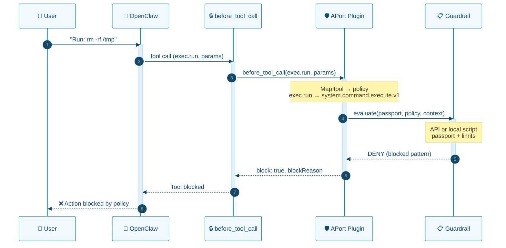
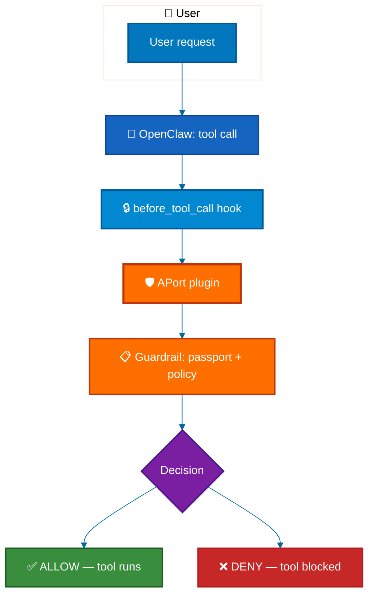
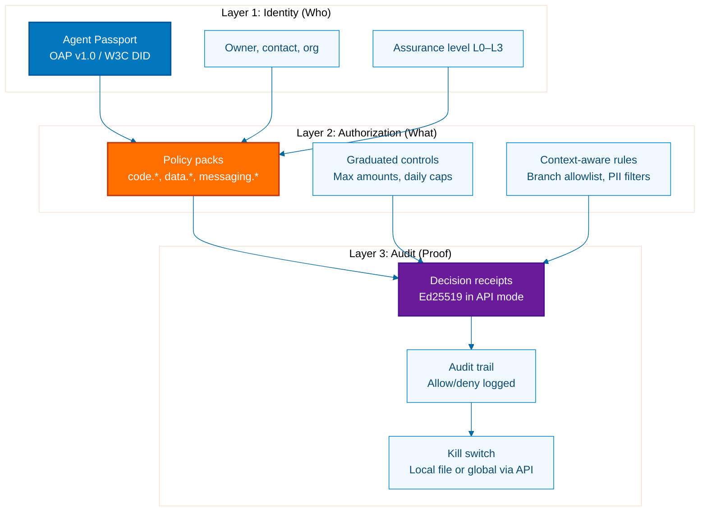
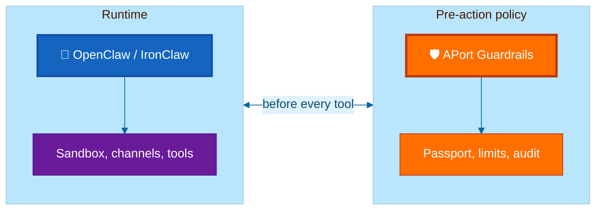
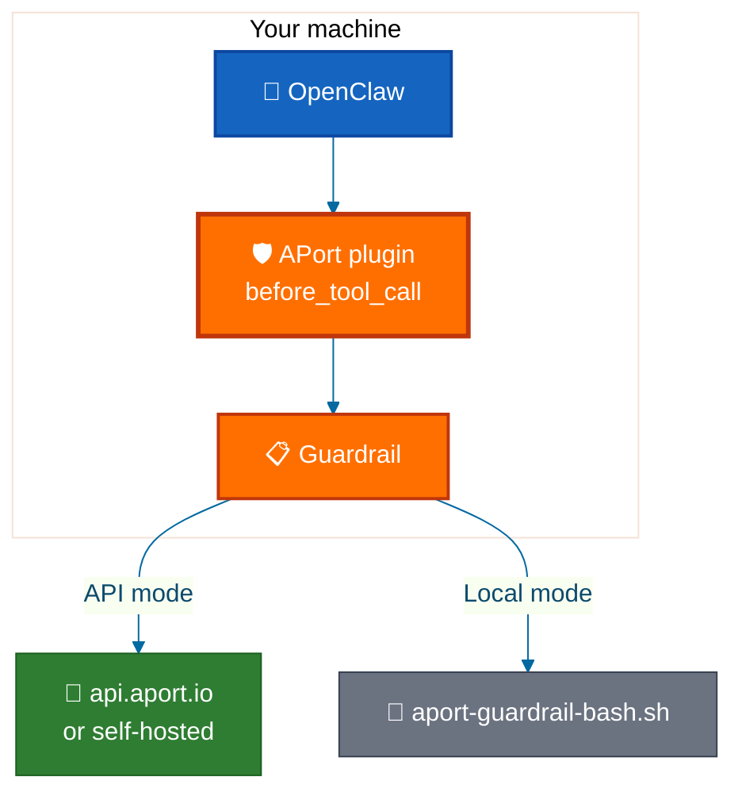

<div align="center">

#  APort Agent Guardrails

[](https://www.npmjs.com/package/@aporthq/aport-agent-guardrails)
[](https://pypi.org/project/aport-agent-guardrails/)
[](LICENSE)
[](tests/)
[](package.json)
[](python/aport_guardrails/pyproject.toml)
[](extensions/openclaw-aport/package.json)

<p>
  <a href="https://www.npmjs.com/package/@aporthq/aport-agent-guardrails">npm</a> •
  <a href="https://pypi.org/project/aport-agent-guardrails/">PyPI</a> •
  <a href="https://aport.io">Website</a> •
  <a href="https://aport.io/docs">Docs</a> •
  <a href="https://aport.io/brand-mascot-agent/">Meet Porter</a> •
  <a href="#-quick-start">Quick Start</a> •
  <a href="SECURITY.md">Security</a>
</p>

</div>

---

Deterministic pre-action authorization for AI agents. Guardrails run before supported tool execution, so prompt injection cannot bypass host-emitted policy checks.

### CTF Evidence

From the live APort Vault adversarial testbed:

| Metric | Result |
|---|---|
| Total authorization decisions observed | 4,437 |
| Total attack sessions observed | 1,151 |
| Level 5 ("Vault") restrictive attempts | 879 |
| Level 5 ("Vault") successful breaches | 0 |
| **Level 5 restrictive success rate** | **0%** |
| Permissive baseline success rate (for comparison) | 74.6% |

- [CTF Results](https://vault.aport.io/results)
- [CTF Replay](https://vault.aport.io/replay)
- [CTF Leaderboard](https://vault.aport.io/leaderboard/page)


## Start Here

### Protect a GitHub repository in 60 seconds

```bash
npx @aporthq/aport-agent-guardrails github
```

This writes a reviewable `.github/workflows/aport-guard.yml` that uses the
public [APort Repository Guard](https://github.com/marketplace/actions/aport-repository-guard)
Action. Default `mode: auto` uses GitHub OIDC, creates or reuses a
repository-scoped hosted OAP passport, and starts with report-only evidence.
Enable hosted enforcement plus branch protection when you are ready for the
guard to block merges or protected-branch pushes.

Blocking setup for protected branches:

```bash
npx @aporthq/aport-agent-guardrails github --mode hosted --branches main,staging
```

### Install runtime guardrails in 60 seconds

```bash
npx @aporthq/aport-agent-guardrails
```

- In a git repository with no detected runtime framework, pressing Enter starts GitHub Repository Guard setup.
- For runtime hooks, choose a released target: `cursor`, `claude-code`, `openclaw`, `langchain`, `crewai`, `deerflow`; a released beta command-hook target: `codex`, `gemini`, `goose`; or a setup-only target: `n8n`
- GitHub repository guard: `npx @aporthq/aport-agent-guardrails github`
- Claude Code direct: `npx @aporthq/aport-agent-guardrails claude` or `claude-code` for Anthropic's `claude` CLI
- Curl install URL for runtime hooks: `curl -fsSL https://aport.io/install.sh | bash -s -- claude-code`
- Existing hosted passport: `npx @aporthq/aport-agent-guardrails <framework> <agent_id>`
- Change enforcement without recreating a passport: `npx @aporthq/aport-agent-guardrails mode claude-code --enforcement=warn`
- Reset a framework to a clean APort state: `npx @aporthq/aport-agent-guardrails reset claude-code --yes`

When prompted for passport setup, the choices are:

1. `Create hosted APort passport now` — recommended; creates a hosted passport and narrow setup key.
2. `Use existing hosted passport ID` — paste an existing `agent_id`.
3. `Create local passport file` — offline/local JSON passport.

For a new hosted setup, choose option `1`. The installer creates a passport, creates a narrow setup key, writes the framework hook/config, and starts sending decisions to APort. For non-interactive installs:

```bash
npx --yes @aporthq/aport-agent-guardrails claude-code \
  --quick-hosted \
  --email you@example.com \
  --non-interactive
```

Equivalent environment-variable form:

```bash
APORT_OWNER_EMAIL="you@example.com" \
APORT_QUICK_HOSTED=1 \
npx --yes @aporthq/aport-agent-guardrails claude-code --non-interactive
```

Both forms create a hosted passport. For a non-interactive install with a local passport file, pass `--mode=local --non-interactive` (add `--output <path>` to pick the file). The wizard then writes a passport with the framework defaults and asks nothing:

```bash
npx --yes @aporthq/aport-agent-guardrails claude-code --mode=local --non-interactive
```

`--non-interactive` with none of the hosted flags falls back to the same local path. For an interactive local passport, run the installer without flags, choose `3. Create local passport file` at the passport prompt and answer the wizard; keep `Spawn sub-agents and tasks?` at `Y` for Claude Code, otherwise every Agent and Task call is denied. Step-by-step: [docs/QUICKSTART.md](docs/QUICKSTART.md#interactive-local-passport-step-by-step).

### Why Developers and teams trust APort

- **Deterministic enforcement:** runtime hook, not prompt instructions
- **Fail-closed defaults:** verification failures block risky actions
- **Explicit rollout mode:** `--enforcement=warn` records completed deny decisions while allowing framework actions during policy tuning; malformed hook input, missing dependencies, and invalid config still fail closed
- **Auditable decisions:** each allow/deny is logged with context
- **Open standard artifacts:** Open Agent Passport ([OAP](https://github.com/aporthq/aport-spec)) v1.0 passport and decision formats
- **Research-backed outcomes:** in a live adversarial testbed, permissive-policy success was 74.6% vs 0% under restrictive OAP policy (879 top-tier attempts)
- **Low latency at production scale:** cloud API verification p50 ~53ms at N=1,000
- **Security docs:** [SECURITY.md](SECURITY.md), [SECURITY_MODEL.md](docs/SECURITY_MODEL.md)
- **Backed by Peer-reviewed research:** [arXiv preprint (Mar 2026)](https://arxiv.org/html/2603.20953v1)

### Fast path by persona

- **I want GitHub protection:** [docs/GITHUB_PROTECTION.md](docs/GITHUB_PROTECTION.md)
- **I already have agent_id:** [docs/HOSTED_PASSPORT_SETUP.md](docs/HOSTED_PASSPORT_SETUP.md)
- **I need framework setup docs:** [docs/frameworks](docs/frameworks)
- **I want Claude Code setup:** [docs/frameworks/claude-code.md](docs/frameworks/claude-code.md)
- **I’m deploying for an IT team:** [docs/ENTERPRISE_DEVICE_DEPLOYMENT.md](docs/ENTERPRISE_DEVICE_DEPLOYMENT.md)
- **I need OpenClaw now:** [docs/QUICKSTART_OPENCLAW_PLUGIN.md](docs/QUICKSTART_OPENCLAW_PLUGIN.md)

### Brand personality (optional)

Security should feel rigorous, not intimidating. Meet Porter, the APort mascot used across the product experience: [Meet Porter](https://aport.io/brand-mascot-agent/).

<details>
<summary><strong style="font-size:18pt">Deeper background (threat model, rationale, evidence)</strong></summary>

The security concern is that agent tools and skills can execute sensitive actions (files, commands, external calls). APort addresses this by verifying each tool call against a passport and policy limits before execution. This reduces prompt-injection and “agent decided wrong” risk from runtime behavior to policy configuration.

</details>

---

## GitHub and Supported Frameworks

**Repository protection:** `npx @aporthq/aport-agent-guardrails github` generates a GitHub Actions workflow that uses `aporthq/policy-verify-action@v1` from the GitHub Marketplace. It is the fastest zero-secret path to collect OAP evidence for AI-assisted repository changes. Use `--mode hosted --branches main,staging` for blocking hosted enforcement on protected branches, and add `--block-protected-paths` when workflow, policy, package, or release surfaces should fail closed.

**Runtime guardrails:** APort adapters and providers are available per framework; the same passport and policies apply. **Node users:** `npx @aporthq/aport-agent-guardrails` (then choose framework) or `npx @aporthq/aport-agent-guardrails <framework>`. **Python users (LangChain/CrewAI/DeerFlow):** run the same CLI for the wizard and config, then install the Python package shown in the framework doc.

**Two ways to use APort:** (1) **Guardrails (CLI/setup)** — run the installer to create your passport and config; (2) **Core (library)** — use the `OAPGuardrailProvider` ([docs/PROVIDER.md](docs/PROVIDER.md)) in your app so each tool call is verified. One provider per language (Python + TypeScript), works with any framework. Framework docs: [GitHub](docs/GITHUB_PROTECTION.md), [Claude Code](docs/frameworks/claude-code.md), [Cursor](docs/frameworks/cursor.md), [Codex](docs/frameworks/codex.md), [Gemini CLI](docs/frameworks/gemini-cli.md), [Goose](docs/frameworks/goose.md), [OpenClaw](docs/frameworks/openclaw.md), [LangChain](docs/frameworks/langchain.md), [CrewAI](docs/frameworks/crewai.md), [DeerFlow](docs/frameworks/deerflow.md), [n8n](docs/frameworks/n8n.md).

**CLI-supported targets today:** `github`, `cursor`, `claude`/`claude-code`, `openclaw`, `langchain`, `crewai`, `deerflow`, setup-only `n8n`, plus beta command-hook targets `codex`, `gemini`, and `goose`. `opencode` is intentionally gated until an installed-version plugin smoke test validates the current plugin API. For IT-managed device rollout, see [Enterprise device deployment](docs/ENTERPRISE_DEVICE_DEPLOYMENT.md).

| Surface | CLI / alias | Doc | Integration | Install |
|-----------|-------------|-----|--------------|--------|
| **GitHub Repository Guard** | `github` | [docs/GITHUB_PROTECTION.md](docs/GITHUB_PROTECTION.md) | GitHub Action with OIDC-backed hosted OAP passport issue/reuse and repository evidence | `npx @aporthq/aport-agent-guardrails github` |
| **Claude Code** | `claude` / `claude-code` | [docs/frameworks/claude-code.md](docs/frameworks/claude-code.md) | PreToolUse hook → writes `~/.claude/settings.json` (Claude Code format; not Cursor). | `npx @aporthq/aport-agent-guardrails claude` |
| **Cursor** | `cursor` | [docs/frameworks/cursor.md](docs/frameworks/cursor.md) | `beforeShellExecution` / `preToolUse` hooks → writes `~/.cursor/hooks.json`. **Runtime enforcement is the bash hook;** the Node package `@aporthq/aport-agent-guardrails-cursor` is a helper only (Evaluator, `getHookPath()`). | `npx @aporthq/aport-agent-guardrails cursor` |
| **OpenClaw** | `openclaw` | [docs/frameworks/openclaw.md](docs/frameworks/openclaw.md) | **Plugin:** `before_tool_call` via `openclaw-aport` | `npx @aporthq/aport-agent-guardrails openclaw` |
| **LangChain / LangGraph** | `langchain` | [docs/frameworks/langchain.md](docs/frameworks/langchain.md) | **Python:** `APortCallback` (`on_tool_start`) | `npx @aporthq/aport-agent-guardrails langchain` then `pip install aport-agent-guardrails-langchain` + `aport-langchain setup` |
| **CrewAI** | `crewai` | [docs/frameworks/crewai.md](docs/frameworks/crewai.md) | **Python:** released hook adapter by default; native `GuardrailProvider` mode for CrewAI builds with native provider support | `npx @aporthq/aport-agent-guardrails crewai` then `pip install aport-agent-guardrails-crewai` + `aport-crewai setup` |
| **DeerFlow** | `deerflow` | [docs/frameworks/deerflow.md](docs/frameworks/deerflow.md) | **Python:** generic OAP provider wiring in DeerFlow config | `npx @aporthq/aport-agent-guardrails deerflow` then follow printed `uv`/config steps |
| **n8n** | `n8n` | [docs/frameworks/n8n.md](docs/frameworks/n8n.md) | *Setup available; custom node coming soon* | `npx @aporthq/aport-agent-guardrails n8n` |
| **Codex CLI** | `codex` | [docs/frameworks/codex.md](docs/frameworks/codex.md) | Beta command hook: repo-local `.codex/hooks.json` for `PreToolUse`; Bash, `apply_patch`, MCP, and local function tools. State stays in `~/.aport/codex`. **Beta limits:** `apply_patch` calls touching more than one file and every `Glob`/`List`/`LS`/`LSP` call are denied by the hook, and warn mode does not lift those two denials. `webrun`, `browser` navigation, `local_shell`, `write_stdin`, `update_plan`, `request_user_input`, `computer_use` and memory tools are mapped; local `computer_use` and interactive browser actions fail closed until hosted `web.browser.v1` can decide them. Unlisted tool names deny as `oap.unknown_tool` by default. Reviewed deployments can set `APORT_CODEX_TOOL_FALLBACK=on` to route one clear payload effect (`url`, path, or command); mixed effects deny. `write_stdin` is evaluated as complete shell input, while partial or control-only chunks fail closed. | `npx @aporthq/aport-agent-guardrails codex` |
| **Gemini CLI** | `gemini` / `gemini-cli` | [docs/frameworks/gemini-cli.md](docs/frameworks/gemini-cli.md) | Beta command hook: `.gemini/settings.json` `BeforeTool` hook for shell, file, web, and MCP tools. | `npx @aporthq/aport-agent-guardrails gemini` |
| **Goose** | `goose` | [docs/frameworks/goose.md](docs/frameworks/goose.md) | Beta Goose Open Plugin: project-scoped `.agents/plugins/aport-guardrail` with blocking `PreToolUse`; secrets/state stay in `~/.aport/goose`. | `npx @aporthq/aport-agent-guardrails goose` |
| **opencode** | `opencode` | [docs/frameworks/opencode.md](docs/frameworks/opencode.md) | Gated; current setup exits with an explanation until plugin API smoke tests pass. | — |
| **VoltAgent** | planned | [VoltAgent PR #1171](https://github.com/VoltAgent/voltagent/pull/1171) | *In progress* — pluggable `GuardrailProvider` interface landing upstream in `@voltagent/core` | — |

Beta command-hook harnesses use the tool names their creators use: `codex`, `gemini`, and `goose`. They ship through this package and share the same local/API evaluator as Claude Code and Cursor, but remain beta while APort continues validating native hook payloads and warning visibility across host versions. opencode stays gated until APort has an installed-version plugin smoke test.

Install via `npx @aporthq/aport-agent-guardrails <framework>` (or choose when prompted). OpenClaw can also use the full installer flow. **For LangChain, CrewAI, and DeerFlow, the CLI writes config and installs the local runtime into the framework config directory; then install the Python package and wire the provider/callback shown in the framework doc.** **Python** packages are on PyPI; **Node** packages are on npm (same version as the CLI).

**Passport path:** Each framework has its own **default** passport path (where that framework stores data): e.g. Cursor → `~/.cursor/aport/passport.json`, OpenClaw → `~/.openclaw/aport/passport.json`, LangChain → `~/.aport/langchain/aport/passport.json`. The passport wizard’s **first question** is “Passport file path [default]:” — press Enter for the framework default or type a different path. In non-interactive mode (e.g. CI) use **`--output /path/to/passport.json`** to choose the path. Roadmap: [docs/FRAMEWORK_ROADMAP.md](docs/FRAMEWORK_ROADMAP.md).

**Using SDKs or middleware directly:** If you prefer to integrate with the APort API from your own app (no CLI/framework installer), use the official SDKs and middleware: **Node** — [@aporthq/sdk-node](https://www.npmjs.com/package/@aporthq/sdk-node), [@aporthq/middleware-express](https://www.npmjs.com/package/@aporthq/middleware-express); **Python** — [aporthq-sdk-python](https://pypi.org/project/aporthq-sdk-python/), [aporthq-middleware-fastapi](https://pypi.org/project/aporthq-middleware-fastapi/).

---

## 🚀 Quick Start

**Prerequisites:** For the setup wizard you need **Node 18+** (or use the Python CLI below). **`jq` is required** by the Claude Code, Cursor, Codex, Gemini CLI and Goose hooks and by the local evaluator: if `jq` is missing, the hook denies every tool call (`APort: jq is required`), in warn mode too. Install it before setup (`brew install jq` or `apt install jq`). No clone required.

**1. Run the setup** — For repositories, generate the GitHub Action. For local runtimes, choose your framework when prompted (or pass it). Same public npm package.

**GitHub Repository Guard:**
```bash
npx @aporthq/aport-agent-guardrails github

# blocking hosted mode for protected branches
npx @aporthq/aport-agent-guardrails github --mode hosted --branches main,staging
```

**Node (GitHub first, then Cursor, Claude Code, OpenClaw, or config for another released framework):**
```bash
npx @aporthq/aport-agent-guardrails
# or: npx @aporthq/aport-agent-guardrails github | cursor | claude | claude-code | codex | gemini | goose | openclaw | langchain | crewai | deerflow | n8n
# n8n currently writes passport/config only; runtime node enforcement ships separately.
# optional mode flags (all frameworks):
#   --mode=api --api-url=https://api.aport.io
#   --mode=local
#   --enforcement=warn   # explicit report-only rollout; default is enforce/fail-closed
```

**Reset / uninstall APort-owned wiring**

Use the same dispatcher for cleanup:

```bash
npx @aporthq/aport-agent-guardrails reset claude-code --yes
# or
npx @aporthq/aport-agent-guardrails claude-code reset --yes
```

Supported reset targets match released and beta runtime targets:
`cursor`, `claude`/`claude-code`, `codex`, `gemini`, `goose`, `openclaw`, `langchain`, `crewai`, `deerflow`, `n8n`.

Reset removes APort-owned config and integration wiring for the selected framework.
When possible, unrelated user hooks are preserved.

**Python (LangChain, CrewAI, or DeerFlow):** Use the Python CLI directly via `uvx` or an installed package:
```bash
uvx --from aport-agent-guardrails aport setup --framework=langchain
# or --framework=crewai / deerflow
```
Or install the package first:
```bash
pip install aport-agent-guardrails
aport setup --framework=langchain
# or --framework=crewai / deerflow
```
Then install the framework-specific Python package and follow the printed integration step for your framework.

This runs setup and writes config for your framework. Choose hosted setup for passport and setup-key creation, or local setup for an on-disk passport. Follow the **next steps** printed at the end (e.g. restart Cursor; or for CrewAI: by default install `aport-agent-guardrails-crewai` for released CrewAI, or opt into native-provider mode if your CrewAI build supports it).

**Guardrail mode (local vs API)** — On the **Node** installer (`npx @aporthq/aport-agent-guardrails …` / `bin/agent-guardrails`), every framework accepts the same flags: `--mode=api` (with optional `--api-url`, default `https://api.aport.io`) or `--mode=local`, and an optional hosted `ap_<hex>` argument (API mode, no local passport). That flow writes `…/aport/guardrail-mode.env` where the hooks/generic installers need it. The **Python** `aport setup` CLI does not parse those flags yet; use the Node command above for API/local mode during setup, or set mode in your framework `config.yaml` per the framework doc.

**Enforcement mode (block vs warn)** — Default is `enforce`: APort fails closed and policy denials block the tool call. Use `--enforcement=warn` only when intentionally rolling out in report-only/audit mode. Warn mode still evaluates policy and records the original deny decision, but lets the framework action continue so teams can tune passports without interrupting development. It does not downgrade malformed hook input, missing dependencies, invalid mode files, unmapped effectful tools, or evaluator integrity failures; those remain fail-closed because APort cannot prove what would have been authorized. Host visibility differs: Claude Code shows a `systemMessage` warning; Cursor returns best-effort warning fields but may not display allow warnings in the UI, so use the audit log/status output as the source of truth. See APort's [OAP Decisions vs Harness Enforcement](https://github.com/aporthq/agent-passport/blob/main/docs/DECISION-VS-ENFORCEMENT.md) guidance for how to reconcile signed `allow: false` decisions with local warn/report-only rollout.

Change enforcement later without creating a new passport or reinstalling hooks:

```bash
npx @aporthq/aport-agent-guardrails mode claude-code --enforcement=warn
npx @aporthq/aport-agent-guardrails mode cursor --enforcement=enforce
npx @aporthq/aport-agent-guardrails mode langchain --mode=api --enforcement=warn
```

**Install into a custom directory.** Each framework's config directory can be moved with one environment variable. The installer, the `mode` and `reset` commands, and the Python `aport setup` CLI all read it (`get_config_dir` in `bin/lib/config.sh`):

| Framework | Variable | Default |
|-----------|----------|---------|
| Claude Code | `APORT_CLAUDE_CODE_CONFIG_DIR` | `~/.claude` |
| Cursor | `APORT_CURSOR_CONFIG_DIR` | `~/.cursor` |
| Codex CLI | `APORT_CODEX_CONFIG_DIR` | `~/.aport/codex` |
| Gemini CLI | `APORT_GEMINI_CLI_CONFIG_DIR` | `~/.aport/gemini-cli` |
| Goose | `APORT_GOOSE_CONFIG_DIR` | `~/.aport/goose` |
| OpenClaw | `APORT_OPENCLAW_CONFIG_DIR`, `OPENCLAW_CONFIG_DIR`, `OPENCLAW_STATE_DIR`, `OPENCLAW_HOME` (the `openclaw` installer itself prompts for the directory) | `~/.openclaw` |
| LangChain, CrewAI, DeerFlow | `APORT_LANGCHAIN_CONFIG_DIR`, `APORT_CREWAI_CONFIG_DIR`, `APORT_DEERFLOW_CONFIG_DIR` | `~/.aport/<framework>` |
| n8n | `APORT_N8N_CONFIG_DIR` | `~/.n8n` |

Passport, `guardrail-mode.env`, the runtime copy and the audit log all land in `<dir>/aport/`. Example: `APORT_CLAUDE_CODE_CONFIG_DIR=/srv/agent/claude npx @aporthq/aport-agent-guardrails claude-code`. For Codex, Gemini CLI and Goose the installer writes the variable into the hook command or wrapper script, so nothing else is needed. For Claude Code and Cursor the settings file stores only the hook path and the hook reads the variable at run time, so export it in the environment the host is launched from; otherwise the hook falls back to `~/.claude` or `~/.cursor` and denies every call when no passport or mode file is there. The Python runtime packages do not read these variables; pass `config_path` to the provider or callback instead.

To point a hook at a passport outside its config directory, set `APORT_PASSPORT_FILE` and also `APORT_ALLOW_EXTERNAL_PASSPORT_FILE=1`. Without the second variable the hook ignores an `APORT_PASSPORT_FILE` that is not under its config directory (`bin/lib/framework-hook-paths.sh`). The guard exists because GUI hosts can inherit a stale variable from another framework's session, which would otherwise swap in a different passport. `APORT_DECISION_FILE` and `APORT_AUDIT_LOG` are subject to the same in-directory rule and have no override.

**2. Hosted passport (optional)** — The installer can create a hosted passport during setup. If you already have an `agent_id` from [aport.io](https://aport.io), use it to skip passport creation: `npx @aporthq/aport-agent-guardrails <framework> <agent_id>`. See [Hosted passport setup](docs/HOSTED_PASSPORT_SETUP.md).

**3. Test that policy runs** — After setup, the guardrail runs automatically when your agent uses tools (Cursor hook, LangChain callback, OpenClaw plugin, etc.). To try allow/deny from the command line (any framework), use the installed `aport-guardrail` command (Node) or call the evaluator from Python; both use your existing passport from the APort framework state dir (e.g. `~/.cursor/aport/`, `~/.aport/langchain/aport/`, `~/.aport/codex/aport/`).

**Node:**
```bash
aport-guardrail system.command.execute '{"command":"ls"}'      # ALLOW (safe)
aport-guardrail system.command.execute '{"command":"rm -rf /"}'  # DENY (blocked pattern)
# Exit: 0 = ALLOW, 1 = DENY
```
*(If you use `npx` without `-g`, run `npx aport-guardrail ...`.)*

**Python:** Use the guardrail in your app (e.g. add `APortCallback()` to your LangChain agent or use `register_aport_guardrail()` for released CrewAI). The guardrail runs on every tool call. To test allow/deny from the shell without Node, use `npx aport-guardrail ...` as above, or see your framework doc for in-app testing.

**Check passport status and audit:**

| What | Where |
|------|--------|
| **Passport & audit** | Stored in your **APort framework state dir** (e.g. `~/.cursor/aport/`, `~/.openclaw/aport/`, `~/.aport/langchain/aport/`, `~/.aport/codex/aport/`, `~/.aport/gemini-cli/aport/`, `~/.aport/goose/aport/`). |
| **Audit log** | `config_dir/aport/audit.log` — one line per decision (timestamp, tool, allow/deny, policy, context). |
| **Last decision** | `config_dir/aport/decision.json` (OAP v1.0 format). |

Your framework doc describes where hook config and APort state are stored for that harness.

📖 **Per-framework:** [GitHub](docs/GITHUB_PROTECTION.md) · [Claude Code](docs/frameworks/claude-code.md) · [Cursor](docs/frameworks/cursor.md) · [Codex](docs/frameworks/codex.md) · [Gemini CLI](docs/frameworks/gemini-cli.md) · [Goose](docs/frameworks/goose.md) · [OpenClaw](docs/frameworks/openclaw.md) · [LangChain](docs/frameworks/langchain.md) · [CrewAI](docs/frameworks/crewai.md) · [DeerFlow](docs/frameworks/deerflow.md) · [n8n](docs/frameworks/n8n.md) · [opencode](docs/frameworks/opencode.md)
🌐 **Hosted passport:** [Use agent_id from aport.io](docs/HOSTED_PASSPORT_SETUP.md)

---

## 🔒 Runtime Enforcement Options

| | Runtime hook / plugin ✅ | AGENTS.md only ⚠️ |
|---|--------------------------|-------------------|
| **Policy timing** | Before the tool call the host exposes | After the model decides to follow instructions |
| **Bypass risk** | Lower, bounded by host/runtime hook coverage | High |
| **Recommended** | **Yes** | Only as documentation or fallback |

**Runtime hook/plugin (recommended):** The host invokes APort before supported tool calls execute. This repo ships runtime integrations for Claude Code, Cursor, OpenClaw, LangChain, CrewAI, Codex CLI, Gemini CLI, Goose, DeerFlow setup, and n8n setup. Exact coverage depends on what each host exposes.
**AGENTS.md:** Agent is *instructed* to call the guardrail; best-effort only. Runtime hooks ignore repository-controlled AGENTS.md passport settings by default so a checked-out repo cannot swap in a permissive passport. Set `APORT_TRUST_REPO_POLICY=1` only for repositories whose AGENTS.md policy you intentionally trust.

**What the shell policy sees:** For Bash-style tools the evaluator receives only the command string. `allowed_commands` is a prefix match. `blocked_patterns` uses word-boundary and glob matching, case-insensitive: a single word such as `sudo` matches only as a whole word (it does not block `sudoku`), an entry containing `*` or `?` is a glob, and a multi-word entry such as `rm -rf` matches as written. When `allowed_commands` is restrictive (not `*`), a command containing an unquoted `&&`, `||`, `;`, `|`, `&`, newline, `(`, `)`, `$(`, `<(`, `>(`, a `#` comment or `$'...'` quoting is denied with `oap.command_chain_unsupported`. It does not parse `git push` remotes or branches, does not see files read by `cat .env` or written with `>`, and does not apply `web.fetch` domain limits to `curl`. Path and domain limits apply to the host's own Read/Write/Edit/WebFetch tools. A passport that sets `max_execution_time` denies shell tools with no timeout (Cursor, Gemini CLI, Goose, Codex `exec_command`); Claude Code Bash and Codex `shell` fall back to their harness defaults of 120 s and 10 s. For unattended agents pair APort with a harness sandbox, a ruleset on the default branch, and a scoped token; details in [docs/SECURITY_MODEL.md](docs/SECURITY_MODEL.md#what-the-bash-policy-does-and-does-not-see).

---

## 🔌 Verification methods (local vs API)

**Default and recommended:** **API mode** — full OAP policy evaluation (JSON Schema, assurance, regions, evaluation rules from policy JSON, signed decisions). The setup wizard defaults to API when you choose a mode.

**Fail-closed by default:** If the evaluator cannot find a passport or guardrail script (e.g. first run, wrong config dir), it **denies** the tool call (`oap.misconfigured`). For legacy allow-when-missing behavior, set `fail_open_when_missing_config: true` in your config or `APORT_FAIL_OPEN_WHEN_MISSING_CONFIG=1` in the environment.

| Mode | Best for | Full OAP? | Network |
|------|----------|-----------|---------|
| **API (default)** | Production, full policy parity, new policy packs without code changes | ✅ | Yes (api.aport.io or self-hosted) |
| **Local (bash)** | Privacy, offline, air-gapped | Subset only (hand-coded limits for exec, file read/write, web fetch, MCP, sessions, messaging, repo; see [what the Bash policy sees](docs/SECURITY_MODEL.md#what-the-bash-policy-does-and-does-not-see)) | No |

**API mode** can use either a **local passport file** (sent in the request body; not stored) or **agent_id only**: set `APORT_AGENT_ID` to your hosted passport’s agent ID and the API fetches the passport from the registry — no passport JSON file needed. See [Hosted passport setup](docs/HOSTED_PASSPORT_SETUP.md).

Deep dive (what each supports, comparison table): [Verification methods](docs/VERIFICATION_METHODS.md).

---

## ⚡ Performance

Guardrail verification latency from the latest preprint benchmark set (**N=1,000**).

| Mode | p50 | p95 | p99 | N |
|------|-----|-----|-----|---|
| Cloud API (agent_id, pack in path) | 53ms | 63ms | 76ms | 1,000 |
| Cloud API (agent_id, policy in body) | 53ms | 62ms | 77ms | 1,000 |
| Cloud API (passport in body, pack in path) | 54ms | 63ms | 74ms | 1,000 |
| Cloud API (passport in body, policy in body) | 53ms | 63ms | 71ms | 1,000 |
| Local policy evaluation | 174ms | 243ms | 358ms | 1,000 |

Source: [Before the Tool Call: Deterministic Pre-Action Authorization for Autonomous AI Agents](https://arxiv.org/html/2603.20953v1)

---

<details>
<summary><strong>📐 How It Works (expand)</strong></summary>

## 📐 How It Works

<div align="center">


```mermaid
%%{init: {'theme':'base', 'themeVariables': {'primaryColor':'#f0f9ff','primaryTextColor':'#0c4a6e','primaryBorderColor':'#0284c7','lineColor':'#0369a1','secondaryColor':'#e0f2fe','tertiaryColor':'#bae6fd'}}}%%
sequenceDiagram
  autonumber
  participant User as 👤 User
  participant OC as 🦀 OpenClaw
  participant Hook as 🔒 before_tool_call
  participant Plugin as 🛡️ APort Plugin
  participant Guard as 📋 Guardrail

  User->>OC: "Run: rm -rf /tmp"
  activate OC
  OC->>Hook: tool call (exec.run, params)
  activate Hook
  Hook->>Plugin: before_tool_call(exec.run, params)
  activate Plugin
  Note over Plugin: Map tool → policy<br/>exec.run → system.command.execute.v1
  Plugin->>Guard: evaluate(passport, policy, context)
  activate Guard
  Note over Guard: API or local script<br/>passport + limits
  Guard-->>Plugin: DENY (blocked pattern)
  deactivate Guard
  Plugin-->>Hook: block: true, blockReason
  deactivate Plugin
  Hook-->>OC: Tool blocked
  deactivate Hook
  OC-->>User: ❌ Action blocked by policy
  deactivate OC
```

**Flow (high level):**


```mermaid
%%{init: {'theme':'base', 'themeVariables': {'primaryColor':'#f0f9ff','primaryTextColor':'#0c4a6e','primaryBorderColor':'#0284c7','lineColor':'#0369a1'}}}%%
flowchart TB
  subgraph User["👤 User"]
    A[User request]
  end
  B[🦀 OpenClaw: tool call]
  C[🔒 before_tool_call hook]
  D[🛡️ APort plugin]
  E[📋 Guardrail: passport + policy]
  F{Decision}
  G[✅ ALLOW — tool runs]
  H[❌ DENY — tool blocked]
  A --> B --> C --> D --> E --> F
  F --> G
  F --> H
  style A fill:#0277bd,stroke:#01579b,stroke-width:2px,color:#fff
  style B fill:#1565c0,stroke:#0d47a1,stroke-width:2px,color:#fff
  style C fill:#0288d1,stroke:#01579b,stroke-width:2px,color:#fff
  style D fill:#ff6f00,stroke:#bf360c,stroke-width:3px,color:#fff
  style E fill:#ff6f00,stroke:#bf360c,stroke-width:2px,color:#fff
  style F fill:#7b1fa2,stroke:#4a148c,stroke-width:2px,color:#fff
  style G fill:#388e3c,stroke:#1b5e20,stroke-width:2px,color:#fff
  style H fill:#c62828,stroke:#b71c1c,stroke-width:2px,color:#fff
```

</div>

```
User → "Delete all log files"
         ↓
   OpenClaw: tool "exec.run"
         ↓
   🔒 before_tool_call hook
         ↓
   🛡️ APort plugin → guardrail (passport + policy)
         ↓
   ┌─────────┴─────────┐
   ✅ ALLOW            ❌ DENY
   Tool runs           Tool blocked
```

**Key:** The platform enforces policy. The AI cannot skip this check.

---

</details>

<details>
<summary><strong>🏛️ Security model (three layers) (expand)</strong></summary>

## 🏛️ Security model (three layers)

APort enforces **identity → authorization → audit** before supported tools run.
GitHub uses the Marketplace Action and OIDC; Claude Code, Cursor, Codex,
Gemini CLI, and Goose use host command hooks; OpenClaw uses the
`before_tool_call` plugin; LangChain/CrewAI use adapters. Each path uses the
same passport and policy model, then either the local evaluator or hosted APort
API evaluates the action.

<div align="center">


```mermaid
%%{init: {'theme':'base', 'themeVariables': {'primaryColor':'#f0f9ff','primaryTextColor':'#0c4a6e','primaryBorderColor':'#0284c7','lineColor':'#0369a1'}}}%%
graph TB
  subgraph L1["Layer 1: Identity (Who)"]
    A[Agent Passport<br/>OAP v1.0 / W3C DID]
    B[Owner, contact, org]
    C[Assurance level L0–L3]
  end

  subgraph L2["Layer 2: Authorization (What)"]
    D[Policy packs<br/>code.*, data.*, messaging.*]
    E[Graduated controls<br/>Max amounts, daily caps]
    F[Context-aware rules<br/>Branch allowlist, PII filters]
  end

  subgraph L3["Layer 3: Audit (Proof)"]
    G[Decision receipts<br/>Ed25519 in API mode]
    H[Audit trail<br/>Allow/deny logged]
    I[Kill switch<br/>Local file or global via API]
  end

  A --> D
  B --> D
  C --> D
  D --> G
  E --> G
  F --> G
  G --> H
  H --> I

  style A fill:#0277bd,stroke:#01579b,stroke-width:2px,color:#fff
  style D fill:#ff6f00,stroke:#bf360c,stroke-width:2px,color:#fff
  style G fill:#6a1b9a,stroke:#4a148c,stroke-width:2px,color:#fff
```

</div>

- **Local-first:** Passport and policy live on your machine (or in repo); no cloud required for basic enforcement.
- **Fail-closed:** Missing or invalid passport → deny.
- **Opt-in cloud:** Use API mode for global kill switch, signed receipts, and team sync.

### What APort Protects

**✅ Pre-action authorization (agent misbehavior):**
- **Prompt injection** - Hook-based enforcement; agent cannot bypass via prompts
- **Malicious skills** - Third-party OpenClaw skills validated before execution
- **Unauthorized commands** - Allowlist + 50+ blocked patterns (rm -rf, sudo, nc, find -exec rm, etc.)
- **Data exfiltration** - File access, messaging, web requests controlled by policy
- **Resource limits** - Rate limits, size caps, transaction amounts enforced

**Application-layer security model:** APort enforces policies at the agent action layer (between agent decision and tool execution). It operates within the OS trust boundary—standard for authorization systems like OAuth, IAM, and policy engines.

**For production:** Use API mode (`mode: api` with `agent_id`) for cryptographically signed decisions, protected passports, and global suspend. See [docs/SECURITY_MODEL.md](docs/SECURITY_MODEL.md) for full threat model, attack scenarios, and best practices.

---

</details>

## 🌐 When to use API vs local

| Use **local** when | Use **API** (default) when |
|--------------------|----------------------------|
| Single developer, no cloud | Team; same policies across machines |
| Offline or air-gapped | You want global kill switch (&lt;15s) |
| Plain audit logs are enough | You need signed receipts (e.g. SOC 2, compliance) |
| No API key / self-host not ready | Registry checks, analytics, or policy marketplace |

See [Verification methods](docs/VERIFICATION_METHODS.md) for a detailed comparison.

---

## 📖 Example outcomes

| Scenario | Without APort | With APort |
|----------|----------------|---------------------------|
| **Oversized PR** | Agent creates 1200-file PR | Denied: “PR size exceeds limit of 500 files” |
| **PII export** | Agent exports SSN/driver’s license | Denied: “PII export not allowed” (data.export policy) |
| **Kill switch** | Manually edit config on every machine | API: suspend passport once → all agents deny in &lt;15s |

---

## GitHub Protection

APort can also verify GitHub repository activity in CI. Use hosted verification for GitHub Actions so APort can validate the workflow identity with GitHub OIDC, issue signed decisions, and record auditable evidence.

Protection surfaces:

| Surface | Policy |
|--------|--------|
| Current Repository Guard Action: PR/repository provenance and merge/push evidence | `code.repository.merge.v1` |
| Agent/runtime or direct guardrail checks: explicit release publishing tools | `code.release.publish.v1` |

The local evaluator includes a lightweight subset for developer/offline checks: repository allowlists, branch allowlists, changed-path allowlists, action-specific capability checks, and semantic-version checks for explicit release publishing tool calls. Hosted verification is the source of truth for GitHub OIDC, signed receipts, Action-collected repository evidence, and organization audit. Shell commands such as `npm publish` still arrive through shell hooks as `system.command.execute.v1`; use explicit release tools or hosted API verification for `code.release.publish.v1`.

See [GitHub protection](docs/GITHUB_PROTECTION.md) for the recommended setup and [Tool / Policy Mapping](docs/TOOL_POLICY_MAPPING.md) for exact tool-to-policy names.

---

## 📜 Commands (after install)

**Node:** When you install via `npm install @aporthq/aport-agent-guardrails` (or use `npx`), these commands are available:

| Command | Purpose |
|--------|---------|
| `agent-guardrails` | Main entry — prompt for framework or pass one: `agent-guardrails openclaw \| cursor \| claude-code \| langchain \| crewai \| deerflow \| n8n`. Project target: `agent-guardrails github [--policy] [--force]`. Args after a framework are passed through (e.g. `agent-guardrails openclaw <agent_id>`). |
| `agent-guardrails reset <framework> [--yes]` | Remove APort-owned config and hook/plugin wiring for one framework. Positional form also works: `agent-guardrails <framework> reset --yes`. |
| `aport` | OpenClaw one-command setup (passport + plugin + wrappers). Optional: `aport <agent_id>` for hosted passport. |
| `aport-guardrail` | Run guardrail check from the CLI (e.g. `aport-guardrail system.command.execute '{"command":"ls"}'`). Uses passport from your APort framework state dir. |

**Python:** After `pip install aport-agent-guardrails` you get `aport` (setup helper). For LangChain or CrewAI, install the framework package and setup:

| Command | Purpose |
|--------|---------|
| `aport setup --framework=langchain` | Print next-step commands (npx wizard, then `pip install aport-agent-guardrails-langchain`, `aport-langchain setup`). |
| `aport setup --framework=crewai` | Default released CrewAI path: bootstrap config/runtime, then use `pip install aport-agent-guardrails-crewai` and `aport-crewai setup`. |
| `aport setup --framework=crewai --integration-mode=native` | Native CrewAI path: bootstrap config/runtime, then use `uv add aport-agent-guardrails` and `OAPGuardrailProvider`. |
| `aport-langchain setup` | LangChain config and wizard (after installing `aport-agent-guardrails-langchain`). |

Use the framework-specific doc for where config and passport live and for any extra steps (e.g. Cursor: restart IDE; LangChain/CrewAI: add callback/hook in code).

*Contributors: repo layout and dev scripts (build, test, release) are in [docs/REPO_LAYOUT.md](docs/REPO_LAYOUT.md) and [CONTRIBUTING.md](CONTRIBUTING.md).*

---

## 📚 Documentation

| Doc | Description |
|-----|-------------|
| [Quick Start Guide](docs/QUICKSTART.md) | Passport wizard, copy-paste option |
| [GitHub Protection](docs/GITHUB_PROTECTION.md) | Protect PR/push workflows with hosted OAP verification and explicit release checks |
| [Hosted passport setup](docs/HOSTED_PASSPORT_SETUP.md) | Use passport from aport.io with any supported framework: `npx ... <framework> <agent_id>` or choose hosted in wizard |
| [Verification methods (local vs API)](docs/VERIFICATION_METHODS.md) | Deep dive: bash vs API evaluator |
| [Security model](docs/SECURITY_MODEL.md) | Threat model, what the Bash policy does and does not see, default sensitive read paths |
| [Tool / Policy Mapping](docs/TOOL_POLICY_MAPPING.md) | Tool names → policy packs |
| [QuickStart: OpenClaw Plugin](docs/QUICKSTART_OPENCLAW_PLUGIN.md) | One-command OpenClaw setup |
| [OpenClaw Local Integration](docs/OPENCLAW_LOCAL_INTEGRATION.md) | API, Python example |
| [Repo Layout](docs/REPO_LAYOUT.md) | For contributors: package layout (`bin/`, `src/`, `extensions/`) |
| [Upgrade Guide](docs/UPGRADE.md) | Migrating between versions (e.g. 0.1.0 → 1.0.0) |
| **Frameworks** | Per-framework setup and how guardrails run |
| → [Claude Code](docs/frameworks/claude-code.md) | PreToolUse hook, `~/.claude/settings.json` |
| → [Cursor](docs/frameworks/cursor.md) | beforeShellExecution / preToolUse hooks, `~/.cursor/hooks.json` |
| → [Codex CLI](docs/frameworks/codex.md) | Beta `PreToolUse` command hook, `.codex/hooks.json` |
| → [Gemini CLI](docs/frameworks/gemini-cli.md) | Beta `BeforeTool` command hook, `.gemini/settings.json` |
| → [Goose](docs/frameworks/goose.md) | Beta Open Plugin with blocking `PreToolUse` |
| → [OpenClaw](docs/frameworks/openclaw.md) | `before_tool_call` plugin |
| → [LangChain / LangGraph](docs/frameworks/langchain.md) | `APortCallback` handler |
| → [CrewAI](docs/frameworks/crewai.md) | Released hook adapter by default; native provider mode when available |
| → [DeerFlow](docs/frameworks/deerflow.md) | Generic provider wiring via DeerFlow `config.yaml` |
| → [n8n](docs/frameworks/n8n.md) | Custom node, branch on allow/deny |
| [Framework roadmap](docs/FRAMEWORK_ROADMAP.md) | Support status and roadmap |

---

<details>
<summary><strong>🏗️ Architecture (expand)</strong></summary>

## 🏗️ Architecture

<div align="center">


```mermaid
%%{init: {'theme':'base', 'themeVariables': {'primaryColor':'#f0f9ff','primaryTextColor':'#0c4a6e','primaryBorderColor':'#0284c7','lineColor':'#0369a1','secondaryColor':'#e0f2fe','tertiaryColor':'#bae6fd'}}}%%
flowchart LR
  subgraph Runtime["Runtime"]
    OC[🦀 OpenClaw / IronClaw]
    S[Sandbox, channels, tools]
    OC --> S
  end
  subgraph Policy["Pre-action policy"]
    AP[🛡️ APort Guardrails]
    P[Passport, limits, audit]
    AP --> P
  end
  Runtime <-->|before every tool| Policy
  style OC fill:#1565c0,stroke:#0d47a1,stroke-width:2px,color:#fff
  style S fill:#6a1b9a,stroke:#4a148c,stroke-width:1px,color:#fff
  style AP fill:#ff6f00,stroke:#bf360c,stroke-width:3px,color:#fff
  style P fill:#ff6f00,stroke:#bf360c,stroke-width:1px,color:#fff
```

**Where verification runs (this repo):**


```mermaid
%%{init: {'theme':'base', 'themeVariables': {'primaryColor':'#f0f9ff','primaryTextColor':'#0c4a6e','primaryBorderColor':'#0284c7','lineColor':'#0369a1'}}}%%
flowchart TB
  subgraph Machine["Your machine"]
    OC[🦀 OpenClaw]
    Plug[🛡️ APort plugin<br/>before_tool_call]
    Guard[📋 Guardrail]
    OC --> Plug
    Plug --> Guard
  end
  Guard -->|API mode| API[📡 api.aport.io<br/>or self-hosted]
  Guard -->|Local mode| Bash[📜 aport-guardrail-bash.sh]
  style OC fill:#1565c0,stroke:#0d47a1,stroke-width:2px,color:#fff
  style Plug fill:#ff6f00,stroke:#bf360c,stroke-width:3px,color:#fff
  style Guard fill:#ff6f00,stroke:#bf360c,stroke-width:2px,color:#fff
  style API fill:#2e7d32,stroke:#1b5e20,stroke-width:1px,color:#fff
  style Bash fill:#6b7280,stroke:#374151,stroke-width:1px,color:#fff
```

</div>

- **OpenClaw** = Runtime (sandbox, channels, tools).  
- **APort plugin** = Pre-action hook; calls guardrail (API or local script).  
- **Guardrail** = Passport + policy evaluation; allow/deny before the tool runs.

Defense in depth: policy *before* execution, runtime safety *during* execution.

---

</details>

## 🤝 Contributing

Contributions welcome: framework adapters, setup improvements, local evaluator support, and docs.
For new public policy packs, start with the policy proposal flow in
[`aporthq/aport-policies`](https://github.com/aporthq/aport-policies), then update this repo's
submodule and mappings as needed. See [CONTRIBUTING.md](CONTRIBUTING.md).

---

## 📄 License

Apache 2.0 — see [LICENSE](LICENSE).

**Open-core:** Local evaluation and CLI in this repo are open source (Apache 2.0). [api.aport.io](https://api.aport.io) is a separate product for cloud features such as signed receipts, global kill switch, and team sync.

---

## 🔗 Links

- [npm package](https://www.npmjs.com/package/@aporthq/aport-agent-guardrails) · [APort](https://aport.io) · [Docs](https://aport.io/docs)
- [GitHub Issues](https://github.com/aporthq/aport-agent-guardrails/issues) · [Discussions](https://github.com/aporthq/aport-agent-guardrails/discussions)

---
