<div align="center">

# 🛡️ APort Agent Guardrails

[](https://www.npmjs.com/package/@aporthq/agent-guardrails)
[](LICENSE)
[](tests/)
[](package.json)
[](extensions/openclaw-aport/package.json)

<p>
  <a href="https://www.npmjs.com/package/@aporthq/agent-guardrails">npm</a> •
  <a href="https://aport.io">Website</a> •
  <a href="https://aport.io/docs">Docs</a> •
  <a href="https://aport.io/brand-mascot-agent/">Meet Porter</a> •
  <a href="#-quick-start">Quick Start</a> •
  <a href="SECURITY.md">Security</a>
</p>

</div>

---

## The problem: OpenClaw skills can exfiltrate data without you knowing

[Cisco's AI security team](https://blogs.cisco.com/ai/personal-ai-agents-like-openclaw-are-a-security-nightmare) documented that **OpenClaw skills can perform silent data exfiltration and prompt-injection attacks**—third-party skills run with the same trust as the agent, so a malicious or compromised skill can read files, run commands, or call external APIs without user awareness. That finding has been amplified by [FourWeekMBA](https://fourweekmba.com/openclaws-security-nightmare-the-risk-openai-just-inherited/), [AuthMind](https://www.authmind.com/post/openclaw-malicious-skills-agentic-ai-supply-chain), [Bitsight](https://www.bitsight.com/blog), and others. Additional vulnerabilities (e.g. [CVE-2026-25253](https://www.securityweek.com/vulnerability-allows-hackers-to-hijack-openclaw-ai-assistant/) token exfiltration leading to gateway compromise) keep surfacing.

**APort Agent Guardrails is the pre-action authorization layer that blocks this before it executes.** Every tool call is checked against a **passport** (identity + capabilities + limits) in the platform's `before_tool_call` hook. The model cannot skip it; malicious or injected commands are denied before they run. See [SECURITY.md](SECURITY.md) for how we address the Cisco findings, prompt injection, and related attack vectors.

---

## Why pre-action authorization?

Your agent should **only do what you explicitly allow**. APort runs in the hook—not in the prompt—so enforcement is deterministic and cannot be bypassed by prompt injection. No “trust the prompt”. The guardrail runs in the hook; the model cannot skip it.


| | Without APort | With APort (plugin) |
|---|----------------|---------------------|
| **Enforcement** | Best-effort (prompts) | Deterministic (platform hook) |
| **Bypass risk** | High (prompt injection) | None |
| **Command control** | Agent can run anything | Allowlist + blocked patterns |
| **Audit** | Optional / ad hoc | Every decision logged |

---

## ✨ Features

🛡️ **Pre-action checks** — Policy runs *before* the tool executes; deny = tool never runs  
📋 **Passport-driven** — OAP v1.0 passports define capabilities and limits (allowed commands, message caps, etc.)  
🔌 **OpenClaw plugin** — `before_tool_call` hook; 5-minute setup, no code changes  
🌐 **API (default) or local** — APort API (recommended, full OAP) or bash evaluator (offline / no network). Both modes now have identical behavior (exec mapping fixed); messaging runs at assurance L0 by default.  
🔴 **Kill switch** — Local file (local mode) or global suspend &lt;15s (API mode)  
⚡ **Sub-300ms** — Local evaluation fast enough for real-time agent loops  
🔄 **Framework-agnostic** — OpenClaw, IronClaw, PicoClaw, or any runtime that can call a script or API  

**What’s protected (out of the box):**

| Policy | What it guards |
|--------|----------------|
| **system.command.execute.v1** | Shell commands — allowlist, 40+ blocked patterns (`rm -rf`, `sudo`, injection) |
| **mcp.tool.execute.v1** | MCP tool calls — server allowlist, rate limits |
| **messaging.message.send.v1** | Message sends — rate caps, capability checks |
| **agent.session.create.v1** / **agent.tool.register.v1** | Sessions and tool registration |

---

## 🚀 Quick Start

**Prerequisites:** Node 18+, `jq` (for bash guardrail). OpenClaw CLI in PATH for plugin install (optional; wizard will prompt).

**One command (recommended)** — run the setup wizard via the [npm package](https://www.npmjs.com/package/@aporthq/agent-guardrails) (no clone required):

```bash
npx @aporthq/agent-guardrails
```

If you already have an agent_id from [aport.io](https://aport.io) (e.g. after creating a passport there), you can run `npx @aporthq/agent-guardrails <agent_id>` to use a hosted passport and skip the wizard. See [Hosted passport setup](docs/HOSTED_PASSPORT_SETUP.md).

This downloads the package (includes policies and plugin), runs the setup wizard, installs the APort OpenClaw plugin, restarts the gateway, and runs a smoke test.

**Alternative: clone the repo** (e.g. to hack on it or use without npm):

```bash
git clone https://github.com/aporthq/aport-agent-guardrails.git && \
  cd aport-agent-guardrails && \
  git submodule update --init --recursive && \
  ./bin/openclaw
```

*Already have the repo?* From the repo root run: `git submodule update --init --recursive && ./bin/openclaw`

The installer will:

1. Ask for your OpenClaw config dir (default `~/.openclaw`)
2. Set up your passport: use a **hosted** one (paste agent_id from aport.io) or run the **passport wizard** (OAP v1.0) for a local file
3. Install the **APort OpenClaw plugin** (deterministic enforcement)
4. Install guardrail wrappers in `.skills/`
5. **Update the passport** — the installer merges required commands automatically (no manual editing needed). Default is `allowed_commands: ["*"]` (blocked patterns like `rm -rf` still apply).
6. Run a **self-check** (guardrail via the same path OpenClaw uses); exit with a clear error if denied
7. Optionally run a smoke test

Then start OpenClaw with your config; the plugin will check every tool call against your passport.

**Test the guardrail:**

```bash
~/.openclaw/.skills/aport-guardrail.sh system.command.execute '{"command":"ls"}'   # ALLOW
~/.openclaw/.skills/aport-guardrail.sh system.command.execute '{"command":"rm -rf"}'  # DENY (blocked pattern)
echo "Exit: $? (0=ALLOW, 1=DENY)"
```

## Quick Example

**Test policy enforcement locally:**

```bash
# Allow a safe command
~/.openclaw/.skills/aport-guardrail.sh system.command.execute '{"command":"mkdir test"}'
# Exit: 0 (ALLOW)

# Block a dangerous pattern
~/.openclaw/.skills/aport-guardrail.sh system.command.execute '{"command":"rm -rf /"}'
# Exit: 1 (DENY - blocked pattern detected)
```

**Check your passport status:**

```bash
~/.openclaw/.skills/aport-status.sh
```

Shows:
- ✅ Passport status and expiration
- 🔐 Active capabilities
- ⚙️ Configured limits
- 📊 Recent activity log

📖 **Full guide:** [QuickStart: OpenClaw Plugin](docs/QUICKSTART_OPENCLAW_PLUGIN.md)
🌐 **Hosted Passport:** [Already created passport at aport.io? Use agent_id only](docs/HOSTED_PASSPORT_SETUP.md)
📦 **Publishing:** [PUBLISHING.md](PUBLISHING.md) — what's in the npm package and how we release.

---

## 🔒 Enforcement Options

| | OpenClaw Plugin ✅ | AGENTS.md only ⚠️ |
|---|-------------------|-------------------|
| **Deterministic** | Yes | No |
| **Bypass risk** | None | High |
| **Recommended** | **Yes** | Only if plugin unavailable |

**Plugin (recommended):** Platform runs the guardrail before every tool; the model cannot skip it. This repo implements the **plugin (before_tool_call)** integration—Option 2 in the [APort × OpenClaw integration proposal](https://github.com/aporthq/agent-passport/tree/main/_plan/execution/openclaw).  
**AGENTS.md:** Agent is *instructed* to call the guardrail; best-effort only.

---

## 🔌 Verification methods (local vs API)

**Default and recommended:** **API mode** — full OAP policy evaluation (JSON Schema, assurance, regions, evaluation rules from policy JSON, signed decisions). The installer (`./bin/openclaw`) defaults to API when you choose a mode.

| Mode | Best for | Full OAP? | Network |
|------|----------|-----------|---------|
| **API (default)** | Production, full policy parity, new policy packs without code changes | ✅ | Yes (api.aport.io or self-hosted) |
| **Local (bash)** | Privacy, offline, air-gapped | Subset only (hand-coded limits for exec, messaging, repo) | No |

**API mode** can use either a **local passport file** (sent in the request body; not stored) or **agent_id only**: set `APORT_AGENT_ID` to your hosted passport’s agent ID and the API fetches the passport from the registry — no passport JSON file needed. See [tests/test-remote-passport-api.sh](tests/test-remote-passport-api.sh).

Deep dive (what each supports, comparison table): [Verification methods](docs/VERIFICATION_METHODS.md).

---

## 📐 How It Works

```mermaid
%%{init: {'theme':'base', 'themeVariables': {'primaryColor':'#f0f9ff','primaryTextColor':'#0c4a6e','primaryBorderColor':'#0284c7','lineColor':'#0369a1','secondaryColor':'#e0f2fe','tertiaryColor':'#bae6fd'}}}%%
sequenceDiagram
  autonumber
  participant User as 👤 User
  participant OC as 🦀 OpenClaw
  participant Hook as 🔒 before_tool_call
  participant Plugin as 🛡️ APort Plugin
  participant Guard as 📋 Guardrail

  User->>OC: "Run: rm -rf /tmp"
  activate OC
  OC->>Hook: tool call (exec.run, params)
  activate Hook
  Hook->>Plugin: before_tool_call(exec.run, params)
  activate Plugin
  Note over Plugin: Map tool → policy<br/>exec.run → system.command.execute.v1
  Plugin->>Guard: evaluate(passport, policy, context)
  activate Guard
  Note over Guard: API or local script<br/>passport + limits
  Guard-->>Plugin: DENY (blocked pattern)
  deactivate Guard
  Plugin-->>Hook: block: true, blockReason
  deactivate Plugin
  Hook-->>OC: Tool blocked
  deactivate Hook
  OC-->>User: ❌ Action blocked by policy
  deactivate OC
```

<div align="center">



**Flow (high level):**

```mermaid
%%{init: {'theme':'base', 'themeVariables': {'primaryColor':'#f0f9ff','primaryTextColor':'#0c4a6e','primaryBorderColor':'#0284c7','lineColor':'#0369a1'}}}%%
flowchart TB
  subgraph User["👤 User"]
    A[User request]
  end
  B[🦀 OpenClaw: tool call]
  C[🔒 before_tool_call hook]
  D[🛡️ APort plugin]
  E[📋 Guardrail: passport + policy]
  F{Decision}
  G[✅ ALLOW — tool runs]
  H[❌ DENY — tool blocked]
  A --> B --> C --> D --> E --> F
  F --> G
  F --> H
  style A fill:#0277bd,stroke:#01579b,stroke-width:2px,color:#fff
  style B fill:#1565c0,stroke:#0d47a1,stroke-width:2px,color:#fff
  style C fill:#0288d1,stroke:#01579b,stroke-width:2px,color:#fff
  style D fill:#ff6f00,stroke:#bf360c,stroke-width:3px,color:#fff
  style E fill:#ff6f00,stroke:#bf360c,stroke-width:2px,color:#fff
  style F fill:#7b1fa2,stroke:#4a148c,stroke-width:2px,color:#fff
  style G fill:#388e3c,stroke:#1b5e20,stroke-width:2px,color:#fff
  style H fill:#c62828,stroke:#b71c1c,stroke-width:2px,color:#fff
```



</div>

```
User → "Delete all log files"
         ↓
   OpenClaw: tool "exec.run"
         ↓
   🔒 before_tool_call hook
         ↓
   🛡️ APort plugin → guardrail (passport + policy)
         ↓
   ┌─────────┴─────────┐
   ✅ ALLOW            ❌ DENY
   Tool runs           Tool blocked
```

**Key:** The platform enforces policy. The AI cannot skip this check.

---

## 🏛️ Security model (three layers)

APort enforces **identity → authorization → audit** before any tool runs. This repo implements the **plugin (Option 2)** integration: OpenClaw calls the APort extension in `before_tool_call`; the extension uses either local script or API to evaluate policy.

<div align="center">


</div>

- **Local-first:** Passport and policy live on your machine (or in repo); no cloud required for basic enforcement.  
- **Fail-closed:** Missing or invalid passport → deny.  
- **Opt-in cloud:** Use API mode for global kill switch, signed receipts, and team sync.

---

## 🌐 When to use API vs local

| Use **local** when | Use **API** (default) when |
|--------------------|----------------------------|
| Single developer, no cloud | Team; same policies across machines |
| Offline or air-gapped | You want global kill switch (&lt;15s) |
| Plain audit logs are enough | You need signed receipts (e.g. SOC 2, compliance) |
| No API key / self-host not ready | Registry checks, analytics, or policy marketplace |

See [Verification methods](docs/VERIFICATION_METHODS.md) for a detailed comparison.

---

## 📖 Example outcomes

| Scenario | Without APort | With APort (this plugin) |
|----------|----------------|---------------------------|
| **Oversized PR** | Agent creates 1200-file PR | Denied: “PR size exceeds limit of 500 files” |
| **PII export** | Agent exports SSN/driver’s license | Denied: “PII export not allowed” (data.export policy) |
| **Kill switch** | Manually edit config on every machine | API: suspend passport once → all agents deny in &lt;15s |

---

## 📁 Repo Layout

| Path | Purpose |
|------|---------|
| **bin/** | CLI: `openclaw` (setup), `aport-create-passport.sh`, `aport-guardrail-bash.sh` (local evaluator), `aport-guardrail-api.sh` (API client) |
| **src/** | **evaluator.js** — Node client for APort verify API (used by API guardrail). **server/index.js** — optional HTTP proxy to agent-passport API. |
| **extensions/openclaw-aport/** | OpenClaw plugin (before_tool_call) |
| **external/** | Submodules: `aport-spec`, `aport-policies` |

📄 **Details:** [docs/REPO_LAYOUT.md](docs/REPO_LAYOUT.md)

---

## 📜 Scripts Reference

| Script | Purpose |
|--------|---------|
| `./bin/openclaw` | One-command setup (passport + plugin + wrappers) |
| `aport-guardrail-bash.sh` | Local evaluator — no API, uses passport + policies |
| `aport-guardrail-api.sh` | API evaluator — cloud or `APORT_API_URL` |
| `aport-create-passport.sh` | Passport wizard (OAP v1.0) |
| `aport-status.sh` | Show passport summary |
| `npm run sync-submodules` | Init/update submodules to recorded refs |
| `npm run sync-submodules:latest` | Update submodules to latest remote main |
| `make test` | Run OAP v1 test suite (including OpenClaw E2E / plugin-style flows). Run before publishing; see [tests/README.md](tests/README.md). |

---

## 📚 Documentation

| Doc | Description |
|-----|-------------|
| [QuickStart: OpenClaw Plugin](docs/QUICKSTART_OPENCLAW_PLUGIN.md) | 5-minute setup (recommended) |
| [Hosted passport setup](docs/HOSTED_PASSPORT_SETUP.md) | Use passport from aport.io — `npx ... <agent_id>` or choose hosted in wizard |
| [Verification methods (local vs API)](docs/VERIFICATION_METHODS.md) | Deep dive: bash vs API evaluator |
| [Quick Start Guide](docs/QUICKSTART.md) | Passport wizard, copy-paste option |
| [OpenClaw Local Integration](docs/OPENCLAW_LOCAL_INTEGRATION.md) | API, Python example |
| [Tool / Policy Mapping](docs/TOOL_POLICY_MAPPING.md) | Tool names → policy packs |
| [Repo Layout](docs/REPO_LAYOUT.md) | What `bin/`, `src/`, `extensions/` do |
| [Upgrade Guide](docs/UPGRADE.md) | Migrating between versions (e.g. 0.1.0 → 1.0.0) |

---

## 🏗️ Architecture

```mermaid
%%{init: {'theme':'base', 'themeVariables': {'primaryColor':'#f0f9ff','primaryTextColor':'#0c4a6e','primaryBorderColor':'#0284c7','lineColor':'#0369a1','secondaryColor':'#e0f2fe','tertiaryColor':'#bae6fd'}}}%%
flowchart LR
  subgraph Runtime["Runtime"]
    OC[🦀 OpenClaw / IronClaw]
    S[Sandbox, channels, tools]
    OC --> S
  end
  subgraph Policy["Pre-action policy"]
    AP[🛡️ APort Guardrails]
    P[Passport, limits, audit]
    AP --> P
  end
  Runtime <-->|before every tool| Policy
  style OC fill:#1565c0,stroke:#0d47a1,stroke-width:2px,color:#fff
  style S fill:#6a1b9a,stroke:#4a148c,stroke-width:1px,color:#fff
  style AP fill:#ff6f00,stroke:#bf360c,stroke-width:3px,color:#fff
  style P fill:#ff6f00,stroke:#bf360c,stroke-width:1px,color:#fff
```

<div align="center">



**Where verification runs (this repo):**

```mermaid
%%{init: {'theme':'base', 'themeVariables': {'primaryColor':'#f0f9ff','primaryTextColor':'#0c4a6e','primaryBorderColor':'#0284c7','lineColor':'#0369a1'}}}%%
flowchart TB
  subgraph Machine["Your machine"]
    OC[🦀 OpenClaw]
    Plug[🛡️ APort plugin<br/>before_tool_call]
    Guard[📋 Guardrail]
    OC --> Plug
    Plug --> Guard
  end
  Guard -->|API mode| API[📡 api.aport.io<br/>or self-hosted]
  Guard -->|Local mode| Bash[📜 aport-guardrail-bash.sh]
  style OC fill:#1565c0,stroke:#0d47a1,stroke-width:2px,color:#fff
  style Plug fill:#ff6f00,stroke:#bf360c,stroke-width:3px,color:#fff
  style Guard fill:#ff6f00,stroke:#bf360c,stroke-width:2px,color:#fff
  style API fill:#2e7d32,stroke:#1b5e20,stroke-width:1px,color:#fff
  style Bash fill:#6b7280,stroke:#374151,stroke-width:1px,color:#fff
```



</div>

- **OpenClaw** = Runtime (sandbox, channels, tools).  
- **APort plugin** = Pre-action hook; calls guardrail (API or local script).  
- **Guardrail** = Passport + policy evaluation; allow/deny before the tool runs.

Defense in depth: policy *before* execution, runtime safety *during* execution.

---

## 🤝 Contributing

Contributions welcome: policy packs, framework adapters, docs. See [CONTRIBUTING.md](CONTRIBUTING.md).

---

## 📄 License

Apache 2.0 — see [LICENSE](LICENSE).

**Open-core:** Local evaluation and CLI in this repo are open source (Apache 2.0). [api.aport.io](https://api.aport.io) is a separate product for cloud features (signed receipts, global kill switch, team sync). See [APort × OpenClaw proposal](https://github.com/aporthq/agent-passport/tree/main/_plan/execution/openclaw) for free vs. paid tiers.

---

## 🔗 Links

- [npm package](https://www.npmjs.com/package/@aporthq/agent-guardrails) · [APort](https://aport.io) · [Docs](https://aport.io/docs)
- [GitHub Issues](https://github.com/aporthq/aport-agent-guardrails/issues) · [Discussions](https://github.com/aporthq/aport-agent-guardrails/discussions)

---

<p align="center">Made with ❤️ by [Uchi](https://github.com/uchibeke/) </p>
