<div align="center">

# 🛡️ APort Agent Guardrails

[](https://www.npmjs.com/package/@aporthq/aport-agent-guardrails)
[](https://pypi.org/project/aport-agent-guardrails/)
[](LICENSE)
[](tests/)
[](package.json)
[](python/aport_guardrails/pyproject.toml)
[](extensions/openclaw-aport/package.json)

<p>
  <a href="https://www.npmjs.com/package/@aporthq/aport-agent-guardrails">npm</a> •
  <a href="https://pypi.org/project/aport-agent-guardrails/">PyPI</a> •
  <a href="https://aport.io">Website</a> •
  <a href="https://aport.io/docs">Docs</a> •
  <a href="https://aport.io/brand-mascot-agent/">Meet Porter</a> •
  <a href="#-quick-start">Quick Start</a> •
  <a href="SECURITY.md">Security</a>
</p>

</div>

---

## The problem: OpenClaw skills can exfiltrate data without you knowing

[Cisco's AI security team](https://blogs.cisco.com/ai/personal-ai-agents-like-openclaw-are-a-security-nightmare) documented that **OpenClaw skills can perform silent data exfiltration and prompt-injection attacks**—third-party skills run with the same trust as the agent, so a malicious or compromised skill can read files, run commands, or call external APIs without user awareness. That finding has been amplified by [FourWeekMBA](https://fourweekmba.com/openclaws-security-nightmare-the-risk-openai-just-inherited/), [AuthMind](https://www.authmind.com/post/openclaw-malicious-skills-agentic-ai-supply-chain), [Bitsight](https://www.bitsight.com/blog), and others. Additional vulnerabilities (e.g. [CVE-2026-25253](https://www.securityweek.com/vulnerability-allows-hackers-to-hijack-openclaw-ai-assistant/) token exfiltration leading to gateway compromise) keep surfacing.

**APort Agent Guardrails is the pre-action authorization layer that blocks this before it executes.** Every tool call is checked against a **passport** (identity + capabilities + limits) in the platform's `before_tool_call` hook. The model cannot skip it; malicious or injected commands are denied before they run. See [SECURITY.md](SECURITY.md) for how we address the Cisco findings, prompt injection, and related attack vectors.

---

## Why pre-action authorization?

Your agent should **only do what you explicitly allow**. APort runs in the hook—not in the prompt—so enforcement is deterministic and cannot be bypassed by prompt injection. No “trust the prompt”. The guardrail runs in the hook; the model cannot skip it.


| | Without APort | With APort (plugin) |
|---|----------------|---------------------|
| **Enforcement** | Best-effort (prompts) | Deterministic (platform hook) |
| **Bypass risk** | High (prompt injection) | None |
| **Command control** | Agent can run anything | Allowlist + blocked patterns |
| **Audit** | Optional / ad hoc | Every decision logged |

---

## ✨ Features

🛡️ **Pre-action checks** — Policy runs *before* the tool executes; deny = tool never runs  
📋 **Passport-driven** — OAP v1.0 passports define capabilities and limits (allowed commands, message caps, etc.)  
🔌 **OpenClaw plugin** — `before_tool_call` hook; 5-minute setup, no code changes  
🌐 **API (default) or local** — APort API (recommended, full OAP) or bash evaluator (offline / no network). Both modes now have identical behavior (exec mapping fixed); messaging runs at assurance L0 by default.  
🔴 **Kill switch** — Suspend the agent so all tool execution is denied: local file (local mode) or **Global Suspend** (hosted passport + API; see below).  
⚡ **Sub-100ms (API)** — Python API verification is typically **~60–65 ms** (mean); local evaluation sub-300ms. [Benchmarks](tests/performance/README.md)  
🔄 **Framework-agnostic** — OpenClaw, IronClaw, PicoClaw, or any runtime that can call a script or API  

**What’s protected (out of the box):**

| Policy | What it guards |
|--------|----------------|
| **system.command.execute.v1** | Shell commands — allowlist, 40+ blocked patterns (`rm -rf`, `sudo`, injection) |
| **mcp.tool.execute.v1** | MCP tool calls — server allowlist, rate limits |
| **messaging.message.send.v1** | Message sends — rate caps, capability checks |
| **agent.session.create.v1** / **agent.tool.register.v1** | Sessions and tool registration |

---

## 🔴 Kill switch (suspend agent) — core feature

The **kill switch suspends the agent**: once active, every tool call is denied until the switch is cleared. No tool runs until you re-enable the agent. **Same standard across all frameworks** (OpenClaw, Cursor, LangChain, CrewAI, n8n): the **passport is the source of truth**; we do **not** create or read any separate file. Local = passport `status`; remote = status in registry.

| Mode | How it works | Scope |
|------|----------------|--------|
| **Local** | The **passport is the source of truth**. Set passport `status` to `suspended` (e.g. edit `passport.json` or `jq '.status = "suspended"' passport.json`). The guardrail checks passport status first and denies with `oap.passport_suspended`. Set back to `active` to resume. No separate file. | Single machine / config dir only. |
| **Global Suspend** | Use a **hosted passport** (agent_id) with API mode. **Log in** to [APort](https://aport.io) and suspend the passport. Per the [Open Agent Passport (OAP) spec](external/aport-spec/oap/oap-spec.md): when a passport is suspended or revoked, validators MUST treat cached decisions as invalid within **≤30 seconds** globally. | **All systems** using that passport deny within &lt;200ms. |

**Remote passports and Global Suspend (pro):** When the same passport is used **across multiple systems** (e.g. team agents, many machines), a **hosted passport** plus API mode lets you **log in once** and suspend that passport in the registry. Every agent using that passport then stops authorizing tool calls within 200ms, per OAP suspend/revoke semantics. That's **Global Suspend** — a major advantage when one passport is shared. See [OAP spec: Suspend/Revoke Semantics](external/aport-spec/oap/oap-spec.md) and [Hosted passport setup](docs/HOSTED_PASSPORT_SETUP.md).

---

## 🔌 Supported frameworks

**APort Agent Guardrail** adapters are available per framework; the same passport and policies apply. **Node users:** `npx @aporthq/aport-agent-guardrails` (then choose framework) or `npx @aporthq/aport-agent-guardrails <framework>`. **Python users (LangChain/CrewAI):** run the same CLI for the wizard and config, then `pip install aport-agent-guardrails-langchain` or `aport-agent-guardrails-crewai` and `aport-langchain setup` / `aport-crewai setup`. **n8n:** coming soon.

**Two ways to use APort:** (1) **Guardrails (CLI/setup)** — run the installer to create your passport and config; (2) **Core (library)** — use the evaluator or framework callback in your app so each tool call is verified. Each framework doc ([LangChain](docs/frameworks/langchain.md), [CrewAI](docs/frameworks/crewai.md), [Cursor](docs/frameworks/cursor.md), [OpenClaw](docs/frameworks/openclaw.md)) describes both and how to use them for that framework (Python and Node where applicable).

**Production-ready today:** OpenClaw (plugin + full installer), Cursor (hooks), **Python** LangChain/CrewAI (`pip install aport-agent-guardrails-langchain` / `aport-agent-guardrails-crewai`), and **Node** (CLI + `@aporthq/aport-agent-guardrails-core`, `-langchain`, `-crewai`, `-cursor` published via CI). See [Deployment readiness](docs/DEPLOYMENT_READINESS.md).

| Framework | Doc | Integration | Install |
|-----------|-----|--------------|--------|
| **OpenClaw** | [docs/frameworks/openclaw.md](docs/frameworks/openclaw.md) | `before_tool_call` plugin | `npx @aporthq/aport-agent-guardrails openclaw` |
| **Cursor** | [docs/frameworks/cursor.md](docs/frameworks/cursor.md) | `beforeShellExecution` / `preToolUse` hooks → writes `~/.cursor/hooks.json`. **Runtime enforcement is the bash hook;** the Node package `@aporthq/aport-agent-guardrails-cursor` is a helper only (Evaluator, `getHookPath()`). | `npx @aporthq/aport-agent-guardrails cursor` |
| **LangChain / LangGraph** | [docs/frameworks/langchain.md](docs/frameworks/langchain.md) | **Python:** `APortCallback` (`on_tool_start`) | `npx @aporthq/aport-agent-guardrails langchain` then `pip install aport-agent-guardrails-langchain` + `aport-langchain setup` |
| **CrewAI** | [docs/frameworks/crewai.md](docs/frameworks/crewai.md) | **Python:** `@before_tool_call` hook, `register_aport_guardrail` | `npx @aporthq/aport-agent-guardrails crewai` then `pip install aport-agent-guardrails-crewai` + `aport-crewai setup` |
| **n8n** | [docs/frameworks/n8n.md](docs/frameworks/n8n.md) | *Coming soon* — custom node and runtime in progress | — |

Install via `npx @aporthq/aport-agent-guardrails <framework>` (or choose when prompted). OpenClaw can also use the full installer flow. **For LangChain and CrewAI, the Node CLI only runs the wizard and writes config; you must then run the printed `pip install` and setup commands to install the runtime adapter.** **Python** adapters on PyPI; **Node** adapters on npm (same version as the CLI).

**Passport path:** Each framework has its own **default** passport path (where that framework stores data): e.g. Cursor → `~/.cursor/aport/passport.json`, OpenClaw → `~/.openclaw/aport/passport.json`, LangChain → `~/.aport/langchain/aport/passport.json`. The passport wizard’s **first question** is “Passport file path [default]:” — press Enter for the framework default or type a different path. In non-interactive mode (e.g. CI) use **`--output /path/to/passport.json`** to choose the path. Roadmap: [docs/FRAMEWORK_ROADMAP.md](docs/FRAMEWORK_ROADMAP.md).

**Using SDKs or middleware directly:** If you prefer to integrate with the APort API from your own app (no CLI/framework installer), use the official SDKs and middleware: **Node** — [@aporthq/sdk-node](https://www.npmjs.com/package/@aporthq/sdk-node), [@aporthq/middleware-express](https://www.npmjs.com/package/@aporthq/middleware-express); **Python** — [aporthq-sdk-python](https://pypi.org/project/aporthq-sdk-python/), [aporthq-middleware-fastapi](https://pypi.org/project/aporthq-middleware-fastapi/). See [User Stories (Story F)](docs/launch/USER_STORIES.md#story-f) for details.

---

## 🚀 Quick Start

**Prerequisites:** For the setup wizard you need **Node 18+** (or use the Python CLI below). `jq` is needed for local/bash guardrail. No clone required.

**1. Run the setup** — Choose your framework when prompted (or pass it). Same wizard for everyone.

**Node (Cursor, OpenClaw, or to create config for any framework):**
```bash
npx @aporthq/aport-agent-guardrails
# or: npx @aporthq/aport-agent-guardrails cursor | openclaw | langchain | crewai
```

**Python (LangChain or CrewAI only):** Run the wizard via the Node command above, then install the Python adapter and run the framework setup (see the printed next steps). Or use the Python CLI to see the exact commands:
```bash
pip install aport-agent-guardrails
aport setup --framework=langchain   # prints: npx ... langchain, then pip install aport-agent-guardrails-langchain, aport-langchain setup
# or --framework=crewai for CrewAI
```
Then run the printed `npx` command to create passport and config, and the printed `pip` / `aport-<framework> setup` to install the adapter.

This runs the **passport wizard** and writes config for your framework. Follow the **next steps** printed at the end (e.g. restart Cursor; or for LangChain/CrewAI: `pip install aport-agent-guardrails-langchain` + `aport-langchain setup`).

**2. Hosted passport (optional)** — If you already have an agent_id from [aport.io](https://aport.io), use it to skip the wizard: `npx @aporthq/aport-agent-guardrails openclaw <agent_id>`. See [Hosted passport setup](docs/HOSTED_PASSPORT_SETUP.md).

**3. Test that policy runs** — After setup, the guardrail runs automatically when your agent uses tools (Cursor hook, LangChain callback, OpenClaw plugin, etc.). To try allow/deny from the command line (any framework), use the installed `aport-guardrail` command (Node) or call the evaluator from Python; both use your existing passport from the framework config dir (e.g. `~/.cursor/aport/`, `~/.aport/langchain/aport/`).

**Node:**
```bash
aport-guardrail system.command.execute '{"command":"ls"}'      # ALLOW (safe)
aport-guardrail system.command.execute '{"command":"rm -rf /"}'  # DENY (blocked pattern)
# Exit: 0 = ALLOW, 1 = DENY
```
*(If you use `npx` without `-g`, run `npx aport-guardrail ...`.)*

**Python:** Use the guardrail in your app (e.g. add `APortCallback()` to your LangChain agent, or `register_aport_guardrail()` for CrewAI). The guardrail runs on every tool call. To test allow/deny from the shell without Node, use `npx aport-guardrail ...` as above, or see your framework doc for in-app testing.

**Check passport status and audit:**

| What | Where |
|------|--------|
| **Passport & audit** | Stored in your **framework config dir** (e.g. `~/.cursor/aport/`, `~/.openclaw/aport/`, `~/.aport/langchain/aport/`). Same for all frameworks. |
| **Audit log** | `config_dir/aport/audit.log` — one line per decision (timestamp, tool, allow/deny, policy, context). |
| **Last decision** | `config_dir/aport/decision.json` (OAP v1.0 format). |

Your framework doc (Cursor, OpenClaw, LangChain, CrewAI) describes where the config dir is and any framework-specific status commands.

📖 **Per-framework:** [OpenClaw](docs/frameworks/openclaw.md) · [Cursor](docs/frameworks/cursor.md) · [LangChain](docs/frameworks/langchain.md) · [CrewAI](docs/frameworks/crewai.md)  
🌐 **Hosted passport:** [Use agent_id from aport.io](docs/HOSTED_PASSPORT_SETUP.md)

---

## 🔒 Enforcement Options

| | OpenClaw Plugin ✅ | AGENTS.md only ⚠️ |
|---|-------------------|-------------------|
| **Deterministic** | Yes | No |
| **Bypass risk** | None | High |
| **Recommended** | **Yes** | Only if plugin unavailable |

**Plugin (recommended):** Platform runs the guardrail before every tool; the model cannot skip it. This repo implements the **plugin (before_tool_call)** integration—Option 2 in the [APort × OpenClaw integration proposal](https://github.com/aporthq/agent-passport/tree/main/_plan/execution/openclaw).  
**AGENTS.md:** Agent is *instructed* to call the guardrail; best-effort only.

---

## 🔌 Verification methods (local vs API)

**Default and recommended:** **API mode** — full OAP policy evaluation (JSON Schema, assurance, regions, evaluation rules from policy JSON, signed decisions). The setup wizard defaults to API when you choose a mode.

**Fail-closed by default:** If the evaluator cannot find a passport or guardrail script (e.g. first run, wrong config dir), it **denies** the tool call (`oap.misconfigured`). For legacy allow-when-missing behavior, set `fail_open_when_missing_config: true` in your config or `APORT_FAIL_OPEN_WHEN_MISSING_CONFIG=1` in the environment.

| Mode | Best for | Full OAP? | Network |
|------|----------|-----------|---------|
| **API (default)** | Production, full policy parity, new policy packs without code changes | ✅ | Yes (api.aport.io or self-hosted) |
| **Local (bash)** | Privacy, offline, air-gapped | Subset only (hand-coded limits for exec, messaging, repo) | No |

**API mode** can use either a **local passport file** (sent in the request body; not stored) or **agent_id only**: set `APORT_AGENT_ID` to your hosted passport’s agent ID and the API fetches the passport from the registry — no passport JSON file needed. See [Hosted passport setup](docs/HOSTED_PASSPORT_SETUP.md).

Deep dive (what each supports, comparison table): [Verification methods](docs/VERIFICATION_METHODS.md).

---

## ⚡ Performance

Guardrail verification latency (real API + local). Python is typically fastest for API mode. Below: **Python only** (n=30, warmup=10, real APort API).

| Method | Identity | Policy | Mean (ms) | p50 | p95 | p99 | N |
|--------|----------|--------|-----------|-----|-----|-----|---|
| API | agent_id (cloud) | pack in path | 63.42 | 63.16 | 70.31 | 70.65 | 30 |
| API | agent_id (cloud) | policy in body | 62.62 | 62.37 | 69.58 | 72.22 | 30 |
| API | passport in body | pack in path | 63.03 | 63.12 | 67.48 | 71.45 | 30 |
| API | passport in body | policy in body | 61.60 | 62.11 | 66.90 | 70.39 | 30 |
| Local | passport file | pack in path | 120.27 | 117.85 | 131.62 | 145.38 | 30² |

² Policy in body not yet for local evaluation.

---

## 📐 How It Works

```mermaid
%%{init: {'theme':'base', 'themeVariables': {'primaryColor':'#f0f9ff','primaryTextColor':'#0c4a6e','primaryBorderColor':'#0284c7','lineColor':'#0369a1','secondaryColor':'#e0f2fe','tertiaryColor':'#bae6fd'}}}%%
sequenceDiagram
  autonumber
  participant User as 👤 User
  participant OC as 🦀 OpenClaw
  participant Hook as 🔒 before_tool_call
  participant Plugin as 🛡️ APort Plugin
  participant Guard as 📋 Guardrail

  User->>OC: "Run: rm -rf /tmp"
  activate OC
  OC->>Hook: tool call (exec.run, params)
  activate Hook
  Hook->>Plugin: before_tool_call(exec.run, params)
  activate Plugin
  Note over Plugin: Map tool → policy<br/>exec.run → system.command.execute.v1
  Plugin->>Guard: evaluate(passport, policy, context)
  activate Guard
  Note over Guard: API or local script<br/>passport + limits
  Guard-->>Plugin: DENY (blocked pattern)
  deactivate Guard
  Plugin-->>Hook: block: true, blockReason
  deactivate Plugin
  Hook-->>OC: Tool blocked
  deactivate Hook
  OC-->>User: ❌ Action blocked by policy
  deactivate OC
```

<div align="center">



**Flow (high level):**

```mermaid
%%{init: {'theme':'base', 'themeVariables': {'primaryColor':'#f0f9ff','primaryTextColor':'#0c4a6e','primaryBorderColor':'#0284c7','lineColor':'#0369a1'}}}%%
flowchart TB
  subgraph User["👤 User"]
    A[User request]
  end
  B[🦀 OpenClaw: tool call]
  C[🔒 before_tool_call hook]
  D[🛡️ APort plugin]
  E[📋 Guardrail: passport + policy]
  F{Decision}
  G[✅ ALLOW — tool runs]
  H[❌ DENY — tool blocked]
  A --> B --> C --> D --> E --> F
  F --> G
  F --> H
  style A fill:#0277bd,stroke:#01579b,stroke-width:2px,color:#fff
  style B fill:#1565c0,stroke:#0d47a1,stroke-width:2px,color:#fff
  style C fill:#0288d1,stroke:#01579b,stroke-width:2px,color:#fff
  style D fill:#ff6f00,stroke:#bf360c,stroke-width:3px,color:#fff
  style E fill:#ff6f00,stroke:#bf360c,stroke-width:2px,color:#fff
  style F fill:#7b1fa2,stroke:#4a148c,stroke-width:2px,color:#fff
  style G fill:#388e3c,stroke:#1b5e20,stroke-width:2px,color:#fff
  style H fill:#c62828,stroke:#b71c1c,stroke-width:2px,color:#fff
```



</div>

```
User → "Delete all log files"
         ↓
   OpenClaw: tool "exec.run"
         ↓
   🔒 before_tool_call hook
         ↓
   🛡️ APort plugin → guardrail (passport + policy)
         ↓
   ┌─────────┴─────────┐
   ✅ ALLOW            ❌ DENY
   Tool runs           Tool blocked
```

**Key:** The platform enforces policy. The AI cannot skip this check.

---

## 🏛️ Security model (three layers)

APort enforces **identity → authorization → audit** before any tool runs. This repo implements the **plugin (Option 2)** integration: OpenClaw calls the APort extension in `before_tool_call`; the extension uses either local script or API to evaluate policy.

<div align="center">


</div>

- **Local-first:** Passport and policy live on your machine (or in repo); no cloud required for basic enforcement.  
- **Fail-closed:** Missing or invalid passport → deny.  
- **Opt-in cloud:** Use API mode for global kill switch, signed receipts, and team sync.

---

## 🌐 When to use API vs local

| Use **local** when | Use **API** (default) when |
|--------------------|----------------------------|
| Single developer, no cloud | Team; same policies across machines |
| Offline or air-gapped | You want global kill switch (&lt;15s) |
| Plain audit logs are enough | You need signed receipts (e.g. SOC 2, compliance) |
| No API key / self-host not ready | Registry checks, analytics, or policy marketplace |

See [Verification methods](docs/VERIFICATION_METHODS.md) for a detailed comparison.

---

## 📖 Example outcomes

| Scenario | Without APort | With APort |
|----------|----------------|---------------------------|
| **Oversized PR** | Agent creates 1200-file PR | Denied: “PR size exceeds limit of 500 files” |
| **PII export** | Agent exports SSN/driver’s license | Denied: “PII export not allowed” (data.export policy) |
| **Kill switch** | Manually edit config on every machine | API: suspend passport once → all agents deny in &lt;15s |

---

## 📜 Commands (after install)

**Node:** When you install via `npm install @aporthq/aport-agent-guardrails` (or use `npx`), these commands are available:

| Command | Purpose |
|--------|---------|
| `agent-guardrails` | Main entry — prompt for framework or pass one: `agent-guardrails cursor \| openclaw \| langchain \| crewai`. Args after the framework are passed through (e.g. `agent-guardrails openclaw <agent_id>`). |
| `aport` | OpenClaw one-command setup (passport + plugin + wrappers). Optional: `aport <agent_id>` for hosted passport. |
| `aport-guardrail` | Run guardrail check from the CLI (e.g. `aport-guardrail system.command.execute '{"command":"ls"}'`). Uses passport from your framework config dir. |

**Python:** After `pip install aport-agent-guardrails` you get `aport` (setup helper). For LangChain or CrewAI, install the adapter and framework setup:

| Command | Purpose |
|--------|---------|
| `aport setup --framework=langchain` | Print next-step commands (npx wizard, then `pip install aport-agent-guardrails-langchain`, `aport-langchain setup`). |
| `aport setup --framework=crewai` | Same for CrewAI: npx wizard, then `pip install aport-agent-guardrails-crewai`, `aport-crewai setup`. |
| `aport-langchain setup` | LangChain config and wizard (after installing `aport-agent-guardrails-langchain`). |
| `aport-crewai setup` | CrewAI config and wizard (after installing `aport-agent-guardrails-crewai`). |

Use the framework-specific doc for where config and passport live and for any extra steps (e.g. Cursor: restart IDE; LangChain/CrewAI: add callback/hook in code).

*Contributors: repo layout and dev scripts (build, test, release) are in [docs/REPO_LAYOUT.md](docs/REPO_LAYOUT.md) and [CONTRIBUTING.md](CONTRIBUTING.md).*

---

## 📚 Documentation

| Doc | Description |
|-----|-------------|
| [QuickStart: OpenClaw Plugin](docs/QUICKSTART_OPENCLAW_PLUGIN.md) | 5-minute OpenClaw setup |
| [Hosted passport setup](docs/HOSTED_PASSPORT_SETUP.md) | Use passport from aport.io — `npx ... <agent_id>` or choose hosted in wizard |
| [Verification methods (local vs API)](docs/VERIFICATION_METHODS.md) | Deep dive: bash vs API evaluator |
| [Quick Start Guide](docs/QUICKSTART.md) | Passport wizard, copy-paste option |
| [OpenClaw Local Integration](docs/OPENCLAW_LOCAL_INTEGRATION.md) | API, Python example |
| [Tool / Policy Mapping](docs/TOOL_POLICY_MAPPING.md) | Tool names → policy packs |
| [Repo Layout](docs/REPO_LAYOUT.md) | For contributors: package layout (`bin/`, `src/`, `extensions/`) |
| [Upgrade Guide](docs/UPGRADE.md) | Migrating between versions (e.g. 0.1.0 → 1.0.0) |
| **Frameworks** | Per-framework setup and how guardrails run |
| → [OpenClaw](docs/frameworks/openclaw.md) | `before_tool_call` plugin |
| → [Cursor](docs/frameworks/cursor.md) | beforeShellExecution / preToolUse hooks, `~/.cursor/hooks.json` |
| → [LangChain / LangGraph](docs/frameworks/langchain.md) | `APortCallback` handler |
| → [CrewAI](docs/frameworks/crewai.md) | `@before_tool_call` hook, `register_aport_guardrail` |
| → [n8n](docs/frameworks/n8n.md) | Custom node, branch on allow/deny |
| [Framework support plan](docs/launch/FRAMEWORK_SUPPORT_PLAN.md) | Strategy, rankings, roadmap |

---

## 🏗️ Architecture

```mermaid
%%{init: {'theme':'base', 'themeVariables': {'primaryColor':'#f0f9ff','primaryTextColor':'#0c4a6e','primaryBorderColor':'#0284c7','lineColor':'#0369a1','secondaryColor':'#e0f2fe','tertiaryColor':'#bae6fd'}}}%%
flowchart LR
  subgraph Runtime["Runtime"]
    OC[🦀 OpenClaw / IronClaw]
    S[Sandbox, channels, tools]
    OC --> S
  end
  subgraph Policy["Pre-action policy"]
    AP[🛡️ APort Guardrails]
    P[Passport, limits, audit]
    AP --> P
  end
  Runtime <-->|before every tool| Policy
  style OC fill:#1565c0,stroke:#0d47a1,stroke-width:2px,color:#fff
  style S fill:#6a1b9a,stroke:#4a148c,stroke-width:1px,color:#fff
  style AP fill:#ff6f00,stroke:#bf360c,stroke-width:3px,color:#fff
  style P fill:#ff6f00,stroke:#bf360c,stroke-width:1px,color:#fff
```

<div align="center">



**Where verification runs (this repo):**

```mermaid
%%{init: {'theme':'base', 'themeVariables': {'primaryColor':'#f0f9ff','primaryTextColor':'#0c4a6e','primaryBorderColor':'#0284c7','lineColor':'#0369a1'}}}%%
flowchart TB
  subgraph Machine["Your machine"]
    OC[🦀 OpenClaw]
    Plug[🛡️ APort plugin<br/>before_tool_call]
    Guard[📋 Guardrail]
    OC --> Plug
    Plug --> Guard
  end
  Guard -->|API mode| API[📡 api.aport.io<br/>or self-hosted]
  Guard -->|Local mode| Bash[📜 aport-guardrail-bash.sh]
  style OC fill:#1565c0,stroke:#0d47a1,stroke-width:2px,color:#fff
  style Plug fill:#ff6f00,stroke:#bf360c,stroke-width:3px,color:#fff
  style Guard fill:#ff6f00,stroke:#bf360c,stroke-width:2px,color:#fff
  style API fill:#2e7d32,stroke:#1b5e20,stroke-width:1px,color:#fff
  style Bash fill:#6b7280,stroke:#374151,stroke-width:1px,color:#fff
```



</div>

- **OpenClaw** = Runtime (sandbox, channels, tools).  
- **APort plugin** = Pre-action hook; calls guardrail (API or local script).  
- **Guardrail** = Passport + policy evaluation; allow/deny before the tool runs.

Defense in depth: policy *before* execution, runtime safety *during* execution.

---

## 🤝 Contributing

Contributions welcome: policy packs, framework adapters, docs. See [CONTRIBUTING.md](CONTRIBUTING.md).

---

## 📄 License

Apache 2.0 — see [LICENSE](LICENSE).

**Open-core:** Local evaluation and CLI in this repo are open source (Apache 2.0). [api.aport.io](https://api.aport.io) is a separate product for cloud features (signed receipts, global kill switch, team sync). See [APort × OpenClaw proposal](https://github.com/aporthq/agent-passport/tree/main/_plan/execution/openclaw) for free vs. paid tiers.

---

## 🔗 Links

- [npm package](https://www.npmjs.com/package/@aporthq/aport-agent-guardrails) · [APort](https://aport.io) · [Docs](https://aport.io/docs)
- [GitHub Issues](https://github.com/aporthq/aport-agent-guardrails/issues) · [Discussions](https://github.com/aporthq/aport-agent-guardrails/discussions)

---

<p align="center">Made with ❤️ by [Uchi](https://github.com/uchibeke/) </p>
