# APort Integration Guide for OpenClaw

> **Pre-action authorization guardrails for OpenClaw agents**  
> Based on [Open Agent Passport (OAP) v1.0](https://github.com/aporthq/aport-spec) specification

---

## Table of Contents

1. [Architecture Overview](#architecture-overview)
2. [Integration Approaches](#integration-approaches)
3. [Implementation: Cloud (APort API)](#implementation-cloud-aport-api)
4. [Implementation: Local (File-Based)](#implementation-local-file-based)
5. [Where It Fits: AGENTS.md vs TOOLS.md vs IDENTITY.md](#where-it-fits)
6. [Tool Wrapper Pattern](#tool-wrapper-pattern)
7. [Local Passport Management](#local-passport-management)
8. [Policy Evaluation Engine](#policy-evaluation-engine)

---

## Architecture Overview

APort provides **pre-action authorization** - a guardrail that verifies permissions **before** any tool execution, not after. This fits perfectly as a middleware layer in OpenClaw's tool execution flow.

```mermaid
sequenceDiagram
    participant User
    participant OpenClaw as OpenClaw Agent
    participant APort as APort Guardrail<br/>(Pre-Action Auth)
    participant Tool as Tool Execution<br/>(git, exec, message, etc.)

    User->>OpenClaw: "Create PR for feature/auth"
    OpenClaw->>OpenClaw: Plan action: github.create_pr
    
    OpenClaw->>APort: verify(tool="github.create_pr", context={...})
    Note over APort: Policy Evaluation:<br/>1. Passport active? ✅<br/>2. Capability exists? ✅<br/>3. Limits OK? ✅<br/>4. Branch allowed? ✅
    
    alt Authorization: ALLOW
        APort-->>OpenClaw: Decision: ALLOW + Receipt
        OpenClaw->>Tool: Execute github.create_pr()
        Tool-->>OpenClaw: Success
        OpenClaw-->>User: ✅ PR created
    else Authorization: DENY
        APort-->>OpenClaw: Decision: DENY + Reasons
        OpenClaw-->>User: ❌ Action blocked: [reasons]
        Note over Tool: Tool NEVER executed
    end
```



---

## Integration Approaches

### Option 1: **Skill-Based** (Recommended for Flexibility)
- Create an APort Skill that wraps critical tools
- Can be enabled/disabled per agent
- Easy to add/remove without core changes

### Option 2: **Agent-Level Guardrail** (Recommended for Security)
- Add pre-action check in `AGENTS.md` as a session-wide rule
- Enforced before every tool call
- Single point of control

### Option 3: **Tool Middleware** (Recommended for Performance)
- Modify tool execution layer to call APort before execution
- Most transparent to agent
- Requires code changes

### Option 4: **Hybrid: Skill + AGENTS.md Rule**
- Skill provides the implementation
- AGENTS.md enforces the rule
- Best of both worlds

---

## Implementation: Cloud (APort API)

### Step 1: Add Pre-Action Rule to AGENTS.md

```markdown
# AGENTS.md

## Pre-Action Authorization (REQUIRED)

**CRITICAL RULE**: Before executing ANY tool that has side effects (git, exec, message, payment, etc.), you MUST:

1. **Check Passport Status**: Verify `~/.openclaw/passport.json` exists and is valid
   - If missing or expired: STOP and prompt user to run `aport verify --agent openclaw`
   - If status is "suspended": REFUSE all actions until reinstated

2. **Call APort Verification**: For effectful tools, call APort API before execution:
   ```bash
   aport verify --tool <tool_name> --context <json_context> --output ~/.openclaw/decision.json
   ```

3. **Check Decision**: Read `~/.openclaw/decision.json`
   - If `allow: false`: STOP execution, return denial reasons to user
   - If `allow: true`: Proceed with tool execution, log receipt ID

4. **Failure Behavior**: 
   - If APort API unreachable: DENY (fail-closed for security)
   - If passport invalid: DENY with clear error message
   - If decision expired: Re-verify before proceeding

**Effectful Tools Requiring Verification**:
- `git.*` (commits, pushes, PRs, merges)
- `exec.*` (command execution)
- `message.*` (sending messages)
- `payment.*` (financial transactions)
- `file.write` (writing files outside workspace)
- `database.*` (data modifications)

**Read-Only Tools (No Verification Needed)**:
- `file.read`
- `web.search`
- `database.query` (SELECT only)

---

## Tool Mapping

Map each tool to its APort policy pack:

| OpenClaw Tool | APort Policy Pack | Context Fields |
|--------------|-------------------|----------------|
| `git.create_pr` | `code.repository.merge.v1` | `repo`, `branch`, `files_changed`, `lines_added` |
| `git.merge` | `code.repository.merge.v1` | `repo`, `branch`, `target_branch` |
| `exec.run` | `system.command.execute.v1` | `command`, `args`, `env` |
| `message.send` | `messaging.message.send.v1` | `recipient`, `channel`, `content_length` |
| `payment.send` | `finance.payment.refund.v1` | `amount`, `currency`, `recipient` |
| `database.write` | `data.export.create.v1` | `collection`, `operation`, `rows_affected` |

---

## Kill Switch

Add to AGENTS.md:

```markdown
## Global Kill Switch

If `~/.openclaw/kill-switch` file exists, REFUSE ALL ACTIONS until file is removed.

Check this file BEFORE any tool execution.
```

---

## Audit Trail

Log every action + receipt:

```markdown
## Audit Logging

After each tool execution (allowed or denied), append to `~/.openclaw/audit.log`:

```
[2026-02-13 10:30:00] tool=git.create_pr decision_id=550e8400-... allow=true receipt=...
[2026-02-13 10:31:00] tool=exec.run decision_id=660f9500-... allow=false reason=command_not_allowed
```
```

---

## Implementation: Local (File-Based)

For local-only deployments without APort cloud service.

### Step 1: Create Local Passport Schema

Create `~/.openclaw/passport.json`:

```json
{
  "passport_id": "550e8400-e29b-41d4-a716-446655440000",
  "kind": "template",
  "spec_version": "oap/1.0",
  "owner_id": "user_uchi",
  "owner_type": "user",
  "assurance_level": "L2",
  "status": "active",
  "capabilities": [
    {
      "id": "repo.pr.create",
      "params": {}
    },
    {
      "id": "repo.merge",
      "params": {}
    },
    {
      "id": "system.command.execute",
      "params": {}
    }
  ],
  "limits": {
    "code.repository.merge": {
      "max_prs_per_day": 10,
      "max_merges_per_day": 5,
      "max_pr_size_kb": 500,
      "allowed_repos": ["open-work/*"],
      "allowed_base_branches": ["feature/*", "bugfix/*"],
      "path_allowlist": ["src/**", "docs/**"],
      "require_review": true
    },
    "system.command.execute": {
      "allowed_commands": ["npm", "yarn", "git", "openclaw"],
      "blocked_patterns": ["rm -rf", "sudo", "chmod 777"],
      "max_execution_time": 300
    },
    "messaging.message.send": {
      "msgs_per_min": 5,
      "msgs_per_day": 100,
      "allowed_recipients": ["+13367407635"],
      "approval_required": false
    }
  },
  "regions": ["US"],
  "created_at": "2026-02-13T00:00:00Z",
  "updated_at": "2026-02-13T00:00:00Z",
  "version": "1.0.0"
}
```

### Step 2: Create Local Policy Evaluator

Create `~/.openclaw/.skills/aport-guardrail.sh`:

```bash
#!/bin/bash
# APort Local Policy Evaluator
# Evaluates OAP v1.0 policies locally without cloud API

PASSPORT_FILE="$HOME/.openclaw/passport.json"
DECISION_FILE="$HOME/.openclaw/decision.json"
AUDIT_LOG="$HOME/.openclaw/audit.log"

# Load passport
if [ ! -f "$PASSPORT_FILE" ]; then
    echo '{"allow": false, "reason": "passport_not_found"}' > "$DECISION_FILE"
    exit 1
fi

PASSPORT=$(cat "$PASSPORT_FILE")
TOOL_NAME="$1"
CONTEXT_JSON="$2"

# Check passport status
STATUS=$(echo "$PASSPORT" | jq -r '.status')
if [ "$STATUS" != "active" ]; then
    echo "{\"allow\": false, \"reason\": \"passport_suspended\", \"status\": \"$STATUS\"}" > "$DECISION_FILE"
    exit 1
fi

# Check kill switch
if [ -f "$HOME/.openclaw/kill-switch" ]; then
    echo "{\"allow\": false, \"reason\": \"kill_switch_active\"}" > "$DECISION_FILE"
    exit 1
fi

# Map tool to policy
case "$TOOL_NAME" in
    git.create_pr|git.merge)
        POLICY="code.repository.merge"
        ;;
    exec.run|exec.*)
        POLICY="system.command.execute"
        ;;
    message.send|message.*)
        POLICY="messaging.message.send"
        ;;
    payment.*)
        POLICY="finance.payment.refund"
        ;;
    *)
        # Unknown tool - allow by default (or deny for security)
        echo "{\"allow\": false, \"reason\": \"unknown_tool\"}" > "$DECISION_FILE"
        exit 1
        ;;
esac

# Evaluate policy limits
LIMITS=$(echo "$PASSPORT" | jq ".limits.\"$POLICY\"")

# Example: Check PR size limit
if [ "$POLICY" = "code.repository.merge" ]; then
    FILES_CHANGED=$(echo "$CONTEXT_JSON" | jq -r '.files_changed // 0')
    MAX_FILES=$(echo "$LIMITS" | jq -r '.max_pr_size_kb // 500')
    
    if [ "$FILES_CHANGED" -gt "$MAX_FILES" ]; then
        echo "{\"allow\": false, \"reason\": \"limit_exceeded\", \"message\": \"PR size $FILES_CHANGED exceeds limit of $MAX_FILES\"}" > "$DECISION_FILE"
        exit 1
    fi
fi

# Example: Check command allowlist
if [ "$POLICY" = "system.command.execute" ]; then
    COMMAND=$(echo "$CONTEXT_JSON" | jq -r '.command')
    ALLOWED=$(echo "$LIMITS" | jq -r '.allowed_commands[]')
    
    ALLOWED_MATCH=false
    for allowed_cmd in $ALLOWED; do
        if [[ "$COMMAND" == "$allowed_cmd"* ]]; then
            ALLOWED_MATCH=true
            break
        fi
    done
    
    if [ "$ALLOWED_MATCH" = false ]; then
        echo "{\"allow\": false, \"reason\": \"command_not_allowed\", \"command\": \"$COMMAND\"}" > "$DECISION_FILE"
        exit 1
    fi
fi

# Check blocked patterns
if [ "$POLICY" = "system.command.execute" ]; then
    BLOCKED=$(echo "$LIMITS" | jq -r '.blocked_patterns[]')
    for pattern in $BLOCKED; do
        if [[ "$COMMAND" == *"$pattern"* ]]; then
            echo "{\"allow\": false, \"reason\": \"blocked_pattern\", \"pattern\": \"$pattern\"}" > "$DECISION_FILE"
            exit 1
        fi
    done
fi

# All checks passed - allow
DECISION_ID=$(uuidgen)
echo "{\"allow\": true, \"decision_id\": \"$DECISION_ID\", \"policy\": \"$POLICY\"}" > "$DECISION_FILE"

# Log to audit trail
echo "[$(date -u +%Y-%m-%d\ %H:%M:%S)] tool=$TOOL_NAME decision_id=$DECISION_ID allow=true policy=$POLICY" >> "$AUDIT_LOG"

exit 0
```

### Step 3: Add to AGENTS.md

```markdown
## Pre-Action Authorization (Local)

Before executing ANY effectful tool, run:

```bash
~/.openclaw/.skills/aport-guardrail.sh <tool_name> '<context_json>'
```

Check `~/.openclaw/decision.json`:
- If `allow: false`: STOP and return reasons to user
- If `allow: true`: Proceed with tool execution
```

---

## Where It Fits

### AGENTS.md ✅ (Primary Location)

**Use for**: Session-wide rules, pre-action requirements, kill switches

```markdown
# AGENTS.md

## Pre-Action Authorization

**REQUIRED**: Before any effectful tool execution:
1. Verify passport status
2. Call APort verification
3. Check decision
4. Log to audit trail

## Kill Switch

If `~/.openclaw/kill-switch` exists, REFUSE ALL ACTIONS.
```

### TOOLS.md ✅ (Secondary Location)

**Use for**: Tool-specific policy mappings, environment config

```markdown
# TOOLS.md

## APort Policy Mappings

- `git.create_pr` → `code.repository.merge.v1`
- `exec.run` → `system.command.execute.v1`
- `message.send` → `messaging.message.send.v1`

## APort Configuration

- Passport file: `~/.openclaw/passport.json`
- Decision cache: `~/.openclaw/decision.json`
- Audit log: `~/.openclaw/audit.log`
```

### IDENTITY.md ❌ (Not Recommended)

**Use for**: Personality, communication style only  
**Don't use for**: Security rules, authorization logic

---

## Tool Wrapper Pattern

Create a Skill that wraps tools with APort verification:

### `~/.openclaw/.skills/aport-wrapped-git.sh`

```bash
#!/bin/bash
# APort-wrapped git tool
# Verifies policy before executing git commands

TOOL="$1"
shift
ARGS="$@"

# Build context from git command
CONTEXT=$(jq -n \
  --arg tool "$TOOL" \
  --arg args "$ARGS" \
  '{tool: $tool, args: $args}')

# Verify with APort
if ! ~/.openclaw/.skills/aport-guardrail.sh "git.$TOOL" "$CONTEXT"; then
    DECISION=$(cat ~/.openclaw/decision.json)
    REASON=$(echo "$DECISION" | jq -r '.reason')
    echo "❌ Action blocked by APort: $REASON"
    exit 1
fi

# Execute git command
git "$TOOL" "$@"
```

### Usage in AGENTS.md

```markdown
## Git Commands

When executing git commands, use APort-wrapped version:

```bash
~/.openclaw/.skills/aport-wrapped-git.sh <command> <args>
```

This ensures policy verification before any git operation.
```

---

## Local Passport Management

### Creating a Passport

Create `~/.openclaw/create-passport.sh`:

```bash
#!/bin/bash
# Create local OAP v1.0 passport

PASSPORT_FILE="$HOME/.openclaw/passport.json"

cat > "$PASSPORT_FILE" <<EOF
{
  "passport_id": "$(uuidgen)",
  "kind": "template",
  "spec_version": "oap/1.0",
  "owner_id": "$(whoami)",
  "owner_type": "user",
  "assurance_level": "L2",
  "status": "active",
  "capabilities": [
    {"id": "repo.pr.create"},
    {"id": "repo.merge"},
    {"id": "system.command.execute"}
  ],
  "limits": {
    "code.repository.merge": {
      "max_prs_per_day": 10,
      "max_pr_size_kb": 500,
      "allowed_repos": ["*"],
      "allowed_base_branches": ["feature/*", "bugfix/*"]
    },
    "system.command.execute": {
      "allowed_commands": ["npm", "yarn", "git", "openclaw"],
      "blocked_patterns": ["rm -rf", "sudo"]
    }
  },
  "regions": ["US"],
  "created_at": "$(date -u +%Y-%m-%dT%H:%M:%SZ)",
  "updated_at": "$(date -u +%Y-%m-%dT%H:%M:%SZ)",
  "version": "1.0.0"
}
EOF

echo "✅ Passport created: $PASSPORT_FILE"
```

### Updating Passport

```bash
# Edit passport
vim ~/.openclaw/passport.json

# Validate schema
jq . ~/.openclaw/passport.json > /dev/null && echo "✅ Valid JSON" || echo "❌ Invalid JSON"
```

### Suspending Passport

```bash
# Suspend (temporary)
jq '.status = "suspended"' ~/.openclaw/passport.json > ~/.openclaw/passport.json.tmp
mv ~/.openclaw/passport.json.tmp ~/.openclaw/passport.json

# Revoke (permanent)
jq '.status = "revoked"' ~/.openclaw/passport.json > ~/.openclaw/passport.json.tmp
mv ~/.openclaw/passport.json.tmp ~/.openclaw/passport.json
```

---

## Policy Evaluation Engine

For complex policy evaluation, create a Node.js/Python evaluator:

### `~/.openclaw/.skills/aport-evaluator.js`

```javascript
#!/usr/bin/env node
// APort Local Policy Evaluator (Node.js)
// Evaluates OAP v1.0 policies against tool context

const fs = require('fs');
const path = require('path');

const PASSPORT_FILE = path.join(process.env.HOME, '.openclaw/passport.json');
const DECISION_FILE = path.join(process.env.HOME, '.openclaw/decision.json');
const AUDIT_LOG = path.join(process.env.HOME, '.openclaw/audit.log');

function loadPassport() {
    if (!fs.existsSync(PASSPORT_FILE)) {
        return null;
    }
    return JSON.parse(fs.readFileSync(PASSPORT_FILE, 'utf8'));
}

function checkKillSwitch() {
    const killSwitchFile = path.join(process.env.HOME, '.openclaw/kill-switch');
    return fs.existsSync(killSwitchFile);
}

function evaluatePolicy(passport, toolName, context) {
    // Check passport status
    if (passport.status !== 'active') {
        return {
            allow: false,
            reason: 'passport_suspended',
            status: passport.status
        };
    }

    // Check kill switch
    if (checkKillSwitch()) {
        return {
            allow: false,
            reason: 'kill_switch_active'
        };
    }

    // Map tool to policy
    const toolPolicyMap = {
        'git.create_pr': 'code.repository.merge',
        'git.merge': 'code.repository.merge',
        'exec.run': 'system.command.execute',
        'message.send': 'messaging.message.send'
    };

    const policy = toolPolicyMap[toolName];
    if (!policy) {
        return {
            allow: false,
            reason: 'unknown_tool',
            tool: toolName
        };
    }

    // Check capability
    const hasCapability = passport.capabilities.some(
        cap => cap.id.startsWith(policy.split('.')[0])
    );
    if (!hasCapability) {
        return {
            allow: false,
            reason: 'missing_capability',
            required: policy
        };
    }

    // Evaluate limits
    const limits = passport.limits[policy];
    if (!limits) {
        return { allow: true }; // No limits = allow
    }

    // Example: Check PR size limit
    if (policy === 'code.repository.merge') {
        const filesChanged = context.files_changed || 0;
        const maxFiles = limits.max_pr_size_kb || 500;
        
        if (filesChanged > maxFiles) {
            return {
                allow: false,
                reason: 'limit_exceeded',
                message: `PR size ${filesChanged} exceeds limit of ${maxFiles}`
            };
        }
    }

    // Example: Check command allowlist
    if (policy === 'system.command.execute') {
        const command = context.command || '';
        const allowed = limits.allowed_commands || [];
        
        const isAllowed = allowed.some(cmd => command.startsWith(cmd));
        if (!isAllowed) {
            return {
                allow: false,
                reason: 'command_not_allowed',
                command: command
            };
        }

        // Check blocked patterns
        const blocked = limits.blocked_patterns || [];
        const isBlocked = blocked.some(pattern => command.includes(pattern));
        if (isBlocked) {
            return {
                allow: false,
                reason: 'blocked_pattern',
                command: command
            };
        }
    }

    return {
        allow: true,
        decision_id: require('crypto').randomUUID(),
        policy: policy
    };
}

// Main execution
const toolName = process.argv[2];
const contextJson = process.argv[3] || '{}';
const context = JSON.parse(contextJson);

const passport = loadPassport();
if (!passport) {
    const decision = { allow: false, reason: 'passport_not_found' };
    fs.writeFileSync(DECISION_FILE, JSON.stringify(decision));
    process.exit(1);
}

const decision = evaluatePolicy(passport, toolName, context);
fs.writeFileSync(DECISION_FILE, JSON.stringify(decision));

// Log to audit trail
const logEntry = `[${new Date().toISOString()}] tool=${toolName} decision_id=${decision.decision_id || 'N/A'} allow=${decision.allow} reason=${decision.reason || 'N/A'}\n`;
fs.appendFileSync(AUDIT_LOG, logEntry);

process.exit(decision.allow ? 0 : 1);
```

---

## Recommended Approach

### For OpenClaw: **Hybrid (Skill + AGENTS.md Rule)**

1. **Create APort Skill** (`~/.openclaw/.skills/aport-guardrail.sh`)
   - Handles policy evaluation
   - Can be updated independently
   - Reusable across agents

2. **Add Rule to AGENTS.md**
   - Enforces pre-action check
   - Single source of truth
   - Agent must comply

3. **Use Local Passport** (for now)
   - No cloud dependency
   - Full control
   - Easy to version control

4. **Migrate to Cloud Later** (optional)
   - When APort API is ready
   - Just swap the verification call
   - Same interface

---

## Example: Complete Integration

### AGENTS.md

```markdown
# OpenClaw Agent Configuration

## Pre-Action Authorization (REQUIRED)

**CRITICAL**: Before executing ANY effectful tool, you MUST:

1. **Check Passport**: Verify `~/.openclaw/passport.json` exists and `status == "active"`
2. **Check Kill Switch**: If `~/.openclaw/kill-switch` exists, REFUSE ALL ACTIONS
3. **Verify Policy**: Run `~/.openclaw/.skills/aport-guardrail.sh <tool> '<context>'`
4. **Check Decision**: Read `~/.openclaw/decision.json`
   - If `allow: false`: STOP, return reasons to user
   - If `allow: true`: Proceed, log receipt ID

**Effectful Tools** (require verification):
- `git.*` (create_pr, merge, push)
- `exec.*` (command execution)
- `message.*` (sending messages)
- `payment.*` (financial transactions)
- `file.write` (writing outside workspace)

**Read-Only Tools** (no verification):
- `file.read`
- `web.search`
- `database.query` (SELECT only)

## Failure Behavior

- APort unreachable: DENY (fail-closed)
- Passport invalid: DENY with error
- Decision expired: Re-verify
- Kill switch active: DENY immediately
```

### TOOLS.md

```markdown
# Tool Configuration

## APort Policy Mappings

| Tool | Policy Pack | Context Fields |
|------|-------------|----------------|
| `git.create_pr` | `code.repository.merge` | `repo`, `branch`, `files_changed` |
| `exec.run` | `system.command.execute` | `command`, `args` |
| `message.send` | `messaging.message.send` | `recipient`, `channel` |

## APort Files

- Passport: `~/.openclaw/passport.json`
- Decision: `~/.openclaw/decision.json`
- Audit: `~/.openclaw/audit.log`
- Kill Switch: `~/.openclaw/kill-switch`
```

---

## Next Steps

1. ✅ Create local passport schema (`passport.json`)
2. ✅ Create policy evaluator script (`aport-guardrail.sh`)
3. ✅ Add rule to `AGENTS.md`
4. ✅ Test with a simple tool (e.g., `git.status`)
5. ✅ Gradually add more tools to verification
6. 🔄 (Optional) Migrate to APort cloud API when ready

---

## References

- [APort Specification](https://github.com/aporthq/aport-spec)
- [OAP v1.0 Schema](https://github.com/aporthq/aport-spec/blob/main/oap/passport-schema.json)
- [APort Goose Architecture](https://github.com/aporthq/.github/blob/main/profile/APORT_GOOSE_ARCHITECTURE.md)
- [OpenAI Agents Python Issue #2022](https://github.com/openai/openai-agents-python/issues/2022)
