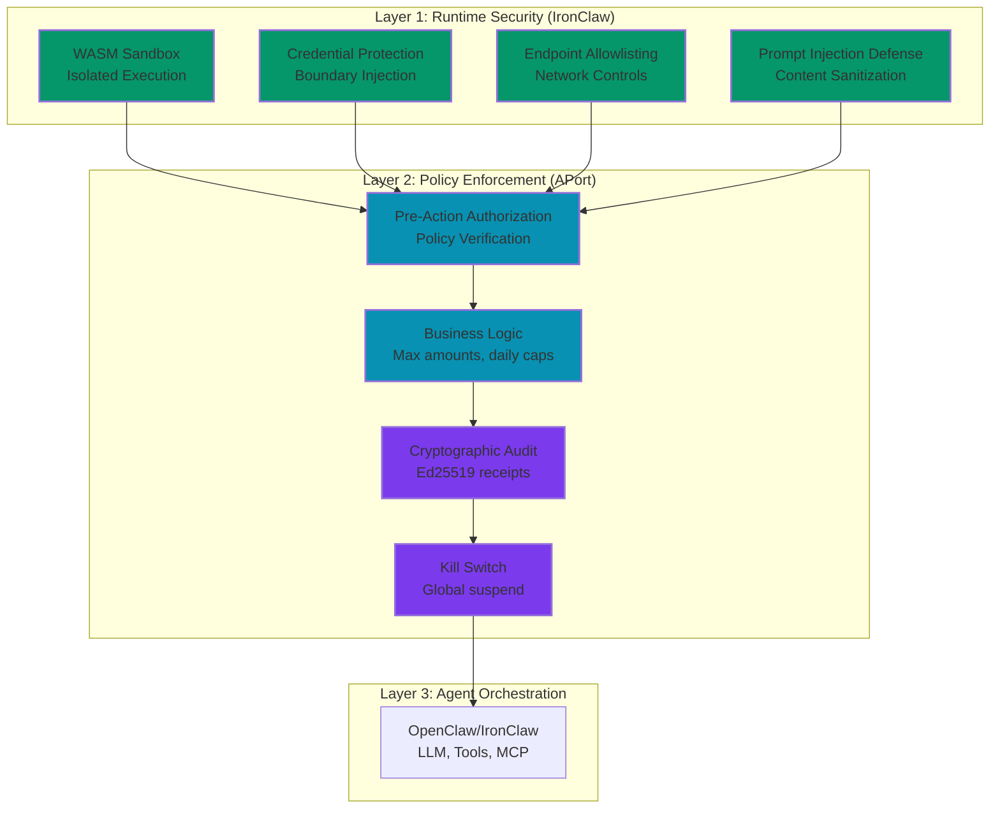

# APort Agent Guardrails: Naming & Scope Strategy

**Date:** February 14, 2026  
**Decision:** Repository name and scope for APort policy enforcement layer

---

## Executive Summary

**Recommendation:** `aporthq/aport-agent-guardrails` (or `aport-runtime-guardrails`)

**Why:** Generic name that works with all OpenClaw-compatible agent frameworks (OpenClaw TypeScript, IronClaw Rust, Go version, etc.)

**Key Insight:** APort doesn't compete with IronClaw—it **complements** it:
- **IronClaw** = Runtime security (sandboxing, isolation, credential protection)
- **APort** = Policy enforcement (business rules, limits, audit, kill switch)

---

## How APort Complements IronClaw (Not Competes)

### IronClaw's Security Model

**What IronClaw Provides:**
- ✅ **WASM Sandbox** - Isolated execution containers
- ✅ **Credential Protection** - Secrets injected at boundary, never exposed
- ✅ **Endpoint Allowlisting** - HTTP requests only to approved hosts
- ✅ **Prompt Injection Defense** - Pattern detection, content sanitization
- ✅ **Leak Detection** - Scans for secret exfiltration

**Layer:** Runtime security (infrastructure-level)

### APort's Policy Model

**What APort Adds:**
- ✅ **Graduated Controls** - "Allow refunds up to $100, deny larger"
- ✅ **Business Logic** - Daily caps, branch restrictions, PII filtering
- ✅ **Pre-Action Authorization** - Verify BEFORE execution (not after)
- ✅ **Cryptographic Audit** - Ed25519 signed receipts (court-admissible)
- ✅ **Global Kill Switch** - Suspend agent across all machines <15 seconds

**Layer:** Policy enforcement (business-rules-level)

### Defense-in-Depth Stack



**Result:** Complete security stack:
- **IronClaw** prevents malicious code execution
- **APort** prevents policy violations (business rules)

---

## Real-World Example: Why Both Are Needed

### Scenario: Agent tries to create 1000-file PR

**Without IronClaw:**
- ❌ Malicious code could execute with full user permissions
- ❌ Credentials could be leaked to external servers
- ❌ Unauthorized network access possible

**With IronClaw (but no APort):**
- ✅ Code runs in WASM sandbox (safe)
- ✅ Credentials protected (injected at boundary)
- ✅ Network requests allowlisted
- ❌ **BUT:** Agent still creates 1000-file PR (no size limit check)

**With IronClaw + APort:**
- ✅ Code runs in WASM sandbox (safe)
- ✅ Credentials protected (injected at boundary)
- ✅ Network requests allowlisted
- ✅ **PLUS:** APort checks policy → Denies 1000-file PR (exceeds 500 limit)

**Conclusion:** IronClaw prevents **malicious execution**, APort prevents **policy violations**.

---

## Naming Options Analysis

### Option 1: `aport-openclaw-integration` ❌

**Pros:**
- Clear what it integrates with
- Specific to OpenClaw ecosystem

**Cons:**
- ❌ Too specific (only works with OpenClaw TypeScript)
- ❌ Doesn't work with IronClaw (Rust), Go version, etc.
- ❌ Limits adoption to one framework

**Verdict:** Too narrow

---

### Option 2: `secure-openclaw` / `controlled-openclaw` ❌

**Pros:**
- Emphasizes security/control aspect

**Cons:**
- ❌ Implies it's a fork/variant of OpenClaw (it's not)
- ❌ Doesn't clarify it's a policy layer (not runtime security)
- ❌ Still too OpenClaw-specific

**Verdict:** Misleading (sounds like a fork)

---

### Option 3: `aport-agent-guardrails` ✅ **RECOMMENDED**

**Pros:**
- ✅ Generic (works with any agent framework)
- ✅ Clear purpose (guardrails = policy enforcement)
- ✅ Branded (APort)
- ✅ Descriptive (agent guardrails)

**Cons:**
- ⚠️ Slightly long name

**Verdict:** Best balance of clarity and generality

---

### Option 4: `aport-runtime-guardrails` ✅ **ALTERNATIVE**

**Pros:**
- ✅ Generic (works with any runtime)
- ✅ Emphasizes runtime policy enforcement
- ✅ Branded (APort)

**Cons:**
- ⚠️ "Runtime" might confuse with runtime security (IronClaw's domain)

**Verdict:** Good alternative, but "agent" is clearer

---

### Option 5: `aport-agent-policy` ⚠️

**Pros:**
- ✅ Generic
- ✅ Clear (policy enforcement)

**Cons:**
- ⚠️ Might conflict with "policy packs" terminology
- ⚠️ Less descriptive than "guardrails"

**Verdict:** Acceptable but not ideal

---

## Recommended Name: `aport-agent-guardrails`

### Repository Structure

```
aporthq/aport-agent-guardrails/
├── README.md                    # Works with OpenClaw, IronClaw, Go version, etc.
├── adapters/                    # Framework-specific adapters
│   ├── openclaw/               # OpenClaw (TypeScript) adapter
│   ├── ironclaw/               # IronClaw (Rust) adapter
│   └── go-claw/                # Go version adapter (future)
├── bin/                        # CLI tools (framework-agnostic)
├── policies/                   # Policy pack definitions
├── examples/                   # Framework-specific examples
│   ├── openclaw/
│   ├── ironclaw/
│   └── go-claw/
└── docs/                       # Documentation
```

### Tagline

**Long:** "Policy enforcement guardrails for OpenClaw-compatible agent frameworks"  
**Short (GitHub):** "Pre-action authorization guardrails for AI agents"

**Description:**
> APort Agent Guardrails adds pre-action authorization, graduated controls, and cryptographic audit trails to OpenClaw, IronClaw, and other compatible agent frameworks. Works alongside runtime security (sandboxing) to provide defense-in-depth protection.

---

## Scope: What Frameworks Are Supported?

### Phase 1: OpenClaw (TypeScript) ✅

**Status:** Current implementation  
**Integration:** AGENTS.md instructions, bash scripts  
**Target Users:** OpenClaw TypeScript users

### Phase 2: IronClaw (Rust) 📝

**Status:** Planned  
**Integration:** Rust crate, CLI tool  
**Target Users:** IronClaw users

**How It Works:**
- IronClaw has WASM sandbox (runtime security)
- APort adds policy layer (business rules)
- Integration via Rust crate: `aport-agent-guardrails-rs`

**Example:**
```rust
use aport_agent_guardrails::PolicyEnforcer;

let enforcer = PolicyEnforcer::new("~/.ironclaw/passport.json")?;

// Before executing tool
match enforcer.verify("git.create_pr", context)? {
    Decision::Allow => execute_tool(),
    Decision::Deny(reason) => return Err(reason),
}
```

### Phase 3: Go Version 📝

**Status:** Future  
**Integration:** Go package  
**Target Users:** Go OpenClaw users

---

## Positioning: How It Doesn't Compete

### IronClaw's Value Proposition

**"Your secure personal AI assistant, always on your side"**

**Focus:**
- Privacy (local data, encrypted)
- Runtime security (WASM sandbox, credential protection)
- Transparency (open source, auditable)

### APort's Value Proposition

**"Policy enforcement guardrails for AI agents"**

**Focus:**
- Business rules (graduated controls, limits)
- Compliance (audit trails, kill switch)
- Enterprise features (team collaboration, analytics)

### Complementary, Not Competitive

| Feature | IronClaw | APort |
|---------|----------|-------|
| **Runtime Security** | ✅ WASM sandbox | ❌ (not runtime security) |
| **Credential Protection** | ✅ Boundary injection | ❌ (not credential management) |
| **Policy Enforcement** | ⚠️ Basic (allow/deny lists) | ✅ Advanced (graduated controls) |
| **Business Logic** | ❌ | ✅ Max amounts, daily caps |
| **Audit Trail** | ⚠️ Basic logs | ✅ Cryptographic receipts |
| **Kill Switch** | ❌ | ✅ Global suspend |

**Result:** Use both for complete security:
- **IronClaw** = Runtime security (infrastructure)
- **APort** = Policy enforcement (business rules)

---

## Marketing Message

### For OpenClaw Users

**"Add policy enforcement to your OpenClaw agents"**

- Pre-action authorization
- Graduated controls (max PR size, daily caps)
- Cryptographic audit trails

### For IronClaw Users

**"Add business rules to IronClaw's runtime security"**

- IronClaw provides runtime security (sandboxing)
- APort adds policy enforcement (business rules)
- Together = Complete defense-in-depth

### For Enterprise Users

**"Enterprise-grade policy enforcement for AI agents"**

- Works with OpenClaw, IronClaw, and compatible frameworks
- SOC 2, IIROC, HIPAA compliant audit trails
- Global kill switch for incident response

---

## Implementation Strategy

### Phase 1: OpenClaw Integration (Q1 2026) ✅

**Repository:** `aporthq/aport-agent-guardrails`  
**Focus:** OpenClaw TypeScript integration  
**Status:** Current implementation  
**Deliverables:**
- CLI tools (bash scripts)
- AGENTS.md instructions
- Policy pack definitions

**Timeline:**
- ✅ Week 1-2: CLI tools, rate limiting, audit chaining
- ✅ Week 3-4: Policy templates, package.json, CI/CD
- ✅ Week 5-6: npm publishing, GitHub release

---

### Phase 2: IronClaw Adapter (Q2 2026) 📝

**Repository:** Same repo, new adapter  
**Focus:** Rust crate for IronClaw  
**Status:** Planned  
**Deliverables:**
- `aport-agent-guardrails-rs` crate
- IronClaw integration examples
- Documentation

**Timeline:**
- Week 1-2: Rust crate development
- Week 3-4: IronClaw integration examples
- Week 5-6: Documentation, testing, release

**How It Works:**
- IronClaw has WASM sandbox (runtime security)
- APort adds policy layer (business rules)
- Integration via Rust crate: `aport-agent-guardrails-rs`

**Example:**
```rust
use aport_agent_guardrails::PolicyEnforcer;

let enforcer = PolicyEnforcer::new("~/.ironclaw/passport.json")?;

// Before executing tool
match enforcer.verify("git.create_pr", context)? {
    Decision::Allow => execute_tool(),
    Decision::Deny(reason) => return Err(reason),
}
```

---

### Phase 3: Go Adapter (Q3 2026) 📝

**Repository:** Same repo, new adapter  
**Focus:** Go package for Go OpenClaw  
**Status:** Future  
**Deliverables:**
- Go package
- Integration examples
- Documentation

**Timeline:**
- Week 1-2: Go package development
- Week 3-4: Integration examples
- Week 5-6: Documentation, testing, release

---

### Phase 4: Python Adapter (Q4 2026) 📝

**Repository:** Same repo, new adapter  
**Focus:** Python package for LangChain, CrewAI, AutoGPT  
**Status:** Future  
**Deliverables:**
- Python package (`aport-agent-guardrails-python`)
- LangChain integration examples
- CrewAI integration examples
- AutoGPT integration examples
- Documentation

**Timeline:**
- Week 1-2: Python package development
- Week 3-4: Framework integrations (LangChain, CrewAI, AutoGPT)
- Week 5-6: Documentation, testing, release

**Why Python:**
- Many AI agent frameworks are Python-based
- Large developer community
- High adoption potential

**Example (LangChain):**
```python
from aport_agent_guardrails import PolicyEnforcer

enforcer = PolicyEnforcer("~/.langchain/passport.json")

# Before tool execution
decision = enforcer.verify("git.create_pr", context)
if not decision.allow:
    raise PolicyViolationError(decision.reason)

# Execute tool
execute_tool()
```

---

## Final Recommendation

### Repository Name: `aporthq/aport-agent-guardrails`

**Rationale:**
1. ✅ Generic (works with all OpenClaw-compatible frameworks)
2. ✅ Clear purpose (guardrails = policy enforcement)
3. ✅ Branded (APort)
4. ✅ Descriptive (agent guardrails)

### Tagline

**Long:** "Policy enforcement guardrails for OpenClaw-compatible agent frameworks"  
**Short (GitHub):** "Pre-action authorization guardrails for AI agents"

### Description

> APort Agent Guardrails adds pre-action authorization, graduated controls, and cryptographic audit trails to OpenClaw, IronClaw, and other compatible agent frameworks. Works alongside runtime security (sandboxing) to provide defense-in-depth protection.

### Key Messages

1. **Complements, doesn't compete** - Works with IronClaw's runtime security
2. **Framework-agnostic** - Works with OpenClaw, IronClaw, Go version, etc.
3. **Policy layer** - Business rules, not runtime security
4. **Enterprise-ready** - Audit trails, kill switch, compliance

---

## Next Steps

1. ✅ **Rename repo** - `aport-openclaw-integration` → `aport-agent-guardrails`
2. ✅ **Update README** - Clarify works with multiple frameworks
3. ✅ **Add adapters** - Create `adapters/` directory structure
4. ✅ **Document IronClaw integration** - How to use with IronClaw
5. ✅ **Marketing materials** - Blog post on "IronClaw + APort = Complete Security"

---

**Prepared by:** Claude (AI Assistant)  
**Date:** February 14, 2026  
**Status:** Ready for Implementation
