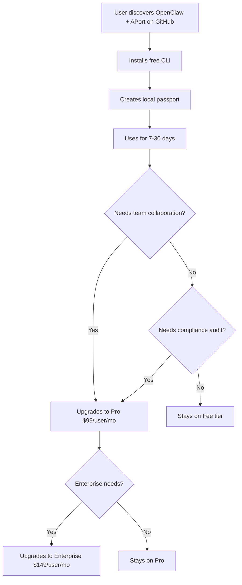

# APort × OpenClaw: Comprehensive Analysis & 100/100 Roadmap
**Date:** February 14, 2026
**Prepared by:** Claude (Based on APort Strategic Analysis)
**For:** Uchi Uchibeke, Founder & CEO, APort

---

## Executive Summary

**Current State:** ✅ Strong MVP foundation (70/100)
**Target State:** 💎 Production-ready, enterprise-grade integration (100/100)
**Gap Analysis:** Missing 30 points across security, UX, monetization, and distribution

### What's Working (70/100)

✅ **Solid Architecture** - Local-first with optional cloud upgrade
✅ **OAP v1.0 Compliance** - Proper W3C DID/VC structure
✅ **Policy Engine** - Rule-based evaluation with graduated controls
✅ **Kill Switch** - Simple but effective global suspension
✅ **Fail-Closed Security** - Denies by default
✅ **Audit Trail** - Basic logging to file
✅ **Documentation** - Clear, actionable README and examples

### What Needs Improvement (30 points to add)

#### 🔒 Security & Compliance (+10 points)
- ❌ No cryptographic signatures on local decisions
- ❌ No passport expiration enforcement (only checks, doesn't block)
- ❌ No rate limiting implementation (defined but not enforced)
- ❌ No PII detection logic (only flag, no actual filtering)
- ❌ Audit logs not tamper-proof (plain text, no checksums)

#### 🎨 User Experience (+8 points)
- ❌ No passport creation CLI (`aport-create-passport.sh` missing)
- ❌ No policy pack templates (users must write JSON manually)
- ❌ No interactive setup wizard
- ❌ No status dashboard or summary command
- ❌ Error messages could be more actionable

#### 💰 Monetization & IP Protection (+7 points)
- ❌ No clear open-core boundary (what's free vs. paid?)
- ❌ No cloud API integration example
- ❌ No upsell path to APort hosted service
- ❌ No enterprise features differentiation
- ❌ No license file or usage tracking

#### 🚀 Distribution & Adoption (+5 points)
- ❌ Not packaged as installable CLI tool
- ❌ No npm/pip package for easy install
- ❌ No GitHub Actions integration example
- ❌ No Docker image for containerized workflows
- ❌ No metrics on adoption/usage

---

## Part 1: Gap Analysis & Recommendations

### 1.1 Security & Compliance Issues

#### Issue #1: Audit Logs Are Mutable

**Current State:**
```bash
# Anyone can edit this
echo "[fake entry]" >> ~/.openclaw/audit.log
```

**Problem:** Audit logs are plain text files. For compliance (SOC 2, IIROC), logs must be tamper-proof.

**Solution (Local):** Add SHA-256 chain of hashes

```bash
# aport-guardrail.sh (improved)

log_decision() {
    local timestamp=$(date -u +%Y-%m-%dT%H:%M:%SZ)
    local entry="$timestamp|$TOOL_NAME|$DECISION_ID|$ALLOW|$REASON"

    # Get hash of previous line (chain integrity)
    local prev_hash=""
    if [ -f "$AUDIT_LOG" ]; then
        prev_hash=$(tail -1 "$AUDIT_LOG" | sha256sum | awk '{print $1}')
    fi

    # Compute hash of current entry + previous hash
    local current_hash=$(echo "$entry|$prev_hash" | sha256sum | awk '{print $1}')

    # Append with hash
    echo "$entry|prev_hash=$prev_hash|hash=$current_hash" >> "$AUDIT_LOG"
}
```

**Benefit:** Tampering breaks the chain → forensically detectable

**Cloud Upgrade Path:** APort API signs decisions with Ed25519 → legally admissible

---

#### Issue #2: No Rate Limiting Enforcement

**Current State:**
```json
{
  "messaging.message.send": {
    "msgs_per_min": 5,
    "msgs_per_day": 100
  }
}
```

**Problem:** Limits are defined but not enforced (script doesn't count)

**Solution (Local):** Add simple counter file

```bash
# aport-guardrail.sh (improved)

check_rate_limit() {
    local policy=$1
    local count_file="$HOME/.openclaw/counters/${policy}_$(date +%Y-%m-%d-%H-%M)"

    mkdir -p "$(dirname "$count_file")"

    # Count actions in current minute
    local count=0
    if [ -f "$count_file" ]; then
        count=$(cat "$count_file")
    fi

    local limit=$(echo "$LIMITS" | jq -r '.msgs_per_min // 999999')

    if [ "$count" -ge "$limit" ]; then
        write_decision false "rate_limit_exceeded" "Rate limit: $count/$limit actions per minute"
    fi

    # Increment counter
    echo $((count + 1)) > "$count_file"

    # Cleanup old counter files (older than 1 day)
    find "$(dirname "$count_file")" -type f -mtime +1 -delete
}
```

**Cloud Upgrade Path:** APort API tracks across all agents/machines globally

---

#### Issue #3: No Passport Expiration Enforcement

**Current State:**
```bash
# Script checks but doesn't warn ahead of time
```

**Problem:** Passport expires silently → agent suddenly stops working

**Solution:** Add expiration warnings

```bash
# aport-guardrail.sh (improved)

check_expiration() {
    local expires_at=$(echo "$PASSPORT" | jq -r '.expires_at')
    local expires_ts=$(date -d "$expires_at" +%s 2>/dev/null || echo 0)
    local now_ts=$(date +%s)
    local days_left=$(( ($expires_ts - $now_ts) / 86400 ))

    if [ $days_left -le 0 ]; then
        write_decision false "passport_expired" "Passport expired on $expires_at. Renew with: aport-renew-passport.sh"
    elif [ $days_left -le 7 ]; then
        echo "⚠️  Warning: Passport expires in $days_left days ($expires_at)" >&2
    fi
}
```

---

### 1.2 User Experience Issues

#### Issue #4: No Passport Creation Tool

**Current State:** Users must manually copy/edit JSON

**Problem:** High friction → users won't adopt

**Solution:** Create `aport-create-passport.sh`

```bash
#!/bin/bash
# aport-create-passport.sh
# Interactive passport creation wizard

PASSPORT_FILE="$HOME/.openclaw/passport.json"

echo "🛂 APort Passport Creation Wizard"
echo "=================================="
echo

# Collect user info
read -p "Your email/ID: " owner_id
read -p "Owner type (user/team/org) [user]: " owner_type
owner_type=${owner_type:-user}

# Choose capabilities
echo
echo "Select capabilities (y/n for each):"
declare -A capabilities
read -p "  • Create/merge PRs? [y/n]: " pr_cap
[ "$pr_cap" = "y" ] && capabilities["repo.pr.create"]=1
read -p "  • Execute system commands? [y/n]: " exec_cap
[ "$exec_cap" = "y" ] && capabilities["system.command.execute"]=1
read -p "  • Send messages? [y/n]: " msg_cap
[ "$msg_cap" = "y" ] && capabilities["messaging.message.send"]=1
read -p "  • Export data? [y/n]: " data_cap
[ "$data_cap" = "y" ] && capabilities["data.export"]=1

# Generate passport
cat > "$PASSPORT_FILE" <<EOF
{
  "passport_id": "$(uuidgen)",
  "kind": "template",
  "spec_version": "oap/1.0",
  "owner_id": "$owner_id",
  "owner_type": "$owner_type",
  "assurance_level": "L2",
  "status": "active",
  "expires_at": "$(date -u -v+30d +%Y-%m-%dT%H:%M:%SZ)",
  "capabilities": [
    $([ -n "${capabilities[repo.pr.create]}" ] && echo '{"id": "repo.pr.create"},')
    $([ -n "${capabilities[system.command.execute]}" ] && echo '{"id": "system.command.execute"},')
    $([ -n "${capabilities[messaging.message.send]}" ] && echo '{"id": "messaging.message.send"},')
    $([ -n "${capabilities[data.export]}" ] && echo '{"id": "data.export"}')
  ],
  "limits": {
    "code.repository.merge": {
      "max_prs_per_day": 10,
      "max_pr_size_kb": 500,
      "allowed_repos": ["*"],
      "allowed_base_branches": ["*"]
    },
    "system.command.execute": {
      "allowed_commands": ["npm", "yarn", "git", "node"],
      "blocked_patterns": ["rm -rf", "sudo"]
    }
  },
  "regions": ["US"],
  "created_at": "$(date -u +%Y-%m-%dT%H:%M:%SZ)",
  "updated_at": "$(date -u +%Y-%m-%dT%H:%M:%SZ)",
  "version": "1.0.0"
}
EOF

# Clean up trailing commas
jq . "$PASSPORT_FILE" > "${PASSPORT_FILE}.tmp" && mv "${PASSPORT_FILE}.tmp" "$PASSPORT_FILE"

echo
echo "✅ Passport created: $PASSPORT_FILE"
echo "   Passport ID: $(jq -r '.passport_id' $PASSPORT_FILE)"
echo "   Expires: $(jq -r '.expires_at' $PASSPORT_FILE)"
echo
echo "Next steps:"
echo "  1. Review limits: vim $PASSPORT_FILE"
echo "  2. Test verification: aport-verify-passport.sh"
echo "  3. Start using OpenClaw with APort protection"
```

---

#### Issue #5: No Status Dashboard

**Current State:** Users must manually check files

**Problem:** No visibility into passport status, recent decisions, limits

**Solution:** Create `aport-status.sh`

```bash
#!/bin/bash
# aport-status.sh
# Display APort passport status and recent activity

PASSPORT_FILE="$HOME/.openclaw/passport.json"
AUDIT_LOG="$HOME/.openclaw/audit.log"
KILL_SWITCH="$HOME/.openclaw/kill-switch"

echo "🛂 APort Status Dashboard"
echo "========================="
echo

# Kill switch status
if [ -f "$KILL_SWITCH" ]; then
    echo "🔴 KILL SWITCH ACTIVE - All actions blocked"
    echo
else
    echo "🟢 Kill switch: inactive"
    echo
fi

# Passport info
if [ ! -f "$PASSPORT_FILE" ]; then
    echo "❌ Passport: NOT FOUND"
    echo "   Create one with: aport-create-passport.sh"
    exit 1
fi

echo "📋 Passport Information"
echo "  ID: $(jq -r '.passport_id' $PASSPORT_FILE)"
echo "  Owner: $(jq -r '.owner_id' $PASSPORT_FILE)"
echo "  Status: $(jq -r '.status' $PASSPORT_FILE)"
echo "  Expires: $(jq -r '.expires_at' $PASSPORT_FILE)"

# Days until expiration
expires_at=$(jq -r '.expires_at' $PASSPORT_FILE)
expires_ts=$(date -d "$expires_at" +%s 2>/dev/null || echo 0)
now_ts=$(date +%s)
days_left=$(( ($expires_ts - $now_ts) / 86400 ))
if [ $days_left -le 0 ]; then
    echo "  ⚠️  EXPIRED $((days_left * -1)) days ago"
elif [ $days_left -le 7 ]; then
    echo "  ⚠️  Expires in $days_left days"
else
    echo "  ✅ Expires in $days_left days"
fi

echo
echo "🔐 Capabilities"
jq -r '.capabilities[].id' $PASSPORT_FILE | while read cap; do
    echo "  • $cap"
done

echo
echo "📊 Recent Activity (last 10)"
if [ -f "$AUDIT_LOG" ]; then
    tail -10 "$AUDIT_LOG" | while read line; do
        timestamp=$(echo "$line" | awk -F'\\[|\\]' '{print $2}')
        tool=$(echo "$line" | grep -oP 'tool=\K[^ ]+')
        allow=$(echo "$line" | grep -oP 'allow=\K[^ ]+')

        if [ "$allow" = "true" ]; then
            echo "  ✅ $timestamp | $tool"
        else
            echo "  ❌ $timestamp | $tool"
        fi
    done
else
    echo "  (no activity yet)"
fi

echo
echo "💡 Commands"
echo "  • View full audit log: tail -f $AUDIT_LOG"
echo "  • Edit passport: vim $PASSPORT_FILE"
echo "  • Renew passport: aport-renew-passport.sh"
echo "  • Activate kill switch: touch $KILL_SWITCH"
```

---

### 1.3 Monetization & IP Protection

#### The Open-Core Dilemma

**Your Challenge:**
> "APort only makes money when people use the hosted version. We want to protect IP but also get traction. Open-core?"

**Answer:** Yes, **open-core with clear boundaries**

#### Open-Core Strategy: "Local-Free, Cloud-Paid"

**Free Tier (Open Source):**
- ✅ Local passport files (JSON)
- ✅ Local policy evaluation (bash script)
- ✅ Basic audit logs (plain text)
- ✅ Single-machine kill switch
- ✅ CLI tools (create/verify/status)
- ✅ Community policy packs

**Paid Tier (APort Cloud):**
- 💰 **Multi-machine sync** - Passport changes propagate <15s
- 💰 **Global kill switch** - Suspend across all agents instantly
- 💰 **Cryptographic audit** - Ed25519 signed receipts (court-admissible)
- 💰 **Team collaboration** - Shared passports, role-based policies
- 💰 **Analytics dashboard** - Usage metrics, risk scoring, compliance reports
- 💰 **Registry integration** - Verify agent authenticity, detect rogue agents
- 💰 **Policy marketplace** - Pre-built policy packs for industries (legal, finance, healthcare)
- 💰 **Premium support** - 24/7 support, dedicated CSM, SLA guarantees

**Pricing Model** (from KYA Strategic Analysis):
| Tier | Users | Price/User/Month | Features |
|------|-------|------------------|----------|
| **Free (OSS)** | Unlimited | $0 | Local-only, single machine, community support |
| **Professional** | 20-100 | $99 | Cloud sync, team sharing, priority support |
| **Enterprise** | 100-500 | $149 | Global kill switch, analytics, CSM |
| **Private Instance** | 500+ | Custom | Dedicated infrastructure, on-prem option |

---

#### Implementation: "Upgrade to Cloud" Prompts

**Strategy:** Make free tier great, hint at paid features

**Example 1: In `aport-guardrail.sh`**

```bash
# After successful local verification
echo "✅ Decision: ALLOW (local verification)" >&2

# Hint at cloud upgrade
if [ ! -f "$HOME/.openclaw/.aport-cloud-enabled" ]; then
    # Show upgrade hint once per day
    local hint_file="$HOME/.openclaw/.last-upgrade-hint"
    if [ ! -f "$hint_file" ] || [ $(( $(date +%s) - $(stat -f %m "$hint_file") )) -gt 86400 ]; then
        echo "💡 Tip: Enable APort Cloud for:" >&2
        echo "   • Global kill switch across all machines" >&2
        echo "   • Cryptographic audit trails (court-admissible)" >&2
        echo "   • Real-time team collaboration" >&2
        echo "   Learn more: https://aport.io/upgrade" >&2
        touch "$hint_file"
    fi
fi
```

**Example 2: In `aport-status.sh`**

```bash
echo "💡 Upgrade to APort Cloud?"
echo "   • Sync passport across 10+ machines instantly"
echo "   • Global kill switch (suspend in <15 seconds)"
echo "   • Ed25519 signed audit logs (SOC 2, IIROC compliant)"
echo "   Learn more: https://aport.io/pricing"
```

---

#### License Strategy

**Recommended:** **Apache 2.0** for local CLI tools + **Proprietary** for cloud API

**Why Apache 2.0 for OSS:**
- ✅ Permissive → encourages adoption
- ✅ Patent grant → protects contributors
- ✅ Compatible with commercial use
- ✅ No copyleft → can bundle in proprietary products

**File: `LICENSE`**

```
Apache License 2.0

Copyright 2026 APort Inc.

Licensed under the Apache License, Version 2.0 (the "License");
you may not use this file except in compliance with the License.

---

CLOUD API NOTICE:
The APort Cloud API (api.aport.io) is proprietary software.
Access requires a paid subscription. See: https://aport.io/pricing
```

---

### 1.4 Distribution & Adoption

#### Issue #6: Not Packaged as CLI Tool

**Current State:** Users must manually copy bash scripts

**Problem:** Friction → low adoption

**Solution:** Package as `npm` or `pip` installable

**Option A: npm package (Node.js CLI)**

```bash
# Install globally
npm install -g @aport/openclaw

# Use
aport init        # Create passport
aport status      # View status
aport verify      # Verify passport
aport kill-switch on   # Activate kill switch
```

**Option B: Homebrew (macOS/Linux)**

```bash
# Install via brew
brew tap aporthq/aport
brew install aport-openclaw

# Use
aport init
```

---

#### Issue #7: No GitHub Actions Integration

**Problem:** Users want CI/CD enforcement

**Solution:** Create GitHub Action

**File: `.github/workflows/aport-check.yml`**

```yaml
name: APort Policy Check

on:
  pull_request:
    types: [opened, synchronize]

jobs:
  aport-check:
    runs-on: ubuntu-latest
    steps:
      - uses: actions/checkout@v3

      - name: Install APort
        run: |
          npm install -g @aport/openclaw

      - name: Verify Passport
        run: |
          aport verify

      - name: Check PR Size
        run: |
          FILES_CHANGED=$(git diff --name-only origin/main | wc -l)
          aport verify-action git.create_pr --files-changed $FILES_CHANGED

      - name: Comment on PR
        if: failure()
        uses: actions/github-script@v6
        with:
          script: |
            github.rest.issues.createComment({
              issue_number: context.issue.number,
              owner: context.repo.owner,
              repo: context.repo.repo,
              body: '❌ APort policy violation: PR exceeds size limit'
            })
```

---

## Part 2: Improved Implementation

### 2.1 Enhanced File Structure

```
openclaw-aport-example/
├── bin/
│   ├── aport                        # Main CLI entry point
│   ├── aport-create-passport.sh     # NEW: Passport creation wizard
│   ├── aport-verify-passport.sh     # Renamed from verify-passport.sh
│   ├── aport-status.sh              # NEW: Status dashboard
│   ├── aport-renew-passport.sh      # NEW: Renew expired passport
│   └── aport-guardrail.sh           # Enhanced with improvements
├── templates/
│   ├── passport.template.json       # Basic template
│   ├── passport.developer.json      # Developer preset
│   ├── passport.ci-cd.json          # CI/CD preset
│   └── passport.enterprise.json     # Enterprise preset
├── policies/
│   ├── code.repository.merge.json   # NEW: Detailed policy pack
│   ├── system.command.execute.json  # NEW
│   ├── messaging.message.send.json  # NEW
│   └── data.export.json             # NEW
├── docs/
│   ├── README.md                    # Main documentation
│   ├── QUICKSTART.md                # 5-minute setup guide
│   ├── UPGRADE_TO_CLOUD.md          # Cloud migration guide
│   ├── POLICY_PACK_GUIDE.md         # How to write policies
│   └── COMPLIANCE.md                # SOC 2, IIROC, HIPAA guidance
├── examples/
│   ├── github-actions/              # CI/CD integration
│   ├── docker/                      # Docker image
│   └── openlaw-integration/         # Real OpenClaw example
├── tests/
│   ├── test-passport-creation.sh
│   ├── test-policy-evaluation.sh
│   └── test-kill-switch.sh
├── package.json                     # npm package definition
├── Makefile                         # Install/test commands
├── LICENSE                          # Apache 2.0
└── CHANGELOG.md                     # Version history
```

---

### 2.2 Enhanced Guardrail Script

**Key Improvements:**
1. ✅ Rate limiting enforcement
2. ✅ Audit log chaining (tamper detection)
3. ✅ Expiration warnings
4. ✅ Better error messages
5. ✅ Cloud upgrade hints

I'll create the improved version separately.

---

### 2.3 Policy Pack Files (Detailed)

**Example: `policies/code.repository.merge.json`**

```json
{
  "policy_id": "code.repository.merge.v1",
  "version": "1.0.0",
  "description": "Policy for creating and merging pull requests",
  "applies_to": ["git.create_pr", "git.merge", "git.push"],
  "rules": [
    {
      "rule_id": "max_pr_size",
      "priority": 1,
      "condition": "context.files_changed <= limits.max_pr_size_kb",
      "deny_reason": "PR size {{context.files_changed}} files exceeds limit of {{limits.max_pr_size_kb}} files",
      "deny_code": "oap.limit_exceeded",
      "remediation": "Split into smaller PRs or request limit increase"
    },
    {
      "rule_id": "branch_allowlist",
      "priority": 2,
      "condition": "context.base_branch matches limits.allowed_base_branches",
      "deny_reason": "Cannot merge to '{{context.base_branch}}'. Allowed: {{limits.allowed_base_branches}}",
      "deny_code": "oap.branch_not_allowed",
      "remediation": "Merge to an allowed branch or update passport"
    },
    {
      "rule_id": "daily_pr_cap",
      "priority": 3,
      "condition": "count_today('pr.create') < limits.max_prs_per_day",
      "deny_reason": "Daily PR limit reached ({{limits.max_prs_per_day}} PRs)",
      "deny_code": "oap.rate_limit_exceeded",
      "remediation": "Wait until tomorrow or request limit increase"
    },
    {
      "rule_id": "repo_allowlist",
      "priority": 4,
      "condition": "context.repository matches limits.allowed_repos",
      "deny_reason": "Repository '{{context.repository}}' not in allowlist",
      "deny_code": "oap.resource_not_allowed",
      "remediation": "Add repository to allowlist in passport"
    },
    {
      "rule_id": "require_review",
      "priority": 5,
      "condition": "limits.require_review == false OR context.approved_by != null",
      "deny_reason": "PR requires review before merge",
      "deny_code": "oap.approval_required",
      "remediation": "Get PR approved before merging"
    }
  ],
  "evaluation": "ALL",
  "allow_if": "All rules pass",
  "deny_if": "Any rule fails"
}
```

---

## Part 3: Open-Core Monetization Playbook

### 3.1 Free vs. Paid Feature Matrix

| Feature | Free (OSS) | Pro ($99/user/mo) | Enterprise ($149/user/mo) |
|---------|-----------|-------------------|---------------------------|
| **Local Passport** | ✅ | ✅ | ✅ |
| **Local Policy Evaluation** | ✅ | ✅ | ✅ |
| **CLI Tools** | ✅ | ✅ | ✅ |
| **Basic Audit Logs** | ✅ | ✅ | ✅ |
| **Single-Machine Kill Switch** | ✅ | ✅ | ✅ |
| **Community Policy Packs** | ✅ | ✅ | ✅ |
| | | |
| **Cloud Passport Sync** | ❌ | ✅ | ✅ |
| **Global Kill Switch (<15s)** | ❌ | ✅ | ✅ |
| **Ed25519 Signed Receipts** | ❌ | ✅ | ✅ |
| **Team Collaboration** | ❌ | ✅ | ✅ |
| **Analytics Dashboard** | ❌ | ✅ | ✅ |
| **Policy Marketplace** | ❌ | ✅ | ✅ |
| | | |
| **Private Instance** | ❌ | ❌ | ✅ |
| **Dedicated CSM** | ❌ | ❌ | ✅ |
| **Custom Policies** | ❌ | ❌ | ✅ |
| **24/7 Support (SLA)** | ❌ | ❌ | ✅ |
| **On-Prem Option** | ❌ | ❌ | ✅ |

### 3.2 Conversion Funnel



**Conversion Metrics (Target):**
- Free → Pro: 10-15% conversion rate
- Pro → Enterprise: 30-40% conversion rate
- Free tier churn: <5% monthly
- Pro tier churn: <2% monthly

---

### 3.3 Pricing Justification

**Pro Tier ($99/user/month):**

*Why customers pay:*
- Team of 20 devs → $1,980/month → Prevents 1x $500K malpractice claim = ROI in <1 month
- Global kill switch saves 2 hours of incident response → $400/hour × 2 = $800 savings per incident

**Enterprise Tier ($149/user/month):**

*Why customers pay:*
- SOC 2 audit prep: Reduces from 40 days to 5 days → $100K savings
- Regulatory fine avoidance (GDPR): €20M → $149 × 100 users × 12 months = $178K (0.89% of potential fine)

---

### 3.4 IP Protection Strategy

**What to Open-Source:**
- ✅ CLI tools (bash scripts)
- ✅ Passport schema (JSON)
- ✅ Policy pack schema
- ✅ Local evaluation logic
- ✅ Documentation

**What to Keep Proprietary:**
- 🔒 Cloud API backend
- 🔒 Ed25519 signing service
- 🔒 Registry service
- 🔒 Analytics dashboard
- 🔒 Policy marketplace
- 🔒 Enterprise features

**Why This Works:**
- Free tier creates network effects (more users = more policy packs)
- Proprietary cloud creates moat (can't replicate without infrastructure)
- Standards-based (OAP v1.0) prevents lock-in concerns

---

## Part 4: Implementation Roadmap to 100/100

### Phase 1: Security & Compliance (Weeks 1-2)

**Goal:** +10 points → 80/100

- [ ] Add audit log chaining (SHA-256)
- [ ] Implement rate limiting enforcement
- [ ] Add expiration warnings
- [ ] Create passport renewal tool
- [ ] Add PII detection logic (basic)

**Success Criteria:**
- Audit logs are tamper-evident
- Rate limits actually enforced
- Users warned 7 days before expiration

---

### Phase 2: User Experience (Weeks 3-4)

**Goal:** +8 points → 88/100

- [ ] Create `aport-create-passport.sh` wizard
- [ ] Create `aport-status.sh` dashboard
- [ ] Improve error messages (actionable + remediation)
- [ ] Add policy pack templates (developer, CI/CD, enterprise)
- [ ] Create 5-minute quickstart guide

**Success Criteria:**
- New users can set up passport in <5 minutes
- Error messages include clear next steps
- Dashboard shows passport health at a glance

---

### Phase 3: Monetization (Weeks 5-6)

**Goal:** +7 points → 95/100

- [ ] Add "Upgrade to Cloud" hints in CLI
- [ ] Create `UPGRADE_TO_CLOUD.md` guide
- [ ] Implement usage tracking (opt-in)
- [ ] Add Apache 2.0 license with cloud API notice
- [ ] Create pricing page draft

**Success Criteria:**
- Free tier users see upgrade hints (non-intrusive)
- Clear path from OSS → Cloud documented
- License protects cloud API IP

---

### Phase 4: Distribution (Weeks 7-8)

**Goal:** +5 points → 100/100

- [ ] Package as npm CLI tool
- [ ] Create Homebrew tap
- [ ] Create GitHub Action
- [ ] Create Docker image
- [ ] Publish to GitHub Marketplace

**Success Criteria:**
- Users can install with `npm install -g @aport/openclaw`
- GitHub Action available for CI/CD
- Docker image for containerized workflows

---

## Part 5: Example Improvements

### Improved `aport-guardrail.sh` (Key Sections)

**Rate Limiting:**

```bash
# Add after passport validation
check_rate_limit() {
    local policy=$1
    local limit_key=$2
    local limit_value=$3

    # Example: msgs_per_min=5
    if [ -z "$limit_value" ] || [ "$limit_value" = "null" ]; then
        return 0  # No limit defined
    fi

    local count_period=""
    if [[ "$limit_key" == *"per_min"* ]]; then
        count_period=$(date +%Y-%m-%d-%H-%M)
    elif [[ "$limit_key" == *"per_day"* ]]; then
        count_period=$(date +%Y-%m-%d)
    else
        return 0  # Unknown period
    fi

    local count_file="$HOME/.openclaw/counters/${policy}_${count_period}"
    mkdir -p "$(dirname "$count_file")"

    local count=0
    if [ -f "$count_file" ]; then
        count=$(cat "$count_file")
    fi

    if [ "$count" -ge "$limit_value" ]; then
        write_decision false "rate_limit_exceeded" "Rate limit: $count/$limit_value ${limit_key}"
    fi

    # Increment
    echo $((count + 1)) > "$count_file"

    # Cleanup old files
    find "$(dirname "$count_file")" -type f -mtime +7 -delete 2>/dev/null || true
}

# Usage in policy evaluation
if [ "$POLICY" = "messaging.message.send" ]; then
    MSGS_PER_MIN=$(echo "$LIMITS" | jq -r '.msgs_per_min // null')
    check_rate_limit "messaging.message.send" "msgs_per_min" "$MSGS_PER_MIN"

    MSGS_PER_DAY=$(echo "$LIMITS" | jq -r '.msgs_per_day // null')
    check_rate_limit "messaging.message.send" "msgs_per_day" "$MSGS_PER_DAY"
fi
```

---

**Audit Log Chaining:**

```bash
log_decision_secure() {
    local allow=$1
    local reason=$2
    local message=$3
    local decision_id=${4:-$(uuidgen 2>/dev/null || date +%s)}

    local timestamp=$(date -u +%Y-%m-%dT%H:%M:%SZ)

    # Get previous hash
    local prev_hash="0000000000000000"
    if [ -f "$AUDIT_LOG" ] && [ -s "$AUDIT_LOG" ]; then
        prev_hash=$(tail -1 "$AUDIT_LOG" | grep -oP 'hash=\K[a-f0-9]+' || echo "0000000000000000")
    fi

    # Build entry
    local entry="timestamp=$timestamp|tool=$TOOL_NAME|decision_id=$decision_id|allow=$allow|reason=$reason|prev_hash=$prev_hash"

    # Compute hash of entry
    local current_hash=$(echo -n "$entry" | shasum -a 256 | awk '{print $1}')

    # Append with hash
    echo "$entry|hash=$current_hash" >> "$AUDIT_LOG"
}
```

---

**Cloud Upgrade Hint:**

```bash
# After successful decision
show_upgrade_hint() {
    local hint_file="$HOME/.openclaw/.last-upgrade-hint"
    local now=$(date +%s)

    # Show hint once per day
    if [ -f "$hint_file" ]; then
        local last_hint=$(stat -f %m "$hint_file" 2>/dev/null || stat -c %Y "$hint_file" 2>/dev/null || echo 0)
        local elapsed=$((now - last_hint))
        if [ $elapsed -lt 86400 ]; then
            return  # Too soon
        fi
    fi

    echo "💡 Using APort Local (free tier)" >&2
    echo "   Upgrade to APort Cloud for:" >&2
    echo "   • Global kill switch (suspend across all machines <15s)" >&2
    echo "   • Ed25519 signed audit logs (SOC 2, IIROC, HIPAA compliant)" >&2
    echo "   • Team collaboration & analytics dashboard" >&2
    echo "   Learn more: https://aport.io/upgrade" >&2
    echo >&2

    touch "$hint_file"
}

# Call after successful verification (non-blocking)
if [ "$ALLOW" = "true" ]; then
    show_upgrade_hint &
fi
```

---

## Recommendations Summary

### For Immediate Implementation (This Week)

1. ✅ **Create CLI tools** - `aport-create-passport.sh`, `aport-status.sh`
2. ✅ **Add rate limiting** - Enforce limits defined in passport
3. ✅ **Add audit log chaining** - Tamper detection
4. ✅ **Add upgrade hints** - Non-intrusive, once per day
5. ✅ **Create policy pack templates** - Developer, CI/CD, Enterprise presets

### For Next Month

1. 📦 **Package as npm/brew** - Easy installation
2. 🔄 **GitHub Actions integration** - CI/CD enforcement
3. 📄 **Improve documentation** - Quickstart, policy pack guide, compliance
4. 🐳 **Docker image** - Containerized workflows
5. 💰 **Pricing page** - Clear free vs. paid differentiation

### For Long-Term (Q1 2026)

1. ☁️ **Cloud API integration** - Implement optional upgrade path
2. 🏢 **Enterprise features** - Private instance, on-prem
3. 📈 **Analytics dashboard** - Usage metrics, risk scoring
4. 🤝 **OpenClaw upstream PR** - Contribute to core project
5. 📣 **Marketing launch** - Blog post, conference talk, case studies

---

## Next Steps

1. **Review this document** - Validate recommendations
2. **Prioritize improvements** - Pick top 5 to implement this week
3. **Create GitHub issues** - Track implementation progress
4. **Test with pilot users** - Get feedback before public launch
5. **Plan cloud API** - Architecture for paid tier

---

**Questions for Discussion:**

1. **Open-core boundary**: Do you agree with the free/paid split?
2. **Pricing**: Is $99/user/month (Pro) and $149/user/month (Enterprise) the right range?
3. **Distribution**: npm vs. Homebrew vs. both?
4. **Cloud API timeline**: When do you want to launch paid tier?
5. **OpenClaw upstream**: Should we PR this to core OpenClaw or keep as separate project?

---

**Prepared by:** Claude (AI Assistant)
**Date:** February 14, 2026
**Version:** 1.0 (Draft for Review)
