# APort → OpenClaw Integration Proposal
**Date:** February 14, 2026
**Author:** Uchi Uchibeke, Founder & CEO, APort
**For:** OpenClaw Community + Anthropic Team

---

## Executive Summary

**The Question:** Can I require OpenClaw to verify agent passports and check policies before performing any action? Where does this fit: AGENTS.md, TOOLS.md, or IDENTITY.md?

**The Answer:** Yes, and the best approach is **multi-layered**:
1. **AGENTS.md** = Policy requirement definition (session-wide rules)
2. **Local Passport** = JSON/YAML file with W3C DID/VC structure (no cloud dependency)
3. **Skill Wrapper** = Pre-action verification layer (can be enabled/disabled)
4. **Optional Cloud** = APort API for advanced features (registry, kill switch, immutable audit)

**Key Insight:** Start with **local-first security** (passport + policy files in repo), optionally upgrade to **APort cloud** for enterprise features (global kill switch, registry, cryptographic audit trails).

---

## Table of Contents

1. [Problem Statement](#1-problem-statement)
2. [Solution Architecture](#2-solution-architecture)
3. [Local-First Implementation](#3-local-first-implementation)
4. [Cloud-Enhanced Implementation](#4-cloud-enhanced-implementation)
5. [Integration Options](#5-integration-options)
6. [Comparison with TrustClaw](#6-comparison-with-trustclaw)
7. [Implementation Roadmap](#7-implementation-roadmap)
8. [Example Use Cases](#8-example-use-cases)

---

## 1. Problem Statement

### What OpenClaw Lacks Today

**Current State:**
- OpenClaw has no pre-action authorization layer
- Users rely on prompt engineering ("don't do X") or manual approval
- No graduated controls (e.g., "allow PRs up to 500 files, deny larger")
- No audit trail (actions happen, but no proof of policy compliance)
- No kill switch (can't globally suspend agent if compromised)

**Real-World Risks:**
- **Prompt injection:** Malicious user tricks agent into exfiltrating data
- **Overpermissioned actions:** Agent creates 1000-file PR because no size limit
- **Audit failures:** Enterprise compliance requires proof agent followed policies
- **Rogue agent:** No way to suspend agent globally if detected misbehaving

**Example from your GitHub issue #2022 on OpenAI agents-python:**
> "Guardrails are great for model safety. But enterprises also need authorization layer: graduated controls (max amounts, approval workflows), cross-agent policies, and cryptographic proof. That's what APort provides."

**Your Tweet Context (Sarah's thread):**
- TrustClaw (by Composio) addresses OpenClaw vulnerabilities:
  - 5,700+ unvetted community skills (malicious cases found)
  - 900+ exposed API tokens in plaintext
  - Scripts executing locally with full user permissions
- TrustClaw's solution: OAuth (not plaintext keys), sandboxed execution (cloud), curated integrations
- **Missing from TrustClaw:** Pre-action policy enforcement with graduated controls (that's APort's value)

---

## 2. Solution Architecture

### Three-Layer Security Model


**Key Principles:**
1. **Local-first:** Passport + policies live in repo (no cloud dependency)
2. **Explicit control:** User must manually create/update passport (no auto-generation)
3. **Fail-closed:** If passport missing/invalid, agent refuses to act
4. **Opt-in cloud:** Advanced features (registry, kill switch) require APort API

---

## 3. Local-First Implementation

### Where to Define the Policy Requirement

**AGENTS.md (RECOMMENDED)** - Session-wide rules enforced at boot time

```markdown
# AGENTS.md

## Pre-Action Authorization (APort Policy Enforcement)

### Requirements
- **Passport Required:** Every action MUST be validated against `auth/passport.json`
- **Policy Checks:** Tools are mapped to policy packs (see `auth/policies/`)
- **Failure Behavior:** If passport missing, expired, or policy denies → REFUSE action

### Passport Location
- **File:** `auth/passport.json` (W3C DID/VC format, OAP v1.0 compliant)
- **Verification:** Check `status: "active"` and `expires_at` before any tool call
- **Renewal:** If expired, prompt user: "Passport expired. Run `make verify-passport` to renew."

### Policy Mapping
| Tool | Policy Pack | Local Policy File |
|------|-------------|-------------------|
| `git commit`, `git push` | `code.repository.merge.v1` | `auth/policies/code.repository.merge.json` |
| `file write`, `file delete` | `data.filesystem.write.v1` | `auth/policies/data.filesystem.write.json` |
| `exec`, `shell` | `system.command.execute.v1` | `auth/policies/system.command.execute.json` |

### Enforcement Flow
1. User requests action: "Create PR with 1000 files"
2. Agent looks up policy: `git push` → `code.repository.merge.v1`
3. Agent loads policy: `auth/policies/code.repository.merge.json`
4. Agent evaluates rules:
   - ✅ Passport active?
   - ✅ Files ≤ 500? (1000 > 500 = DENY)
5. Agent refuses: "Policy violation: PR size 1000 files exceeds limit of 500"
6. Agent logs decision: `logs/decisions/2026-02-14.log`

### Manual Override
- User can override: Add `--force-allow` flag to command
- Requires confirmation: "Override policy? Type 'yes' to confirm."
- Logged: All overrides logged to `logs/overrides/`
```

**TOOLS.md** - Environment-specific notes (API keys, device names)
- Not recommended for policy enforcement (TOOLS.md is for configuration, not rules)
- Better use: Document how to get passport (`make verify-passport`)

**IDENTITY.md** - Personal flavor (name, role)
- Not recommended for policy enforcement (IDENTITY.md is for user preferences)

---

### Passport File Structure (Local)

**Location:** `auth/passport.json`

```json
{
  "passport_id": "550e8400-e29b-41d4-a716-446655440000",
  "kind": "template",
  "spec_version": "oap/1.0",
  "owner_id": "uchi@aport.io",
  "owner_type": "individual",
  "assurance_level": "L2",
  "status": "active",
  "expires_at": "2026-03-14T00:00:00Z",
  "capabilities": [
    {"id": "repo.pr.create", "params": {}},
    {"id": "repo.merge", "params": {}},
    {"id": "file.write", "params": {}},
    {"id": "data.export", "params": {}}
  ],
  "limits": {
    "code.repository.merge": {
      "max_prs_per_day": 10,
      "max_merges_per_day": 5,
      "max_pr_size_files": 500,
      "allowed_repos": ["aporthq/*", "openclaw/*"],
      "allowed_base_branches": ["feature/*", "bugfix/*", "main"],
      "require_review": false
    },
    "data.export": {
      "max_export_rows": 10000,
      "allow_pii": false,
      "allowed_formats": ["csv", "json"]
    },
    "system.command.execute": {
      "allowed_commands": ["npm", "pnpm", "git", "make"],
      "blocked_commands": ["rm -rf", "sudo", "curl | bash"],
      "require_approval": true
    }
  },
  "regions": ["US", "CA"],
  "created_at": "2026-02-14T00:00:00Z",
  "updated_at": "2026-02-14T00:00:00Z",
  "version": "1.0.0",
  "signature": null,
  "_comment": "Local passport - no signature. For cloud-verified passport, add Ed25519 signature."
}
```

**Key Fields:**
- `status`: "active" | "suspended" | "revoked" (kill switch)
- `expires_at`: Force renewal every 30 days (prevents stale permissions)
- `capabilities`: What agent CAN do (allowlist, not denylist)
- `limits`: Business logic (max amounts, daily caps, allowlists)

---

### Policy Pack Files (Local)

**Location:** `auth/policies/code.repository.merge.json`

```json
{
  "policy_id": "code.repository.merge.v1",
  "description": "Policy for creating and merging pull requests",
  "rules": [
    {
      "rule_id": "max_pr_size",
      "condition": "context.files_changed <= limits.max_pr_size_files",
      "deny_reason": "PR size {{context.files_changed}} files exceeds limit of {{limits.max_pr_size_files}} files",
      "deny_code": "oap.limit_exceeded"
    },
    {
      "rule_id": "branch_allowlist",
      "condition": "context.base_branch in limits.allowed_base_branches",
      "deny_reason": "Cannot merge to '{{context.base_branch}}'. Allowed: {{limits.allowed_base_branches}}",
      "deny_code": "oap.branch_not_allowed"
    },
    {
      "rule_id": "daily_pr_cap",
      "condition": "count_today('pr.create') < limits.max_prs_per_day",
      "deny_reason": "Daily PR limit reached ({{limits.max_prs_per_day}} PRs)",
      "deny_code": "oap.rate_limit_exceeded"
    },
    {
      "rule_id": "repo_allowlist",
      "condition": "context.repository matches limits.allowed_repos",
      "deny_reason": "Repository '{{context.repository}}' not in allowlist",
      "deny_code": "oap.resource_not_allowed"
    }
  ],
  "allow_if": "ALL rules pass",
  "deny_if": "ANY rule fails"
}
```

**Rule Evaluation:**
1. Load `passport.json` → Extract `limits.code.repository.merge`
2. Load `code.repository.merge.json` → Extract `rules`
3. For each rule:
   - Evaluate `condition` against `context` (PR details) + `limits` (from passport)
   - If condition fails → DENY with `deny_reason` and `deny_code`
4. If ALL rules pass → ALLOW

---

### Local Verification Script

**Location:** `Makefile` or `scripts/verify-passport.sh`

```bash
#!/bin/bash
# scripts/verify-passport.sh
# Local passport verification (no cloud API)

PASSPORT_FILE="auth/passport.json"
LOGS_DIR="logs/decisions"

# 1. Check passport exists
if [ ! -f "$PASSPORT_FILE" ]; then
  echo "❌ Passport not found: $PASSPORT_FILE"
  echo "Create passport: cp auth/passport.template.json $PASSPORT_FILE"
  exit 1
fi

# 2. Check passport status
STATUS=$(jq -r '.status' "$PASSPORT_FILE")
if [ "$STATUS" != "active" ]; then
  echo "❌ Passport status: $STATUS (expected: active)"
  echo "Update passport: edit $PASSPORT_FILE and set status='active'"
  exit 1
fi

# 3. Check passport not expired
EXPIRES_AT=$(jq -r '.expires_at' "$PASSPORT_FILE")
NOW=$(date -u +"%Y-%m-%dT%H:%M:%SZ")
if [[ "$EXPIRES_AT" < "$NOW" ]]; then
  echo "❌ Passport expired: $EXPIRES_AT"
  echo "Renew passport: edit $PASSPORT_FILE and update expires_at"
  exit 1
fi

# 4. Log verification
mkdir -p "$LOGS_DIR"
echo "$(date -u +"%Y-%m-%dT%H:%M:%SZ") | VERIFY | passport_id=$(jq -r '.passport_id' $PASSPORT_FILE) | status=active | expires_at=$EXPIRES_AT" >> "$LOGS_DIR/$(date +%Y-%m-%d).log"

echo "✅ Passport verified: $(jq -r '.passport_id' $PASSPORT_FILE)"
echo "   Status: $STATUS"
echo "   Expires: $EXPIRES_AT"
echo "   Owner: $(jq -r '.owner_id' $PASSPORT_FILE)"
```

**Usage:**
```bash
# Before starting OpenClaw session
make verify-passport

# Output:
# ✅ Passport verified: 550e8400-e29b-41d4-a716-446655440000
#    Status: active
#    Expires: 2026-03-14T00:00:00Z
#    Owner: uchi@aport.io
```

---

## 4. Cloud-Enhanced Implementation

### When to Use APort API (Optional)

**Use Local-Only When:**
- ✅ Single developer working alone
- ✅ No need for global kill switch
- ✅ Trust local audit logs (not immutable)
- ✅ Don't need cryptographic proof for compliance

**Upgrade to APort Cloud When:**
- ✅ **Team environment** (multiple developers need same policies)
- ✅ **Enterprise compliance** (SOC 2, IIROC, OSFI require immutable audit trails)
- ✅ **Global kill switch** (suspend agent across all machines <15 seconds)
- ✅ **Registry integration** (verify agent status in real-time)
- ✅ **Cryptographic receipts** (Ed25519 signed decisions for legal disputes)

---

### APort API Integration

**Architecture:**

```mermaid
sequenceDiagram
    participant User
    participant OpenClaw
    participant LocalPolicy as Local Policy<br/>(auth/policies/)
    participant APortAPI as APort API<br/>(api.aport.io)
    participant Registry as Registry<br/>(Kill Switch)

    User->>OpenClaw: "Create PR with 450 files"
    OpenClaw->>LocalPolicy: Load passport.json
    LocalPolicy-->>OpenClaw: passport_id, limits

    alt Cloud mode enabled
        OpenClaw->>APortAPI: POST /verify/policy/code.repository.merge.v1
        APortAPI->>Registry: Check passport status (active? suspended?)
        Registry-->>APortAPI: Status: active
        APortAPI->>APortAPI: Evaluate policy (450 ≤ 500? ✅)
        APortAPI-->>OpenClaw: Decision: ALLOW + signature
        OpenClaw->>OpenClaw: Cache decision (10 min TTL)
    else Local mode only
        OpenClaw->>LocalPolicy: Load code.repository.merge.json
        LocalPolicy->>LocalPolicy: Evaluate rules (450 ≤ 500? ✅)
        LocalPolicy-->>OpenClaw: Decision: ALLOW (no signature)
    end

    OpenClaw->>User: ✅ PR created (Receipt: 550e8400-...)
```



**Configuration:**

```yaml
# .openclaw/config.yaml

aport:
  enabled: true
  mode: "cloud"  # "local" | "cloud" | "hybrid"

  local:
    passport_file: "auth/passport.json"
    policies_dir: "auth/policies/"
    logs_dir: "logs/decisions/"
    cache_ttl: 600  # 10 minutes

  cloud:
    api_url: "https://api.aport.io"
    api_key: "ap_live_xxxxx"  # Optional for public registry
    passport_id: "550e8400-e29b-41d4-a716-446655440000"
    fallback_to_local: true  # If API unreachable, use local policies
    fail_closed: true  # If both API and local fail, deny action

  policy_mappings:
    git:
      commit: "code.repository.merge.v1"
      push: "code.repository.merge.v1"
    file:
      write: "data.filesystem.write.v1"
      delete: "data.filesystem.delete.v1"
    exec:
      shell: "system.command.execute.v1"
```

---

### Kill Switch Flow

**Scenario:** User suspects agent is compromised → suspends passport globally


**Why This Matters:**
- **Incident response:** If agent is hacked, suspend globally in <15 seconds
- **No local changes needed:** Kill switch propagates via cloud (no need to edit local files on 10 machines)
- **Audit trail:** Suspension logged immutably (proves you took action)

---

## 5. Integration Options

### Option 1: Skill Wrapper (Easiest)

**Approach:** Wrap sensitive tools with pre-action verification

**Implementation:**

```python
# skills/aport_verify.py

import json
import subprocess
from datetime import datetime

PASSPORT_FILE = "auth/passport.json"
POLICIES_DIR = "auth/policies/"

def verify_action(tool_name, context):
    """
    Verify action against local passport and policy.
    Returns: (allow: bool, reason: str)
    """
    # 1. Load passport
    with open(PASSPORT_FILE) as f:
        passport = json.load(f)

    # 2. Check passport active
    if passport["status"] != "active":
        return False, f"Passport status: {passport['status']} (expected: active)"

    # 3. Check not expired
    expires_at = datetime.fromisoformat(passport["expires_at"].replace("Z", "+00:00"))
    if expires_at < datetime.now(timezone.utc):
        return False, f"Passport expired: {passport['expires_at']}"

    # 4. Map tool to policy
    policy_map = {
        "git push": "code.repository.merge",
        "file write": "data.filesystem.write",
        "exec": "system.command.execute"
    }
    policy_id = policy_map.get(tool_name)
    if not policy_id:
        return True, "No policy defined (allow)"  # Fail-open for unmapped tools

    # 5. Load policy
    policy_file = f"{POLICIES_DIR}{policy_id}.json"
    with open(policy_file) as f:
        policy = json.load(f)

    # 6. Evaluate rules
    limits = passport["limits"].get(policy_id, {})
    for rule in policy["rules"]:
        condition = rule["condition"]
        # Simple evaluation (production would use safe expression evaluator)
        if not eval_condition(condition, context, limits):
            return False, rule["deny_reason"].format(**context, **limits)

    # 7. Log decision
    log_decision("ALLOW", tool_name, context)
    return True, "Policy check passed"

def eval_condition(condition, context, limits):
    """Evaluate rule condition (simplified - production needs safe eval)"""
    # Example: "context.files_changed <= limits.max_pr_size_files"
    # This is simplified - real implementation needs safe expression parser
    try:
        return eval(condition, {"context": context, "limits": limits})
    except:
        return False  # Fail-closed if evaluation error

def log_decision(decision, tool, context):
    """Append decision to audit log"""
    log_entry = {
        "timestamp": datetime.utcnow().isoformat() + "Z",
        "decision": decision,
        "tool": tool,
        "context": context
    }
    with open(f"logs/decisions/{datetime.now().strftime('%Y-%m-%d')}.log", "a") as f:
        f.write(json.dumps(log_entry) + "\n")
```

**Usage in OpenClaw:**

```python
# Before git push
allow, reason = verify_action("git push", {
    "repository": "aporthq/agent-passport",
    "branch": "feature/auth",
    "base_branch": "main",
    "files_changed": 450
})

if not allow:
    raise Exception(f"Policy violation: {reason}")

# Proceed with git push
subprocess.run(["git", "push"])
```

---

### Option 2: Agent Wrapper (More Integrated)

**Approach:** Wrap ALL OpenClaw actions with verification layer

```python
# .openclaw/extensions/aport.py

class APortExtension:
    """
    APort policy enforcement extension for OpenClaw.
    Checks passport + policy before ANY tool execution.
    """

    def __init__(self, config):
        self.passport_file = config["passport_file"]
        self.policies_dir = config["policies_dir"]
        self.mode = config.get("mode", "local")  # "local" | "cloud"
        self.api_url = config.get("api_url")
        self.api_key = config.get("api_key")

    def before_tool_call(self, tool_name, params):
        """
        Called BEFORE any tool execution.
        Returns: (allow: bool, reason: str, receipt: dict)
        """
        if self.mode == "cloud":
            return self._verify_cloud(tool_name, params)
        else:
            return self._verify_local(tool_name, params)

    def _verify_local(self, tool_name, params):
        """Verify using local passport + policy files"""
        # (Same logic as Option 1)
        pass

    def _verify_cloud(self, tool_name, params):
        """Verify using APort API"""
        import requests

        policy_id = self._map_tool_to_policy(tool_name)
        if not policy_id:
            return True, "No policy defined", {}

        response = requests.post(
            f"{self.api_url}/api/verify/policy/{policy_id}",
            json={
                "passport_id": self._get_passport_id(),
                "context": params
            },
            headers={"Authorization": f"Bearer {self.api_key}"}
        )

        decision = response.json()
        if decision["allow"]:
            return True, "Policy check passed", decision
        else:
            reasons = ", ".join(r["message"] for r in decision["reasons"])
            return False, reasons, decision
```

**Configuration:**

```yaml
# .openclaw/config.yaml

extensions:
  - name: aport
    enabled: true
    module: .openclaw.extensions.aport
    config:
      passport_file: auth/passport.json
      policies_dir: auth/policies/
      mode: cloud  # "local" | "cloud"
      api_url: https://api.aport.io
      api_key: ${APORT_API_KEY}
```

---

### Option 3: Secure OpenClaw Distribution (Most Integrated)

**Approach:** Fork OpenClaw → Add APort as core feature

**Benefits:**
- ✅ Pre-action verification built-in (no extension needed)
- ✅ Users opt-in via config (disabled by default)
- ✅ Branded as "OpenClaw Secure Edition" or "OpenClaw with APort"

**Implementation:**

1. Fork OpenClaw repo
2. Add APort verification to core agent loop:

```python
# core/agent.py

class Agent:
    def __init__(self, config):
        self.aport_enabled = config.get("aport", {}).get("enabled", False)
        if self.aport_enabled:
            self.aport = APortExtension(config["aport"])

    async def call_tool(self, tool_name, params):
        # PRE-ACTION VERIFICATION
        if self.aport_enabled:
            allow, reason, receipt = self.aport.before_tool_call(tool_name, params)
            if not allow:
                raise PolicyViolationError(reason, receipt)

        # EXECUTE TOOL (if allowed)
        result = await self._execute_tool(tool_name, params)

        # POST-ACTION LOGGING
        if self.aport_enabled:
            self.aport.after_tool_call(tool_name, params, result, receipt)

        return result
```

3. Distribute as separate branch: `openclaw-secure` or `openclaw-aport`

**Trade-offs:**
- ✅ Most seamless user experience
- ❌ Maintenance burden (keeping fork up-to-date with upstream OpenClaw)
- ❌ Fragmentation risk (two versions of OpenClaw)

---

## 6. Comparison with TrustClaw

### What TrustClaw Solves

**Problems:**
1. ✅ Unvetted community skills (5,700+ with malicious cases)
2. ✅ Exposed API tokens (900+ plaintext tokens found)
3. ✅ Local script execution (full user permissions)

**Solutions:**
1. ✅ OAuth (no plaintext tokens)
2. ✅ Sandboxed execution (cloud, not local)
3. ✅ Curated integrations (Composio's 1000+ tools)

---

### What TrustClaw Doesn't Solve (APort's Value Add)

**Missing:**
1. ❌ **Graduated controls** - Can't express "allow refunds up to $100, deny larger"
2. ❌ **Business logic** - No daily caps, branch restrictions, PII filtering
3. ❌ **Pre-action authorization** - Actions verified AFTER execution (too late)
4. ❌ **Audit trail** - No cryptographic proof of policy compliance
5. ❌ **Kill switch** - Can't globally suspend agent if compromised

**Example:** TrustClaw can prevent plaintext token exposure, but **can't prevent** agent from creating 1000-file PR because there's no size limit check.

---

### Combining TrustClaw + APort


**Ideal Stack:**
1. **TrustClaw** = Secure infrastructure (OAuth, sandboxing, curated tools)
2. **APort** = Policy enforcement (graduated controls, audit trail, kill switch)
3. **OpenClaw** = Agent orchestration (LLM, skills, MCP)

**Result:** Defense-in-depth security:
- TrustClaw prevents **credential theft**
- APort prevents **policy violations**
- OpenClaw provides **agent capabilities**

---

## 7. Implementation Roadmap

### Phase 1: Local-Only (MVP - 2 Weeks)

**Goal:** Basic pre-action verification without cloud dependency

**Deliverables:**
1. ✅ `auth/passport.json` template (W3C DID/VC structure)
2. ✅ `auth/policies/*.json` files (3 policies: code, data, system)
3. ✅ `scripts/verify-passport.sh` (local verification script)
4. ✅ `AGENTS.md` section (policy requirement definition)
5. ✅ Python skill wrapper (`skills/aport_verify.py`)

**Success Criteria:**
- User creates passport → OpenClaw checks status → Denies expired passport
- User attempts 1000-file PR → OpenClaw checks policy → Denies (exceeds 500 limit)
- All decisions logged to `logs/decisions/YYYY-MM-DD.log`

---

### Phase 2: Cloud Integration (4 Weeks)

**Goal:** Optional APort API for advanced features

**Deliverables:**
1. ✅ APort API client (`aport_client.py`)
2. ✅ Registry integration (check passport status in real-time)
3. ✅ Kill switch support (suspend passport globally)
4. ✅ Cryptographic receipts (Ed25519 signed decisions)
5. ✅ Webhook support (receive kill switch notifications)

**Success Criteria:**
- User enables cloud mode → OpenClaw calls APort API → Verifies passport
- User suspends passport in dashboard → OpenClaw refuses actions <15 seconds
- Audit logs include Ed25519 signatures (tamper-proof)

---

### Phase 3: OpenClaw Core Integration (8 Weeks)

**Goal:** APort as optional core feature (not extension)

**Deliverables:**
1. ✅ Fork OpenClaw → Add APort to core agent loop
2. ✅ Config flag: `aport.enabled: true` (disabled by default)
3. ✅ CLI command: `openclaw aport init` (generate passport + policies)
4. ✅ Documentation: "Securing OpenClaw with APort" guide
5. ✅ PR to upstream OpenClaw (or maintain as separate branch)

**Success Criteria:**
- Users install OpenClaw → Run `openclaw aport init` → Policies enforced
- Zero breaking changes (APort disabled by default, opt-in)
- Upstream OpenClaw maintainers approve (or fork becomes "OpenClaw Secure")

---

## 8. Example Use Cases

### Use Case 1: Prevent Oversized PRs

**Scenario:** Developer asks OpenClaw to create PR with 1200 files

**Without APort:**
```
User: "Create PR for refactor branch"
OpenClaw: ✅ PR created with 1200 files
Result: Code review nightmare, CI/CD fails
```

**With APort (Local):**
```
User: "Create PR for refactor branch"
OpenClaw: Loading passport... ✅ active
OpenClaw: Checking policy code.repository.merge.v1...
OpenClaw: ❌ DENIED: PR size 1200 files exceeds limit of 500 files
OpenClaw: Suggested fix: Split into multiple smaller PRs
Result: Developer creates 3x 400-file PRs instead
```

---

### Use Case 2: Block PII Export

**Scenario:** Developer asks OpenClaw to export customer data with SSNs

**Without APort:**
```
User: "Export customer profiles with SSN to CSV"
OpenClaw: ✅ Exported 10,000 rows with SSN, email, phone
Result: GDPR/PIPEDA violation, $2M+ fine
```

**With APort (Local):**
```
User: "Export customer profiles with SSN to CSV"
OpenClaw: Loading passport... ✅ active
OpenClaw: Checking policy data.export.create.v1...
OpenClaw: ❌ DENIED: PII export not allowed (fields: ssn, drivers_license)
OpenClaw: Suggested fix: Remove PII fields or request admin override
Result: Export blocked, compliance maintained
```

---

### Use Case 3: Kill Switch (Cloud)

**Scenario:** Security team suspects agent is compromised

**Without APort:**
```
Security Team: Agent might be hacked, need to stop it!
Developer: Manually editing config on 10 machines...
Result: Takes 2 hours, agent causes $50K damage in meantime
```

**With APort (Cloud):**
```
Security Team: *Clicks "Suspend Passport" in APort dashboard*
APort: Broadcasting suspension to all agents... ✅
OpenClaw (Machine 1): ❌ Passport suspended, refusing all actions
OpenClaw (Machine 2): ❌ Passport suspended, refusing all actions
OpenClaw (Machine 10): ❌ Passport suspended, refusing all actions
Result: <15 seconds to suspend globally, $0 damage
```

---

## Recommendations

### For Individual Developers (You)

**Recommendation:** Start with **Option 1 (Skill Wrapper)** + **Local-Only**

**Why:**
- ✅ Quick to implement (2-3 days)
- ✅ No cloud dependency (works offline)
- ✅ No extension system needed (just Python functions)
- ✅ Prove value before investing in full integration

**Next Steps:**
1. Create `auth/passport.json` (use OAP v1.0 schema)
2. Create `auth/policies/code.repository.merge.json`
3. Add section to `AGENTS.md` (policy requirement)
4. Write `skills/aport_verify.py` (verification function)
5. Test: `verify_action("git push", {"files_changed": 1200})` → Should deny

### Implementation Status: 70/100 ✅ MVP Complete, 30 Points to Add

**Current Implementation:** See `/Users/uchi/Downloads/projects/open-work/openclaw-aport-example/`

**What's Working (70/100):**
- ✅ Local passport evaluation (bash script)
- ✅ Policy pack mapping (4 policy types)
- ✅ Kill switch (simple but effective)
- ✅ Audit logging (plain text)
- ✅ AGENTS.md integration example
- ✅ README with usage examples

**What Needs Improvement (30 points):**
1. **Security & Compliance (+10):**
   - Add audit log chaining (SHA-256) for tamper detection
   - Implement rate limiting enforcement (currently defined but not enforced)
   - Add PII detection logic (not just flag)
   - Add passport expiration warnings

2. **User Experience (+8):**
   - Create `aport-create-passport.sh` wizard (currently manual JSON editing)
   - Create `aport-status.sh` dashboard (visibility into passport health)
   - Improve error messages with actionable remediation steps
   - Add policy pack templates (developer, CI/CD, enterprise presets)

3. **Monetization & IP Protection (+7):**
   - Define clear open-core boundary (free vs. paid features)
   - Add "Upgrade to Cloud" hints in CLI (non-intrusive)
   - Create Apache 2.0 license with cloud API notice
   - Document pricing model and conversion funnel

4. **Distribution & Adoption (+5):**
   - Package as npm/pip CLI tool (currently raw scripts)
   - Create GitHub Action for CI/CD integration
   - Create Docker image for containerized workflows
   - Add Homebrew tap for easy installation

**Detailed Analysis:** See `APORT_OPENCLAW_ANALYSIS_AND_ROADMAP.md` in `/Users/uchi/Downloads/projects/open-work/`

---

### For OpenClaw Community

**Recommendation:** **Option 2 (Agent Wrapper)** as optional extension

**Why:**
- ✅ Non-breaking (disabled by default)
- ✅ Users opt-in via config
- ✅ Extensible (supports local + cloud modes)
- ✅ Community can contribute policy packs

**Next Steps:**
1. Propose extension API to OpenClaw maintainers
2. Implement `APortExtension` class (local + cloud modes)
3. Document in OpenClaw README: "Optional: Secure with APort"
4. Publish policy pack library (GitHub repo with 10-20 policies)

---

### For Enterprise Users

**Recommendation:** **Option 3 (Secure Distribution)** or **TrustClaw + APort**

**Why:**
- ✅ Compliance requirements (SOC 2, IIROC, OSFI)
- ✅ Need global kill switch
- ✅ Need cryptographic audit trails
- ✅ Budget for cloud services ($50-$200/month)

**Next Steps:**
1. Contact APort sales (enterprise tier)
2. Get custom policy packs (finance, healthcare, data governance)
3. Deploy OpenClaw with APort cloud integration
4. Connect to APort registry (kill switch + audit logs)

---

## Appendix A: File Structure

```
.openclaw/
├── config.yaml              # OpenClaw config with APort settings
├── extensions/
│   └── aport.py            # APort extension (Option 2)
└── skills/
    └── aport_verify.py     # APort skill wrapper (Option 1)

auth/
├── passport.json           # W3C DID/VC passport (OAP v1.0)
├── passport.template.json  # Template for new users
└── policies/
    ├── code.repository.merge.json
    ├── data.export.create.json
    └── system.command.execute.json

logs/
├── decisions/
│   └── 2026-02-14.log     # Audit trail (local)
└── overrides/
    └── 2026-02-14.log     # Manual overrides (logged)

scripts/
└── verify-passport.sh      # Local passport verification

AGENTS.md                   # Policy requirement definition
TOOLS.md                    # Environment notes (API keys, etc.)
IDENTITY.md                 # Personal preferences
```

---

## Appendix B: OAP v1.0 Compliance

**APort uses Open Agent Passport (OAP) v1.0 specification:**
- Spec: https://github.com/aporthq/aport-spec
- Schema: https://github.com/aporthq/aport-spec/blob/main/oap/passport-schema.json
- Policies: https://github.com/aporthq/aport-spec/tree/main/policies

**Key Standards:**
- ✅ W3C DID Core 1.0 (Decentralized Identifiers)
- ✅ W3C VC 1.1 (Verifiable Credentials)
- ✅ Ed25519 signatures (cryptographic receipts)
- ✅ JSON Schema validation (passport + policy schemas)

---

## Appendix C: Open-Core Strategy & Monetization

### The Challenge

> "APort only makes money when people use the hosted version and verifier. We want to protect IP and not give APort for free, even though we want to get traction. I guess open-core? Advice."

### The Answer: "Local-Free, Cloud-Paid" Open-Core

**Philosophy:** Make the free tier genuinely useful (not crippled), but add meaningful value in paid tier that enterprises need.

### Free Tier (Open Source - Apache 2.0)

**What's Included:**
- ✅ Local passport files (JSON/YAML)
- ✅ Local policy evaluation (bash/Python scripts)
- ✅ Basic audit logs (plain text)
- ✅ Single-machine kill switch (file-based)
- ✅ CLI tools (create, verify, status, renew)
- ✅ Community policy packs
- ✅ Full AGENTS.md integration
- ✅ Documentation & examples

**Target Users:** Individual developers, hobbyists, open-source projects, students

**Conversion Goal:** 10-15% upgrade to Pro after 30 days

---

### Paid Tier (APort Cloud - Proprietary)

#### Pro Tier: $99/user/month
**Target:** Teams of 20-100 developers

**Exclusive Features:**
- 💰 **Multi-machine sync** - Passport changes propagate <15 seconds across all agents
- 💰 **Global kill switch** - Suspend passport globally from dashboard (not per-machine file)
- 💰 **Ed25519 signed receipts** - Cryptographically signed audit logs (court-admissible)
- 💰 **Team collaboration** - Shared passports, role-based policies, approval workflows
- 💰 **Analytics dashboard** - Usage metrics, risk scoring, anomaly detection
- 💰 **Policy marketplace** - Pre-built policy packs for industries (legal, finance, healthcare)
- 💰 **Priority support** - Email/Slack support, 24-hour response SLA

**ROI Justification:**
- Prevents 1x $500K malpractice claim = 21 months of service paid back
- Global kill switch saves 2 hours of incident response × $400/hour = $800 per incident
- Team of 50 devs = $4,950/month → Prevents 1 major compliance violation = ROI in <1 month

#### Enterprise Tier: $149/user/month
**Target:** Large organizations (100-500+ developers)

**Everything in Pro, PLUS:**
- 💰 **Private instance** - Dedicated infrastructure (AWS/GCP/Azure)
- 💰 **On-premises option** - Self-hosted in customer data center
- 💰 **Dedicated CSM** - Customer Success Manager for onboarding/support
- 💰 **Custom policies** - Tailor-made policy packs for specific use cases
- 💰 **24/7 support** - Phone/Slack support with 1-hour SLA
- 💰 **Compliance reports** - SOC 2, IIROC, HIPAA, OSFI audit-ready reports
- 💰 **SSO/SAML** - Enterprise identity integration

**ROI Justification:**
- SOC 2 audit prep: Reduces from 40 days to 5 days → $100K savings
- Regulatory fine avoidance (GDPR): €20M potential fine vs. $178K/year = 0.89% insurance cost
- Enterprise deal size: 100 users × $149/month × 12 = $178,800 ARR per customer

---

### Feature Comparison Matrix

| Feature | Free (OSS) | Pro ($99/user/mo) | Enterprise ($149/user/mo) |
|---------|-----------|-------------------|---------------------------|
| **Local Passport** | ✅ | ✅ | ✅ |
| **Local Policy Evaluation** | ✅ | ✅ | ✅ |
| **CLI Tools** | ✅ | ✅ | ✅ |
| **Basic Audit Logs** | ✅ | ✅ | ✅ |
| **Single-Machine Kill Switch** | ✅ | ✅ | ✅ |
| **Community Policy Packs** | ✅ | ✅ | ✅ |
| | | |
| **Cloud Passport Sync** | ❌ | ✅ | ✅ |
| **Global Kill Switch (<15s)** | ❌ | ✅ | ✅ |
| **Ed25519 Signed Receipts** | ❌ | ✅ | ✅ |
| **Team Collaboration** | ❌ | ✅ | ✅ |
| **Analytics Dashboard** | ❌ | ✅ | ✅ |
| **Policy Marketplace** | ❌ | ✅ | ✅ |
| **Priority Support** | ❌ | ✅ | ✅ |
| | | |
| **Private Instance** | ❌ | ❌ | ✅ |
| **On-Premises Option** | ❌ | ❌ | ✅ |
| **Dedicated CSM** | ❌ | ❌ | ✅ |
| **Custom Policies** | ❌ | ❌ | ✅ |
| **24/7 Support (SLA)** | ❌ | ❌ | ✅ |
| **Compliance Reports** | ❌ | ❌ | ✅ |
| **SSO/SAML** | ❌ | ❌ | ✅ |

---

### Conversion Funnel

```
Developer discovers OpenClaw + APort on GitHub
        ↓
Installs free CLI (npm install -g @aport/openclaw)
        ↓
Creates local passport (aport init)
        ↓
Uses for 7-30 days (sees upgrade hints 1x/day)
        ↓
    ┌───┴───┐
    ↓       ↓
Needs team collaboration?  OR  Needs compliance audit?
    ↓       ↓
    Yes    Yes
    ↓       ↓
Upgrades to Pro ($99/user/mo)
        ↓
Uses for 3-6 months
        ↓
Needs private instance? OR Needs on-prem? OR Needs 24/7 support?
        ↓
       Yes
        ↓
Upgrades to Enterprise ($149/user/mo)
```

**Target Conversion Rates:**
- Free → Pro: 10-15% within 90 days
- Pro → Enterprise: 30-40% within 12 months
- Free tier churn: <5% monthly
- Pro tier churn: <2% monthly

---

### Licensing Strategy

**Open-Source Components (Apache 2.0):**
- CLI tools (bash/Python scripts)
- Passport schema (JSON)
- Policy pack schema
- Local evaluation logic
- Documentation & examples

**Proprietary Components:**
- Cloud API backend (`api.aport.io`)
- Ed25519 signing service
- Registry service (agent verification)
- Analytics dashboard
- Policy marketplace
- Enterprise features (SSO, custom policies, compliance reports)

**License File (`LICENSE`):**

```
Apache License 2.0

Copyright 2026 APort Inc.

Licensed under the Apache License, Version 2.0 (the "License");
you may not use this file except in compliance with the License.

---

CLOUD API NOTICE:
The APort Cloud API (api.aport.io) is proprietary software.
Access requires a paid subscription.

Free tier: Single-machine local evaluation
Pro tier: Multi-machine sync, global kill switch, analytics
Enterprise tier: Private instance, on-prem, 24/7 support

Pricing: https://aport.io/pricing
```

---

### Implementation: Non-Intrusive Upgrade Hints

**Strategy:** Show upgrade hints ONLY when relevant, max 1x per day

**Example 1: After Successful Local Verification**

```bash
# In aport-guardrail.sh

if [ "$ALLOW" = "true" ]; then
    echo "✅ Decision: ALLOW (local verification)" >&2

    # Show hint once per day
    local hint_file="$HOME/.openclaw/.last-upgrade-hint"
    if [ ! -f "$hint_file" ] || [ $(( $(date +%s) - $(stat -f %m "$hint_file") )) -gt 86400 ]; then
        echo "" >&2
        echo "💡 Using APort Local (free tier)" >&2
        echo "   Upgrade to APort Cloud for:" >&2
        echo "   • Global kill switch (suspend across all machines <15s)" >&2
        echo "   • Ed25519 signed audit logs (SOC 2, IIROC, HIPAA compliant)" >&2
        echo "   • Team collaboration & analytics dashboard" >&2
        echo "   Learn more: https://aport.io/upgrade" >&2
        echo "" >&2
        touch "$hint_file"
    fi
fi
```

**Example 2: In Status Dashboard**

```bash
# In aport-status.sh

echo "💡 Upgrade to APort Cloud?"
echo "   • Sync passport across 10+ machines instantly"
echo "   • Global kill switch (suspend in <15 seconds)"
echo "   • Ed25519 signed audit logs (court-admissible)"
echo "   • Team collaboration with role-based policies"
echo ""
echo "   Free trial: https://aport.io/trial"
echo "   Pricing: https://aport.io/pricing"
```

---

### IP Protection Through Standards

**Why Open-Sourcing Local Evaluation Doesn't Hurt:**

1. **Network Effects:** More free users = more policy packs = bigger ecosystem = harder for competitors to replicate
2. **Standards Lock-In:** OAP v1.0 becomes the de-facto standard → APort is reference implementation
3. **Cloud Moat:** Can't replicate global kill switch, multi-machine sync, or cryptographic signing without infrastructure
4. **Trust Building:** Open-source local version builds trust → enterprises upgrade to paid tier for compliance
5. **Distribution:** GitHub/npm discoverability >> closed-source gated trial

**Why This Worked for Others:**
- **GitLab:** Free CE, paid EE → $500M+ ARR
- **Elastic:** Free open-source, paid cloud → $1B+ ARR
- **HashiCorp (Terraform):** Free OSS, paid cloud → $500M+ ARR

---

### Revenue Projections (3-Year)

**Based on APort KYA Strategic Analysis:**

| Year | Customers | Avg ACV | ARR | Notes |
|------|-----------|---------|-----|-------|
| 2026 | 10 (5 free → Pro) | $50K | $500K | Founder-led sales, pilot conversions |
| 2027 | 38 (25 Pro, 13 Enterprise) | $75K | $2.85M | 2 AEs hired, Clio partnership live |
| 2028 | 93 (50 Pro, 43 Enterprise) | $100K | $9.3M | 4 AEs, enterprise motion mature |

**Conversion Math (2027):**
- Free tier users: ~500 (GitHub stars, npm downloads)
- Free → Pro conversion: 10% = 50 paying customers
- Pro → Enterprise upsell: 30% = 15 enterprise customers
- Net new enterprise: 13 (38 total customers)

**Gross Margin:** 85-90% (SaaS infrastructure costs low)

---

## Questions?

**Discord:** [Join APort Community](https://discord.gg/aport)
**GitHub:** [github.com/aporthq/agent-passport](https://github.com/aporthq/agent-passport)
**Email:** uchi@aport.io

**Next Steps:**
1. Review this proposal + open-core strategy
2. Choose integration option (1, 2, or 3)
3. Implement security improvements (audit log chaining, rate limiting)
4. Add upgrade hints to CLI (non-intrusive)
5. Package as npm CLI tool for easy distribution
6. Create pilot implementation (2-4 weeks)
7. Launch free tier on GitHub + npm
8. Share feedback with APort team

---

**Built with ❤️ by the APort team**
**Compliant with [OAP v1.0 Specification](https://github.com/aporthq/aport-spec)**
