# APort Framework Support Strategy & Architecture

**Version:** 2.0 (Comprehensive)
**Last Updated:** 2026-02-18
**Status:** Living Document (Public)

> **Implementation aligned with v1.0.8:** Package renames (npm/PyPI), PyPI automation, security hardening, and docs are reflected in [CHANGELOG.md](../../CHANGELOG.md). This plan’s “Implementation status” table and DEPLOYMENT_READINESS are the source of truth for what is shipped.

> **Vision:** One command (`npx @aporthq/aport-agent-guardrails` or `pip install aport-agent-guardrails`) that brings pre-action authorization to ANY AI agent framework—code, low-code, or no-code.

---

## Implementation status (current vs plan)

**Use this section when assessing readiness.** The plan below describes the target architecture; this table reflects what is **actually implemented** as of the last doc update.

| Plan pillar | Implemented? | Where to look |
|-------------|---------------|---------------|
| **Shared layer** (passport wizard, policy packs, guardrail scripts, config helpers) | ✅ Yes | `bin/aport-create-passport.sh`, `bin/aport-guardrail-*.sh`, `bin/lib/*.sh`, `external/aport-policies/`. Tests: `tests/unit`, `tests/test-*.sh`. |
| **Single dispatcher CLI** | ✅ Yes | `bin/agent-guardrails` — detection, `--framework`, env overrides. Tests: `tests/frameworks/<name>/setup.sh`. Framework scripts run wizard + write config; they do **not** auto-install pip/npm packages (except OpenClaw full installer). |
| **TypeScript core (evaluator, config, passport)** | ✅ Yes | `packages/core/src/core/evaluator.ts`, `config.ts`, `passport.ts`, `pathUtils.ts` — full implementation: API + local bash, native fetch in sync path, config YAML, passport loading. **Fail-closed by default** when passport/script missing (`fail_open_when_missing_config` or `APORT_FAIL_OPEN_WHEN_MISSING_CONFIG=1` for legacy). Jest: `packages/core/src/core/*.test.ts`. |
| **Node LangChain adapter** | ✅ Yes | `packages/langchain/src/middleware.ts` — `APortGuardrailCallback`, `GuardrailViolationError`, uses core `Evaluator`. Jest: `middleware.test.ts`. |
| **Node CrewAI adapter** | ✅ Yes | `packages/crewai/src/middleware.ts` — `beforeToolCall`, `registerAPortGuardrail`, `withAPortGuardrail`, uses core `verifySync`; module-level Evaluator reuse. Feature parity with Python. |
| **Node Cursor package** | ✅ Yes | `packages/cursor` — `Evaluator`, `getHookPath()`. `activate()`/`deactivate()` are no-op stubs reserved for future VS Code extension. Runtime enforcement is bash hook from CLI. |
| **Python LangChain/CrewAI adapters** | ✅ Yes | `python/langchain_adapter`, `python/crewai_adapter` — PyPI packages, CLIs, E2E in CI. |
| **OpenClaw plugin** | ✅ Yes | `extensions/openclaw-aport/`, `bin/openclaw` — full installer + tests. |
| **Cursor hook** | ✅ Yes | `bin/frameworks/cursor.sh`, `bin/aport-cursor-hook.sh` — unit + integration tests. |
| **n8n custom node** | ❌ No | n8n is **coming soon**. Config/installer only; no custom node; `@aporthq/aport-agent-guardrails-n8n` not published. See `docs/frameworks/n8n.md`. |
| **Release CI** | ✅ Yes | `.github/workflows/release.yml` — on tag push: publishes root + core, langchain, crewai, cursor to npm; Python to PyPI; GitHub Release. |

**Single source of truth for deployability:** [DEPLOYMENT_READINESS.md](../DEPLOYMENT_READINESS.md). Production-ready today: OpenClaw, Cursor, Python LangChain/CrewAI, **and** the Node CLI + Node packages (root, core, langchain, crewai, cursor).

---

## Table of Contents

1. [Executive Summary](#executive-summary)
2. [Original Request & Goals](#original-request--goals)
3. [Architecture Overview](#architecture-overview)
4. [Framework Rankings & Justification](#framework-rankings--justification)
5. [Technical Architecture](#technical-architecture)
6. [Repository Structure](#repository-structure)
7. [Shared Components Strategy](#shared-components-strategy)
8. [Per-Framework Integration Patterns](#per-framework-integration-patterns)
9. [Implementation Roadmap](#implementation-roadmap)
10. [Success Metrics](#success-metrics)
11. [Open Questions](#open-questions)

---

## Executive Summary

### The Problem
Every AI agent framework (LangChain, CrewAI, OpenClaw, AutoGen, etc.) needs pre-action authorization, but each has different:
- Runtime architecture (Node, Python, Rust)
- Hook mechanisms (middleware, decorators, callbacks)
- Configuration patterns
- Developer personas (code vs low-code vs no-code)

### The Solution
**Single unified installer** for each language ecosystem that:
1. **Detects or prompts** for target framework
2. **Runs shared passport creation flow** (same wizard, same OAP v1.0 format)
3. **Installs framework-specific integration** (middleware, decorator, config)
4. **Supports hosted or local** (agent_id-only or passport.json)

### The Architecture
```
Common Layer (Shared):
  - Passport wizard (OAP v1.0)
  - Policy packs (JSON, SHIELD import)
  - Verification logic (API client or local evaluator)
  - Config management

Framework Layer (Diverges):
  - Node: npm packages with framework-specific hooks
  - Python: pip packages with decorators/middleware
  - Low/No-Code: HTTP/webhook integrations
```

### The Opportunity
- **200K+ GitHub stars** across top frameworks
- **1M+ developers** building AI agents
- **94% of enterprises** plan to expand agent use in 2026
- **Minimal APort adoption today** = greenfield opportunity

---

## Original Request & Goals

### User Request (Verbatim)
> "I want a single command:
> - `npx @aporthq/aport-agent-guardrails` for Node agent frameworks
> - Similar command for Python (deploy to PyPI?)
>
> The tool should:
> 1. First ask for the framework
> 2. Passport creation happens the same way
> 3. Only divergence: how passport is saved and evaluator (if local)
>
> Possible: packages for each framework for SEO, then main command calls sub-packages
>
> Goal: Find common reusable tools and utils. Think like a Staff Developer with extensive backend, opensource, security experience."

### Success Criteria
1. ✅ **Single entry point** per language (npx, pip)
2. ✅ **Maximum code reuse** across frameworks
3. ✅ **Minimal maintenance burden** for new frameworks
4. ✅ **SEO/discovery** via framework-specific packages
5. ✅ **Production-ready** architecture that scales

---

## Architecture Overview

### High-Level Flow

```mermaid
%%{init: {'theme':'base', 'themeVariables': {'primaryColor':'#f0f9ff','primaryTextColor':'#0c4a6e','primaryBorderColor':'#0284c7'}}}%%
flowchart TB
    Start([Developer runs install command]) --> Detect[Detect or prompt for framework]
    Detect --> Wizard[Shared Passport Wizard<br/>OAP v1.0 format]
    Wizard --> Choice{Hosted or Local?}
    Choice -->|Hosted| HostedFlow[agent_id only<br/>API verification]
    Choice -->|Local| LocalFlow[passport.json<br/>Local or API verification]
    HostedFlow --> Install[Install framework integration]
    LocalFlow --> Install
    Install --> Configure[Write framework config]
    Configure --> Test[Run smoke test]
    Test --> Done([✅ Ready to use])

    style Start fill:#0277bd,stroke:#01579b,color:#fff
    style Wizard fill:#ff6f00,stroke:#bf360c,color:#fff
    style Install fill:#2e7d32,stroke:#1b5e20,color:#fff
    style Done fill:#388e3c,stroke:#1b5e20,color:#fff
```



### Core Principle: Shared + Divergent

```
┌─────────────────────────────────────────────────────────────┐
│ SHARED LAYER (90% of code)                                  │
├─────────────────────────────────────────────────────────────┤
│  • Passport wizard (bin/aport-create-passport.sh)           │
│  • Policy packs (external/aport-policies/*)                 │
│  • Verification logic (src/evaluator.js, bin/*-bash.sh)     │
│  • Config templates (lib/templates/*.yaml)                  │
│  • Status/diagnostic tools (bin/aport-status.sh)            │
└────────────────────┬────────────────────────────────────────┘
                     │
        ┌────────────┴────────────┬──────────────┐
        ▼                         ▼              ▼
┌───────────────┐   ┌─────────────────┐   ┌──────────────┐
│ NODE LAYER    │   │ PYTHON LAYER    │   │ HTTP LAYER   │
├───────────────┤   ├─────────────────┤   ├──────────────┤
│ • TypeScript  │   │ • Decorators    │   │ • Webhooks   │
│   middleware  │   │ • Async context │   │ • REST API   │
│ • Config:     │   │ • Config:       │   │ • Config:    │
│   YAML/JSON   │   │   .aport/       │   │   URL + key  │
└───────────────┘   └─────────────────┘   └──────────────┘
```

---

## Framework Rankings & Justification

### Ranking Methodology

**Scoring Matrix (100 points total):**
- **Estimated Users (30 pts):** GitHub stars, downloads, community size
- **ROI vs Effort (25 pts):** Integration complexity vs adoption potential
- **APort Adoption Potential (25 pts):** How well pre-action authorization fits use case
- **Strategic Value (20 pts):** Ecosystem position, enterprise adoption, growth trajectory

### Rankings Table

| Rank | Framework | Category | Est. Users | Effort | ROI Score | APort Fit | Total | Status | Notes |
|------|-----------|----------|------------|--------|-----------|-----------|-------|--------|-------|
| **1** | **OpenClaw** | Code (Node) | 200K+ ⭐ | Low | 25/25 | 25/25 | **95/100** | ✅ Shipped | Already integrated; moving to OpenAI foundation |
| **2** | **LangChain/LangGraph** | Code (Python) | 80K+ ⭐, massive enterprise | Medium | 24/25 | 24/25 | **92/100** | 🎯 Priority | Market leader, proven enterprise adoption |
| **3** | **Cursor IDE** | IDE (Node/Electron) | 1M+ users, $500M ARR | Medium | 23/25 | 25/25 | **91/100** | 🎯 Priority | 50% Fortune 500 use it; pre-execution hooks needed |
| **4** | **CrewAI** | Code (Python) | 20K+ ⭐, growing fast | Medium | 22/25 | 23/25 | **88/100** | 🎯 Priority | Multi-agent focus; strong community |
| **5** | **n8n** | Low-Code (Node) | 50K+ ⭐, open-source | Low | 23/25 | 21/25 | **87/100** | 🚀 High | 70+ AI nodes; webhook integration simple |
| **6** | **Microsoft AutoGen** | Code (Python) | 35K+ ⭐, MS backing | Medium | 21/25 | 22/25 | **86/100** | 🚀 High | Enterprise adoption; Microsoft ecosystem |
| **7** | **Zapier AI Actions** | No-Code | 8000+ app integrations | Low | 20/25 | 20/25 | **83/100** | 🚀 High | Largest connector library; webhook integration |
| **8** | **FlowiseAI** | Low-Code (Node) | 30K+ ⭐ | Low | 21/25 | 19/25 | **82/100** | 🟡 Medium | LangChain-based; visual builder |
| **9** | **LlamaIndex Agents** | Code (Python) | 40K+ ⭐ | Medium | 19/25 | 20/25 | **81/100** | 🟡 Medium | RAG + agents; callback hooks |
| **10** | **Semantic Kernel** | Code (C#/Python) | 22K+ ⭐, MS backing | High | 18/25 | 20/25 | **80/100** | 🟡 Medium | .NET ecosystem; enterprise focus |
| **11** | **Goose CLI** | Code (Node) | Developer tool | Medium | 19/25 | 19/25 | **78/100** | 🟡 Medium | CLI-first; hook system exists |
| **12** | **OpenAI Agents SDK** | Code (Python/Node) | Official OpenAI | Medium | 18/25 | 21/25 | **77/100** | ⏳ Future | SDK still evolving; wait for stable API |
| **13** | **IronClaw** | Code (Rust/Node) | OpenClaw fork | Medium | 17/25 | 18/25 | **76/100** | ⏳ Future | Rust performance focus |
| **14** | **Anthropic Tool Use** | Code (Python) | Official Claude | Medium | 17/25 | 19/25 | **75/100** | ⏳ Future | Tool use SDK; callback hooks |
| **15** | **Windsurf IDE** | IDE (Node) | 100K+ users, growing | Medium | 16/25 | 18/25 | **74/100** | ⏳ Future | Cascades multi-file editing |
| **16** | **Make (Integromat)** | No-Code | 500K+ users | Low | 18/25 | 16/25 | **73/100** | 🟡 Medium | Visual automation; HTTP modules |
| **17** | **AutoGPT** | Code (Python) | 180K+ ⭐ (legacy) | High | 14/25 | 17/25 | **71/100** | 🔵 Backlog | Declining activity; watch for resurgence |
| **18** | **Temporal Workflows** | Code (Go/TS) | Enterprise infra | High | 16/25 | 16/25 | **70/100** | 🔵 Backlog | Activity interceptors exist |
| **19** | **AWS Bedrock Agents** | Cloud (Python) | AWS ecosystem | Medium | 15/25 | 17/25 | **69/100** | 🔵 Backlog | Lambda hooks; IAM integration |
| **20** | **Langroid** | Code (Python) | 4K+ ⭐ | Medium | 14/25 | 15/25 | **67/100** | 🔵 Backlog | Actor-based; smaller community |
| **21** | **PicoClaw** | Code (Go) | OpenClaw fork | High | 13/25 | 15/25 | **66/100** | 🔵 Backlog | Go ecosystem; smaller base |
| **22** | **Google AI Studio** | Cloud (Python/Node) | Google ecosystem | Medium | 13/25 | 16/25 | **65/100** | 🔵 Backlog | Guardrail APIs exist |
| **23** | **NanoClaw** | Code (Python) | OpenClaw fork | High | 12/25 | 14/25 | **64/100** | 🔵 Backlog | Python port; smaller base |
| **24** | **Slack Bolt Framework** | Code (Node/Python) | Enterprise bots | Medium | 12/25 | 13/25 | **62/100** | 🔵 Backlog | Middleware hooks; bot focus |
| **25** | **Microsoft Teams Bots** | Code (C#/Node) | Enterprise | Medium | 11/25 | 13/25 | **60/100** | 🔵 Backlog | Bot framework; Azure integration |

### Category Breakdown

#### Code Frameworks (Python) — 8 frameworks
**Why prioritize:** Largest AI/ML developer community, established patterns (decorators, async middleware)

**Top Picks:**
1. LangChain/LangGraph (92/100) — Market leader
2. CrewAI (88/100) — Multi-agent specialist
3. Microsoft AutoGen (86/100) — Enterprise backing

#### Code Frameworks (Node/TypeScript) — 6 frameworks
**Why prioritize:** Web3, DevTools, IDE extensions; TypeScript = enterprise adoption

**Top Picks:**
1. OpenClaw (95/100) — Already shipped
2. n8n (87/100) — Low-code + code hybrid
3. FlowiseAI (82/100) — Visual LangChain

#### IDE/Editor Extensions — 3 frameworks
**Why prioritize:** Developers use daily; massive potential reach

**Top Picks:**
1. Cursor IDE (91/100) — $500M ARR, 50% Fortune 500
2. Windsurf (74/100) — Growing Cascade competitor
3. VS Code extensions (future)

#### Low-Code/No-Code — 4 frameworks
**Why prioritize:** Non-technical users; simple HTTP integration; massive TAM

**Top Picks:**
1. n8n (87/100) — Open-source; 70+ AI nodes
2. Zapier AI (83/100) — 8000+ integrations
3. Make (73/100) — 500K+ users

#### Cloud Platforms — 3 frameworks
**Why prioritize:** Enterprise budgets; compliance requirements

**Top Picks:**
1. AWS Bedrock Agents (69/100) — Lambda hooks
2. Google AI Studio (65/100) — Guardrail APIs
3. Azure (future)

---

## Technical Architecture

### 1. Single Command, Multiple Entry Points

#### Node Ecosystem

```bash
# Option 1: Main CLI (detects framework)
npx @aporthq/aport-agent-guardrails

# Option 2: Framework-specific (SEO)
npx @aporthq/aport-agent-guardrails-langchain
npx @aporthq/aport-agent-guardrails-crewai
npx @aporthq/aport-agent-guardrails-n8n

# Option 3: Direct framework argument
npx @aporthq/aport-agent-guardrails --framework=langchain
```

#### Python Ecosystem

```bash
# Option 1: Main CLI
pip install aport-agent-guardrails
aport setup

# Option 2: Framework-specific (SEO)
pip install aport-agent-guardrails-langchain
aport-langchain setup

# Option 3: Python module
python -m aport_guardrails --framework=crewai
```

### 2. Package Strategy: Monorepo + SEO Packages

```
Repository Structure:
aport-agent-guardrails/
  packages/
    core/                    # @aporthq/aport-agent-guardrails (main)
    langchain/               # @aporthq/aport-agent-guardrails-langchain
    crewai/                  # @aporthq/aport-agent-guardrails-crewai
    n8n/                     # @aporthq/aport-agent-guardrails-n8n
  python/
    aport_guardrails/        # aport-agent-guardrails (main)
    langchain_adapter/       # aport-agent-guardrails-langchain
    crewai_adapter/          # aport-agent-guardrails-crewai

Strategy:
  - Main package = full installer with all adapters
  - Framework-specific = thin wrapper calling main package
  - Benefits: SEO (appears in "langchain security"), discoverability
```

### 3. Shared Components (90% Reuse)

#### Core Shared Logic

```
bin/
  lib/
    common.sh               # Shared bash functions
    passport.sh             # Passport creation wizard
    config.sh               # Config file management
    allowlist.sh            # Command allowlisting
  aport-create-passport.sh  # Main wizard (all frameworks use this)
  aport-status.sh           # Status checker (all frameworks)

src/
  core/
    evaluator.ts            # API verification client (Node)
    passport.ts             # Passport schema validation
    config.ts               # Config management
  evaluators/
    api.ts                  # API mode evaluator
    local.ts                # Local bash evaluator wrapper

python/
  aport_guardrails/
    core/
      evaluator.py          # API verification client (Python)
      passport.py           # Passport schema validation
      config.py             # Config management
    evaluators/
      api.py                # API mode evaluator
      local.py              # Local evaluator wrapper

external/                   # Git submodules (shared policies)
  aport-policies/
    system.command.execute.v1/
    mcp.tool.execute.v1/
    [... other policy packs ...]
```

#### What's Shared (Same Code Everywhere)

1. **Passport Creation** (bin/aport-create-passport.sh)
   - OAP v1.0 wizard
   - JSON schema validation
   - Hosted vs local choice
   - Credential storage

2. **Policy Packs** (external/aport-policies/)
   - JSON definitions
   - SHIELD import
   - Evaluation rules
   - All frameworks reference same files

3. **Verification Logic** (`packages/core/src/core/evaluator.ts`, `python/aport_guardrails/core/evaluator.py`)
   - **Both implemented.** Node: API + local bash, native fetch in sync path; Python: API + local. Request/response handling, error handling, config/passport loading.

4. **Config Management** (src/core/config.ts, python/aport_guardrails/core/config.py)
   - Read/write config files
   - Environment variable handling
   - Credential management

#### What Diverges (Framework-Specific)

1. **Integration Hook** (where guardrail is called)
   - LangChain: AsyncCallbackHandler
   - CrewAI: Task decorator
   - OpenClaw: before_tool_call plugin
   - n8n: Custom HTTP node

2. **Config File Location**
   - OpenClaw: ~/.openclaw/aport-config.yaml
   - LangChain: .aport/config.yaml or ~/.aport/langchain/
   - n8n: n8n credentials store

3. **Middleware/Decorator Pattern**
   - Node: TypeScript classes
   - Python: async decorators
   - No-code: HTTP webhook

### 4. Verification Flow (Identical Logic, Different Wrappers)

```mermaid
%%{init: {'theme':'base', 'themeVariables': {'primaryColor':'#f0f9ff','primaryTextColor':'#0c4a6e'}}}%%
sequenceDiagram
    participant Framework as 🔧 Framework<br/>(LangChain/OpenClaw/n8n)
    participant Adapter as 📦 APort Adapter<br/>(framework-specific)
    participant Core as 🛡️ Core Evaluator<br/>(shared)
    participant API as 🌐 APort API<br/>(or local script)

    Framework->>Adapter: Tool call intercepted
    Note over Adapter: Maps tool → OAP capability<br/>(framework-specific logic)
    Adapter->>Core: evaluate(passport, policy, context)
    Note over Core: Load config, prepare request<br/>(shared logic)
    Core->>API: POST /api/verify
    API-->>Core: Allow/Deny + reasons
    Note over Core: Parse decision, log audit<br/>(shared logic)
    Core-->>Adapter: Decision object
    Note over Adapter: Format framework response<br/>(framework-specific)
    Adapter-->>Framework: Allow or throw error
```



**Key Insight:** Only the adapter layer (10% of code) is framework-specific. 90% is shared.

---

## Repository Structure

### Current State (OpenClaw-focused)

```
aport-agent-guardrails/
├── bin/
│   ├── openclaw                    # OpenClaw-specific setup
│   ├── aport-create-passport.sh    # Shared wizard
│   ├── aport-guardrail-bash.sh     # Local evaluator
│   └── aport-guardrail-api.sh      # API evaluator
├── src/
│   ├── evaluator.js                # API client
│   └── server/                     # Optional proxy
├── extensions/
│   └── openclaw-aport/             # OpenClaw plugin
├── external/                       # Git submodules
│   ├── aport-spec/
│   └── aport-policies/
├── docs/
├── tests/
└── package.json
```

### Target State (Multi-Framework)

```
aport-agent-guardrails/
├── bin/
│   ├── agent-guardrails            # 🆕 Main dispatcher
│   ├── lib/
│   │   ├── common.sh               # 🆕 Shared bash functions
│   │   ├── passport.sh             # 🆕 Refactored wizard logic
│   │   ├── config.sh               # 🆕 Config helpers
│   │   └── templates/              # 🆕 Config templates
│   ├── frameworks/                 # 🆕 Framework scripts
│   │   ├── openclaw.sh
│   │   ├── langchain.sh
│   │   ├── crewai.sh
│   │   └── n8n.sh
│   ├── aport-create-passport.sh    # Now calls lib/passport.sh
│   ├── aport-guardrail-bash.sh     # Local evaluator
│   └── aport-guardrail-api.sh      # API evaluator
├── packages/                       # 🆕 Monorepo packages
│   ├── core/                       # @aporthq/aport-agent-guardrails
│   │   ├── src/
│   │   │   ├── index.ts            # Main CLI entry point
│   │   │   ├── core/
│   │   │   │   ├── evaluator.ts    # Shared evaluator
│   │   │   │   ├── passport.ts     # Passport handling
│   │   │   │   └── config.ts       # Config management
│   │   │   ├── frameworks/         # Framework adapters
│   │   │   │   ├── base.ts         # Base adapter class
│   │   │   │   ├── openclaw.ts
│   │   │   │   ├── langchain.ts
│   │   │   │   └── n8n.ts
│   │   │   └── cli.ts              # CLI logic
│   │   ├── package.json
│   │   └── tsconfig.json
│   ├── langchain/                  # @aporthq/aport-agent-guardrails-langchain
│   │   ├── src/
│   │   │   ├── index.ts            # Exports middleware
│   │   │   └── middleware.ts       # LangChain callback
│   │   └── package.json            # Thin wrapper → core
│   ├── crewai/                     # @aporthq/aport-agent-guardrails-crewai
│   ├── n8n/                        # @aporthq/aport-agent-guardrails-n8n
│   └── cursor/                     # @aporthq/aport-agent-guardrails-cursor
├── python/                         # 🆕 Python packages
│   ├── aport_guardrails/           # aport-agent-guardrails (main)
│   │   ├── __init__.py
│   │   ├── cli.py                  # Main CLI
│   │   ├── core/
│   │   │   ├── evaluator.py        # Shared evaluator
│   │   │   ├── passport.py
│   │   │   └── config.py
│   │   ├── frameworks/
│   │   │   ├── base.py
│   │   │   ├── langchain.py
│   │   │   └── crewai.py
│   │   └── setup.py
│   ├── langchain_adapter/          # aport-agent-guardrails-langchain
│   │   ├── __init__.py             # Exports decorator
│   │   ├── middleware.py           # LangChain async callback
│   │   └── setup.py                # Depends on aport-agent-guardrails
│   └── crewai_adapter/             # aport-agent-guardrails-crewai
├── integrations/                   # 🆕 Framework-specific code
│   ├── openclaw/
│   │   └── extensions/             # Plugin code
│   ├── langchain/
│   │   ├── middleware.py           # Python middleware
│   │   ├── middleware.ts           # Node middleware
│   │   └── examples/
│   ├── crewai/
│   │   ├── decorator.py            # Task decorator
│   │   └── examples/
│   ├── n8n/
│   │   ├── nodes/                  # Custom nodes
│   │   └── credentials/
│   └── cursor/
│       └── extension/              # VS Code extension
├── extensions/
│   └── openclaw-aport/             # Keep for backward compat
├── external/                       # Git submodules (unchanged)
│   ├── aport-spec/
│   └── aport-policies/
├── docs/
│   ├── frameworks/                 # 🆕 Per-framework docs
│   │   ├── openclaw.md
│   │   ├── langchain.md
│   │   ├── crewai.md
│   │   └── n8n.md
│   └── FRAMEWORK_SUPPORT_PLAN.md   # This doc
├── tests/
│   ├── core/                       # Shared tests
│   └── frameworks/                 # Framework-specific tests
├── lerna.json                      # 🆕 Monorepo management
├── package.json                    # Root package
└── pyproject.toml                  # 🆕 Python monorepo
```

### Key Design Decisions

1. **Monorepo Structure**
   - ✅ **Pro:** Single source of truth; atomic changes across frameworks
   - ✅ **Pro:** Shared CI/CD; easier version management
   - ⚠️ **Con:** Larger repo size
   - **Verdict:** Use Lerna (Node) + Poetry workspaces (Python)

2. **Framework-Specific Packages**
   - ✅ **Pro:** SEO (show up in "langchain security" searches)
   - ✅ **Pro:** Lighter install for single-framework users
   - ✅ **Pro:** Clear entry point per framework
   - **Implementation:** Thin wrappers that depend on core package

3. **Shared vs Separate Git Repos**
   - ❌ **Separate:** Hard to keep passport wizard in sync
   - ✅ **Single repo:** Easier to maintain shared logic
   - **Verdict:** Single repo with clear boundaries

---

## Shared Components Strategy

### What Must Be Shared (Non-Negotiable)

#### 1. Passport Format (OAP v1.0)
**Why:** Interoperability. Same passport works across all frameworks.

**Shared Files:**
- `external/aport-spec/oap/oap-spec.md` (submodule)
- `bin/aport-create-passport.sh` (wizard)
- Schema validation in evaluator

**Framework Divergence:** Only storage location
- OpenClaw: `~/.openclaw/passport.json`
- LangChain: `~/.aport/langchain/passport.json`
- Hosted: No file (agent_id only)

#### 2. Policy Packs
**Why:** Consistency. Same policy definitions across frameworks.

**Shared Files:**
- `external/aport-policies/` (submodule)
- All JSON policy packs
- SHIELD import adapter

**Framework Divergence:** Policy → tool mapping
- OpenClaw: `exec.run` → `system.command.execute.v1`
- LangChain: `ShellTool` → `system.command.execute.v1`
- Different tool names, same policy

#### 3. Verification Logic
**Why:** Security. Core authorization logic must be identical.

**Shared Implementation:**
```typescript
// packages/core/src/core/evaluator.ts
export class Evaluator {
  async verify(
    passport: Passport,
    policy: PolicyPack,
    context: ToolContext
  ): Promise<Decision> {
    // 1. Load config (API URL, agent_id)
    // 2. Prepare request body
    // 3. Call API or local script
    // 4. Parse decision
    // 5. Log audit trail
    // 6. Return allow/deny
  }
}
```

**Python Mirror:**
```python
# python/aport_guardrails/core/evaluator.py
class Evaluator:
    async def verify(
        self,
        passport: Passport,
        policy: PolicyPack,
        context: ToolContext
    ) -> Decision:
        # Identical logic to TypeScript
```

**Framework Divergence:** Only the wrapper
- LangChain: Calls evaluator from `AsyncCallbackHandler`
- OpenClaw: Calls evaluator from plugin
- n8n: Calls evaluator from HTTP node

### What Can Diverge (Framework-Specific)

#### 1. Integration Hook
**Why:** Each framework has different extension APIs.

**Examples:**
- **LangChain:** `AsyncCallbackHandler.on_tool_start()`
- **CrewAI:** `@task_wrapper` decorator
- **OpenClaw:** `before_tool_call` plugin
- **n8n:** Custom HTTP node

#### 2. Config File Format
**Why:** Match framework conventions.

**Examples:**
- **OpenClaw:** YAML in `~/.openclaw/aport-config.yaml`
- **LangChain:** JSON in `.aport/config.json`
- **n8n:** Stored in n8n credentials

**Shared Logic:** All configs have same fields, just different serialization.

#### 3. Installation Flow
**Why:** Different frameworks have different setup steps.

**Shared Steps (90%):**
1. Prompt for framework
2. Run passport wizard (shared)
3. Choose hosted or local (shared)
4. Write config (shared logic, different path)
5. Run smoke test (shared)

**Divergent Steps (10%):**
- OpenClaw: Install plugin via `~/.openclaw/config.yaml`
- LangChain: Add middleware import to user code
- n8n: Install custom node via UI

### Shared Utils Library

```typescript
// packages/core/src/utils/index.ts
export class SharedUtils {
  // Config management
  static loadConfig(path: string): Config { }
  static writeConfig(path: string, config: Config): void { }

  // Passport handling
  static loadPassport(pathOrAgentId: string): Passport { }
  static validatePassport(passport: Passport): ValidationResult { }

  // Policy management
  static loadPolicy(capability: string): PolicyPack { }
  static mapToolToCapability(frameworkName: string, toolName: string): string { }

  // Verification
  static async callVerifyAPI(req: VerifyRequest): Promise<VerifyResponse> { }
  static parseDecision(response: VerifyResponse): Decision { }

  // Audit
  static logDecision(decision: Decision, context: Context): void { }
}
```

**Why this works:**
- All frameworks import `@aporthq/aport-agent-guardrails-core`
- Framework adapters call `SharedUtils` methods
- Changes to shared logic update all frameworks instantly

---

## Per-Framework Integration Patterns

### Pattern Categories

#### Category A: Code Frameworks (Middleware/Decorator)
**Examples:** LangChain, CrewAI, AutoGen

**Integration Pattern:**
1. User imports middleware/decorator
2. Middleware wraps tool execution
3. Calls shared evaluator before tool runs
4. Returns allow/deny

**Code Example (LangChain):**
```python
from langchain.callbacks import AsyncCallbackHandler
from aport_guardrails.core import Evaluator

class APortGuardrailCallback(AsyncCallbackHandler):
    def __init__(self, passport_path: str):
        self.evaluator = Evaluator(passport_path)

    async def on_tool_start(self, tool_name: str, input_str: str, **kwargs):
        # Map tool name to OAP capability
        capability = self._map_tool(tool_name)

        # Load policy pack for capability
        policy = self.evaluator.load_policy(capability)

        # Prepare context
        context = {"tool": tool_name, "input": input_str}

        # Verify
        decision = await self.evaluator.verify(
            passport=self.passport,
            policy=policy,
            context=context
        )

        # Deny if not allowed
        if not decision.allow:
            raise PermissionError(decision.reasons[0].message)

# User code:
from langchain.agents import AgentExecutor
agent = AgentExecutor(
    callbacks=[APortGuardrailCallback("~/.aport/passport.json")]
)
```

#### Category B: Plugin Architectures (Hooks)
**Examples:** OpenClaw, Cursor, Windsurf

**Integration Pattern:**
1. User installs plugin via framework's plugin manager
2. Plugin registers hooks (before_tool_call, etc.)
3. Hook calls shared evaluator
4. Hook returns block=true/false

**Code Example (OpenClaw - already implemented):**
```typescript
// extensions/openclaw-aport/src/index.ts
export async function before_tool_call(
  tool: Tool,
  params: ToolParams
): Promise<{ block: boolean; blockReason?: string }> {
  const evaluator = new Evaluator(config.passportPath);
  const decision = await evaluator.verify(passport, policy, params);

  if (!decision.allow) {
    return { block: true, blockReason: decision.reasons[0].message };
  }
  return { block: false };
}
```

#### Category C: Low-Code/No-Code (HTTP/Webhook)
**Examples:** n8n, Zapier, Make, FlowiseAI

**Integration Pattern:**
1. User adds HTTP request node before action
2. Node calls APort API (or self-hosted)
3. Workflow branches on allow/deny
4. Action executes only if allowed

**Visual Flow (n8n):**
```
[Trigger] → [HTTP: APort Verify] → [IF: allow?]
                                        ├─ Yes → [Action Node]
                                        └─ No → [Send Error Notification]
```

**Implementation:**
- Provide n8n custom node (TypeScript)
- Node wraps evaluator.verify()
- User drags node into workflow

#### Category D: IDE Extensions
**Examples:** Cursor, Windsurf, VS Code, JetBrains

**Integration Pattern:**
1. Extension hooks into IDE's agent API
2. Before agent executes command, call evaluator
3. Show approval dialog if required
4. Block execution if denied

**Code Example (Cursor):**
```typescript
// Extension: cursor_aport.ts
import * as vscode from 'vscode';
import { Evaluator } from '@aporthq/aport-agent-guardrails-core';

export function activate(context: vscode.ExtensionContext) {
  const evaluator = new Evaluator(/* config */);

  // Hook into Cursor's agent API (pseudocode)
  cursor.agent.onBeforeToolExecute(async (tool, params) => {
    const decision = await evaluator.verify(passport, policy, params);
    if (!decision.allow) {
      vscode.window.showErrorMessage(decision.reasons[0].message);
      return { cancel: true };
    }
  });
}
```

### Framework-Specific Details

#### 1. OpenClaw (Already Implemented) ✅

**Current Integration:**
- Plugin: `extensions/openclaw-aport/`
- Hook: `before_tool_call`
- Config: `~/.openclaw/aport-config.yaml`
- Status: Shipped, in production

**Refactor for Multi-Framework:**
- Move to `integrations/openclaw/`
- Extract shared logic to `packages/core/`
- Keep `bin/frameworks/openclaw.sh` as installer

#### 2. LangChain/LangGraph 🎯

**Integration:**
- Package: `aport-agent-guardrails-langchain` (Python)
- Hook: `AsyncCallbackHandler.on_tool_start`
- Config: `.aport/config.yaml` or `~/.aport/langchain/`

**Installation Flow:**
```bash
pip install aport-agent-guardrails-langchain
aport-langchain setup
# → Runs passport wizard
# → Writes .aport/config.yaml
# → Prints code snippet
```

**User Code:**
```python
from langchain.agents import initialize_agent
from aport_guardrails_langchain import APortCallback

agent = initialize_agent(
    tools=tools,
    llm=llm,
    callbacks=[APortCallback()]  # Auto-loads from .aport/config.yaml
)
```

**Effort:** Medium (3-5 days)
- AsyncCallbackHandler implementation
- Tool name → capability mapping
- Documentation + examples

#### 3. CrewAI 🎯

**Integration:**
- Package: `aport-agent-guardrails-crewai` (Python)
- Hook: Task decorator or crew-level middleware
- Config: `.aport/config.yaml`

**Installation Flow:**
```bash
pip install aport-agent-guardrails-crewai
aport-crewai setup
```

**User Code:**
```python
from crewai import Task, Crew
from aport_guardrails_crewai import with_aport_guardrail

@with_aport_guardrail
class MyTask(Task):
    def execute(self, context):
        # Task logic
        pass

crew = Crew(tasks=[MyTask()])
```

**Effort:** Medium (3-5 days)
- Decorator implementation
- Hook into CrewAI task execution
- Multi-agent orchestration support

#### 4. Cursor IDE 🎯

**Integration:**
- Package: `@aporthq/aport-agent-guardrails-cursor` (Node)
- Hook: VS Code extension API
- Config: VS Code settings.json

**Installation Flow:**
```bash
npx @aporthq/aport-agent-guardrails cursor
# → Runs passport wizard
# → Installs VS Code extension
# → Configures extension settings
```

**User Experience:**
1. Cursor agent suggests command
2. Extension intercepts before execution
3. Shows inline approval UI if needed
4. Blocks if denied

**Effort:** Medium-High (5-7 days)
- VS Code extension boilerplate
- Hook into Cursor agent API (if available)
- UI for approval dialogs
- Marketplace submission

#### 5. n8n 🚀

**Integration:**
- Package: `@aporthq/aport-agent-guardrails-n8n` (Node)
- Hook: Custom node
- Config: n8n credentials store

**Installation Flow:**
```bash
npx @aporthq/aport-agent-guardrails n8n
# → Runs passport wizard
# → Installs custom node in ~/.n8n/custom/
# → Adds credentials type
```

**User Experience:**
1. User drags "APort Guardrail" node into workflow
2. Node configured with agent_id or passport path
3. Connect to action nodes
4. Workflow routes on allow/deny

**Effort:** Low-Medium (2-4 days)
- n8n custom node (TypeScript)
- Credentials type definition
- Documentation + example workflows

#### 6. Microsoft AutoGen 🚀

**Integration:**
- Package: `aport-agent-guardrails-autogen` (Python)
- Hook: UserProxyAgent tool execution wrapper
- Config: `.aport/config.yaml`

**Installation Flow:**
```bash
pip install aport-agent-guardrails-autogen
aport-autogen setup
```

**User Code:**
```python
from autogen import UserProxyAgent
from aport_guardrails_autogen import APortProxyAgent

agent = APortProxyAgent(
    name="assistant",
    # APort guardrail wraps tool execution
)
```

**Effort:** Medium (3-5 days)
- Wrap UserProxyAgent or extend
- Hook into multi-agent conversations
- Handle approval requests in chat

#### 7. Zapier AI Actions 🚀

**Integration:**
- Package: None (HTTP only)
- Hook: Webhook node
- Config: Zapier Code step

**Installation Flow:**
```
Documentation page with Zapier template:
1. Add "Webhooks by Zapier" action
2. POST to https://api.aport.io/api/verify
3. Body: { agentId, capability, context }
4. Branch on response.allow
```

**User Experience:**
1. User imports Zapier template
2. Configures agent_id in template
3. Template checks permission before action
4. Sends notification if denied

**Effort:** Low (1-2 days)
- Create Zapier template
- Documentation
- Video tutorial

---

## Implementation Roadmap

### Phase 1: Foundation (Weeks 1-2)

**Goal:** Refactor existing codebase for multi-framework support

**Tasks:**
1. ✅ Create monorepo structure
   - Set up Lerna for Node packages
   - Set up Poetry for Python packages
   - Migrate existing code to `packages/core/`

2. ✅ Extract shared components
   - Refactor `bin/aport-create-passport.sh` → `bin/lib/passport.sh`
   - Create `bin/lib/common.sh` with shared functions
   - Extract evaluator to `packages/core/src/core/evaluator.ts`

3. ✅ Create framework dispatcher
   - Implement `bin/agent-guardrails` (main entry point)
   - Implement framework detection
   - Implement framework selection prompt

4. ✅ Migrate OpenClaw integration
   - Move to `integrations/openclaw/`
   - Create `bin/frameworks/openclaw.sh`
   - Ensure backward compatibility

**Deliverables:**
- ✅ Monorepo structure
- ✅ Shared components extracted
- ✅ OpenClaw still works (no regression)
- ✅ Foundation for new frameworks

### Phase 2: Priority Frameworks (Weeks 3-6)

**Goal:** Ship top 3 frameworks (LangChain, Cursor, CrewAI)

**Current status:** ✅ Delivered. Node packages (`packages/core`, `langchain`, `crewai`, `cursor`) are implemented with real evaluator and adapters; Jest tests for core and langchain; CI publishes to npm on tag. Python adapters and Cursor hook were already shipped. See [Implementation status (current vs plan)](#implementation-status-current-vs-plan) above.

#### Week 3: LangChain/LangGraph
- ✅ Implement `packages/langchain/` (Node) — APortGuardrailCallback, Jest tests
- ✅ Implement `python/langchain_adapter/` (Python)
- Create `bin/frameworks/langchain.sh` installer
- Write docs + examples
- Test with real LangChain agents

#### Week 4: Cursor IDE
- Implement `packages/cursor/` (VS Code extension)
- Create `bin/frameworks/cursor.sh` installer
- Build approval UI
- Submit to VS Code marketplace
- Write docs + video tutorial

#### Week 5: CrewAI
- ✅ Implement `python/crewai_adapter/`
- ✅ Implement `packages/crewai/` (Node) — beforeToolCall, withAPortGuardrail
- ✅ Create `bin/frameworks/crewai.sh` installer
- Test with multi-agent crews
- Write docs + examples

#### Week 6: Testing & Launch Prep
- E2E tests for all frameworks
- CI/CD for multi-package publishing
- Update main README
- Launch announcement prep

**Deliverables:**
- ✅ LangChain integration (Python + Node)
- ✅ Cursor IDE integration (hook + Node package)
- ✅ CrewAI integration (Python + Node)
- ✅ TypeScript core (evaluator, config, passport) with Jest
- ✅ Documentation for all three; release CI
- ✅ Ready to announce

### Phase 3: Low-Code/No-Code (Weeks 7-8)

**Goal:** Ship n8n, Zapier, FlowiseAI

#### Week 7: n8n
- Implement `packages/n8n/` custom node
- Create credentials type
- Write installer + docs
- Submit to n8n community nodes

#### Week 8: Zapier + FlowiseAI
- Create Zapier template
- Write HTTP integration guide
- FlowiseAI custom node (similar to n8n)
- Video tutorials for all three

**Deliverables:**
- ✅ n8n custom node
- ✅ Zapier template
- ✅ FlowiseAI integration
- ✅ No-code user docs

### Phase 4: Expand & Optimize (Weeks 9-12)

**Goal:** Add remaining high-value frameworks, optimize shared code

#### Week 9: Microsoft AutoGen + Semantic Kernel
- AutoGen Python adapter
- Semantic Kernel (Python + C#)

#### Week 10: LlamaIndex + OpenAI Agents SDK
- LlamaIndex callback hooks
- OpenAI Agents SDK (when stable)

#### Week 11: Goose + IDE Extensions
- Goose CLI integration
- Windsurf extension

#### Week 12: Optimization & Cloud Frameworks
- Performance optimization
- AWS Bedrock integration
- Google AI Studio integration

**Deliverables:**
- ✅ 10+ frameworks supported
- ✅ Performance benchmarks
- ✅ Cloud platform integrations

### Phase 5: Long Tail & Enterprise (Ongoing)

**Goal:** Cover backlog frameworks, enterprise features

**Backlog (as needed):**
- IronClaw, PicoClaw, NanoClaw (OpenClaw forks)
- Temporal Workflows
- Slack/Teams bot frameworks
- AutoGPT (if resurgence)
- Langroid
- Home automation (Home Assistant)
- Custom serverless (Lambda, Cloud Run)

**Enterprise Features:**
- SSO integration
- Team policy management
- Compliance reporting dashboards
- Custom policy pack builder UI

---

## Success Metrics

### Adoption Metrics (Primary)

| Metric | Target (6 months) | Measurement |
|--------|-------------------|-------------|
| **Total Installs** | 10,000+ | npm + pip downloads |
| **Active Frameworks** | 10+ | Frameworks with >100 installs each |
| **GitHub Stars** | 5,000+ | Main repo stars |
| **Community Contributions** | 50+ | PRs from external contributors |

### Framework-Specific Metrics

| Framework | Target Installs (6mo) | Target Conversion | Notes |
|-----------|----------------------|-------------------|-------|
| OpenClaw | 2,000 | 1% of 200K stars | Already shipped; growth mode |
| LangChain | 3,000 | 0.1% of 3M+ devs | Largest TAM; competitive |
| Cursor | 5,000 | 0.5% of 1M users | High-value users; enterprise |
| CrewAI | 1,000 | 5% of 20K stars | Strong community; multi-agent focus |
| n8n | 1,500 | 3% of 50K stars | Low-code; visual appeal |
| AutoGen | 800 | 2% of 35K stars | Enterprise; Microsoft ecosystem |

### Technical Metrics (Secondary)

| Metric | Target | Purpose |
|--------|--------|---------|
| **Shared Code %** | 85%+ | Measure reusability |
| **Install Success Rate** | 95%+ | Measure setup quality |
| **Verification Latency** | <300ms p99 | Measure performance |
| **Framework Add Time** | <3 days | Measure scalability |

### Business Metrics (Long-Term)

| Metric | Target (12 months) | Impact |
|--------|-------------------|--------|
| **API Mode Adoption** | 40% | Drives APort Cloud revenue |
| **Enterprise Leads** | 100+ | Cursor/Cursor users → enterprise deals |
| **Marketplace Presence** | Top 10 in 3 categories | SEO + discoverability |

---

## Open Questions

### Technical Questions

1. **Q: Should we support framework version pinning?**
   - **Context:** LangChain v0.1 vs v0.2 have different APIs
   - **Options:**
     - A) Maintain adapters for multiple versions
     - B) Only support latest stable
     - C) Let users specify version in config
   - **Recommendation:** B for MVP, A for popular frameworks as needed

2. **Q: How to handle framework-specific config schemas?**
   - **Context:** Each framework has different tool names, params
   - **Options:**
     - A) Monolithic config file (all frameworks)
     - B) Per-framework config files
     - C) Shared config + framework overrides
   - **Recommendation:** C (shared passport + framework-specific tool mappings)

3. **Q: Local evaluator in Python?**
   - **Context:** Currently bash-only
   - **Options:**
     - A) Keep bash, call from Python via subprocess
     - B) Rewrite in Python
     - C) Both (Python for speed, bash for portability)
   - **Recommendation:** A for MVP, B if performance matters

### Product Questions

4. **Q: Pricing for framework-specific packages?**
   - **Context:** Core package free, but framework packages?
   - **Options:**
     - A) All free (maximize adoption)
     - B) Free for top 5, paid for enterprise frameworks
     - C) Free packages, paid for hosted features
   - **Recommendation:** C (aligns with current model)

5. **Q: Support matrix?**
   - **Context:** Which framework versions do we guarantee support for?
   - **Proposal:**
     - Tier 1 (OpenClaw, LangChain, Cursor): 100% coverage, <24h support
     - Tier 2 (CrewAI, AutoGen, n8n): Best-effort, community support
     - Tier 3 (Backlog): Community-driven, no official support
   - **Recommendation:** Publish support tiers clearly

### Strategic Questions

6. **Q: Open-source everything?**
   - **Context:** Framework adapters could be copied by competitors
   - **Options:**
     - A) Open-source all (maximize adoption)
     - B) Core open, enterprise adapters closed
     - C) Delay source release (binary-only npm packages)
   - **Recommendation:** A (network effects > IP protection)

7. **Q: Certification program for community adapters?**
   - **Context:** Community might build adapters for niche frameworks
   - **Proposal:**
     - "APort Certified" badge for adapters that pass test suite
     - Listed in official docs
     - Quality signal for users
   - **Recommendation:** Yes, implement in Phase 4

8. **Q: Should we build a marketplace?**
   - **Context:** Policy packs + framework adapters could be a marketplace
   - **Vision:**
     - Users browse "LangChain + AWS Bedrock" integrations
     - Creators publish custom policy packs
     - APort takes 20% cut
   - **Recommendation:** Phase 5+ (after product-market fit)

---

## Appendix A: Example Installation Flows

### Example 1: LangChain Developer

```bash
# Install
pip install aport-agent-guardrails-langchain

# Setup
aport-langchain setup

# Interactive prompts:
# → Using LangChain framework
# → Create new passport or use existing? [New]
# → Agent name: my-research-assistant
# → Owner: john@example.com
# → Capabilities: [x] Command Execution  [x] Web Search  [ ] File Write
# → Allowed commands: git, npm, python, curl
# → Verification mode: API (recommended) or Local? [API]
# → ✅ Passport created: ap_abc123...
# → ✅ Config written to ~/.aport/langchain/config.yaml
# → ✅ Test verification: PASSED

# Copy this code to your agent:
"""
from langchain.agents import initialize_agent
from aport_guardrails_langchain import APortCallback

agent = initialize_agent(
    tools=tools,
    llm=llm,
    callbacks=[APortCallback()]
)
"""
```

### Example 2: n8n User (No-Code)

```bash
# Install custom node
npx @aporthq/aport-agent-guardrails n8n

# Interactive prompts:
# → Using n8n framework
# → Create new passport or use existing? [Use existing]
# → Paste agent_id from aport.io: ap_abc123...
# → Verification mode: API (required for n8n)
# → ✅ Custom node installed to ~/.n8n/custom/
# → ✅ Restart n8n to see "APort Guardrail" node
#
# Next steps:
# 1. Restart n8n (systemctl restart n8n)
# 2. Open n8n editor
# 3. Drag "APort Guardrail" node before any action
# 4. Configure node with agent_id: ap_abc123...
# 5. Connect to action nodes (Branch on allow/deny)
```

### Example 3: Cursor IDE Developer

```bash
# Install extension
npx @aporthq/aport-agent-guardrails cursor

# Interactive prompts:
# → Using Cursor IDE framework
# → Create new passport or use existing? [New]
# → Agent name: cursor-coding-assistant
# → Owner: jane@example.com
# → Capabilities: [x] Command Execution  [x] File Write
# → Allowed commands: git, node, npm, yarn, pnpm
# → Verification mode: API (recommended) or Local? [API]
# → ✅ Passport created: ap_def456...
# → ✅ VS Code extension installed
# → ✅ Extension configured in settings.json
#
# Restart Cursor IDE to activate guardrails.
#
# What happens next:
# - Cursor agent suggests commands
# - APort verifies before execution
# - Denied commands show inline error
# - Approved commands execute normally
```

---

## Appendix B: Architecture Diagrams

### System Architecture (All Frameworks)


### Package Dependency Graph

```mermaid
%%{init: {'theme':'base', 'themeVariables': {'primaryColor':'#f0f9ff','primaryTextColor':'#0c4a6e'}}}%%
graph LR
    subgraph "Published Packages"
        CORE[@aporthq/aport-agent-guardrails<br/>Core package]
        LC[@aporthq/aport-agent-guardrails-langchain<br/>LangChain adapter]
        CC[@aporthq/aport-agent-guardrails-crewai<br/>CrewAI adapter]
        N8[@aporthq/aport-agent-guardrails-n8n<br/>n8n adapter]
        CU[@aporthq/aport-agent-guardrails-cursor<br/>Cursor adapter]
    end

    subgraph "Python Packages"
        PYCORE[aport-agent-guardrails<br/>Core package]
        PYLC[aport-agent-guardrails-langchain<br/>LangChain adapter]
        PYCC[aport-agent-guardrails-crewai<br/>CrewAI adapter]
    end

    LC --> CORE
    CC --> CORE
    N8 --> CORE
    CU --> CORE

    PYLC --> PYCORE
    PYCC --> PYCORE

    style CORE fill:#f59e0b,color:#fff
    style PYCORE fill:#f59e0b,color:#fff
    style LC fill:#3b82f6,color:#fff
    style CC fill:#3b82f6,color:#fff
    style N8 fill:#10b981,color:#fff
    style CU fill:#8b5cf6,color:#fff
    style PYLC fill:#3b82f6,color:#fff
    style PYCC fill:#3b82f6,color:#fff
```

### Verification Flow (Shared Logic)

```mermaid
%%{init: {'theme':'base', 'themeVariables': {'primaryColor':'#f0f9ff','primaryTextColor':'#0c4a6e'}}}%%
sequenceDiagram
    participant F as Framework<br/>(LangChain/OpenClaw/n8n)
    participant A as Adapter<br/>(framework-specific)
    participant E as Evaluator<br/>(shared core)
    participant C as Config<br/>(shared)
    participant V as Verifier<br/>(API or local)

    F->>A: Tool call intercepted
    activate A
    Note over A: Map tool → capability<br/>(framework-specific)
    A->>E: verify(capability, context)
    activate E
    E->>C: Load passport + policy
    activate C
    C-->>E: passport, policy
    deactivate C
    E->>V: POST /verify (or bash call)
    activate V
    V-->>E: Decision (allow/deny + reasons)
    deactivate V
    Note over E: Log audit trail<br/>(shared)
    E-->>A: Decision object
    deactivate E
    Note over A: Format response<br/>(framework-specific)
    A-->>F: Allow or throw error
    deactivate A
```



---

## Appendix C: Code Reuse Analysis

### Current State (OpenClaw-only)

```
Total Lines of Code: ~3,500
  - Shared:     ~2,000 (57%)
    - Passport wizard: 500
    - Policy packs: 800 (external submodule)
    - Evaluator: 400
    - Config: 300
  - OpenClaw-specific: ~1,500 (43%)
    - Plugin: 800
    - Installer: 500
    - Tests: 200
```

### Target State (10 Frameworks)

```
Total Lines of Code: ~12,000 (estimate)
  - Shared:     ~5,000 (42% of total, but 90% reuse)
    - Core evaluator: 1,200
    - Passport wizard: 700
    - Config management: 600
    - Policy packs: 1,500 (external)
    - Utils: 1,000
  - Framework-specific: ~7,000 (58% of total, 10% unique per framework)
    - 10 frameworks × 700 LOC each
    - Each framework:
      - Adapter: 400 LOC
      - Installer: 200 LOC
      - Tests: 100 LOC

Reuse Factor: 90% of logic shared across frameworks
Maintenance Burden: +700 LOC per new framework (2-3 days)
```

### Maintenance Cost Projection

**Adding a new framework (after initial setup):**
- Adapter implementation: 1-2 days
- Installer script: 0.5 days
- Documentation + examples: 0.5 days
- Testing: 0.5-1 day
- **Total: 2.5-4 days per framework**

**Updating shared logic (benefits all frameworks):**
- Passport format change: 1 update = 10 frameworks updated
- Policy pack addition: 1 addition = 10 frameworks gain capability
- Security fix: 1 fix = 10 frameworks patched

**ROI of Shared Architecture:**
- **Without shared code:** 10 frameworks × 10 days each = 100 days
- **With shared code:** 20 days (core) + 10 × 3 days (adapters) = 50 days
- **Savings: 50%** for initial implementation
- **Ongoing: 90% savings** for updates

---

## Appendix D: FAQ for Framework Maintainers

### Q: I maintain [Framework X]. How do I add APort support?

**A:** We'd love to collaborate! Two options:

1. **We build it:** Open an issue at [github.com/aporthq/aport-agent-guardrails](https://github.com/aporthq/aport-agent-guardrails) with:
   - Framework name + repo link
   - Extension API docs (how to hook into tool execution)
   - Estimated user base
   - We'll prioritize based on our roadmap

2. **You build it:** Follow our [Adapter Development Guide](docs/ADAPTER_DEVELOPMENT_GUIDE.md):
   - Fork the repo
   - Copy `packages/core/src/frameworks/base.ts` as template
   - Implement 4 methods: `detect()`, `install()`, `verify()`, `test()`
   - Submit PR with tests + docs
   - We'll review and publish

### Q: Does adding APort slow down my framework?

**A:** Negligible impact:
- **API mode:** <300ms p99 (network call)
- **Local mode:** <50ms p99 (bash script)
- **Overhead:** Adds one HTTP request or subprocess call per tool
- **Comparison:** LLM inference (1-5s) >> APort verification (0.05-0.3s)

### Q: Can users disable it?

**A:** Yes, multiple ways:
- **Framework level:** User doesn't install APort adapter = no guardrails
- **Config level:** Set `APORT_ENABLED=false` in config
- **Policy level:** Use `allowed_commands: ["*"]` + no blocked patterns = allow all

APort is opt-in by design.

### Q: What data does APort see?

**A:** Only what's needed for authorization:
- **API mode:** Tool name, parameters, passport (user's identity)
- **NOT sent:** LLM prompts, responses, conversation history, API keys
- **Retention:** Decisions logged for audit (30 days default, configurable)

See [Privacy Policy](https://aport.io/privacy).

### Q: Is this open-source?

**A:** Mostly:
- **Framework adapters:** Apache 2.0 (open-source)
- **Core evaluator:** Apache 2.0 (open-source)
- **APort API:** Proprietary (but self-hostable with enterprise license)

Users can use local mode (100% open-source) or API mode (freemium SaaS).

---

## Document Changelog

| Version | Date | Changes |
|---------|------|---------|
| 2.0 | 2026-02-17 | Complete rewrite: rankings, architecture, roadmap |
| 0.1 | 2026-02-17 | Initial draft (OpenClaw-focused) |

---

**Status:** Living Document (will be updated as we ship frameworks)

**Feedback:** Open an issue at [github.com/aporthq/aport-agent-guardrails/issues](https://github.com/aporthq/aport-agent-guardrails/issues) with "Framework Support:" prefix

**Contribute:** See [CONTRIBUTING.md](../CONTRIBUTING.md) for adapter development guide

---

<p align="center">
<em>One command. Any framework. Pre-action authorization for all AI agents.</em>
</p>
