# APort OpenClaw Plugin

[](LICENSE) [](package.json) — **APort Node SDK:** [npm](https://www.npmjs.com/package/@aporthq/sdk-node)

**Deterministic pre-action authorization for OpenClaw agents.**

This plugin registers `before_tool_call` hooks to enforce APort policies **before every tool execution**. No more relying on prompts or hoping the AI follows instructions - the platform enforces policy.

---

## Features

✅ **100% Deterministic** - Platform enforces, AI cannot bypass
✅ **Fail-Closed** - Blocks on error (configurable)
✅ **Local or API Mode** - Use local script or APort cloud API
✅ **Zero OpenClaw Changes** - Uses existing plugin API
✅ **Audit Logging** - Optional after_tool_call hook

---

## Installation

### Option 1: Via Setup Script (Recommended)

```bash
# From aport-agent-guardrails repo root — one run secures OpenClaw
./bin/openclaw
```

The setup script will:
1. Ask for OpenClaw config directory (default `~/.openclaw`)
2. Create passport (OAP v1.0 spec) there
3. Prompt to install this OpenClaw plugin (deterministic enforcement)
4. Generate `config.yaml` with plugin config (passport path, guardrail script path, mode)
5. Install guardrail wrappers in `CONFIG_DIR/.skills/` (including `aport-guardrail-bash.sh` used by the plugin in local mode)
6. Optionally install the APort skill, AGENTS.md rule, and run a smoke test
7. Verify plugin installation

**One run is enough.** After that, start OpenClaw with the generated config (e.g. `openclaw gateway start --config ~/.openclaw/config.yaml`); the plugin will enforce policy on every tool call. See [QUICKSTART_OPENCLAW_PLUGIN.md](../../docs/QUICKSTART_OPENCLAW_PLUGIN.md).

### Option 2: Manual Installation

```bash
# From your OpenClaw config directory
openclaw plugins install /path/to/aport-agent-guardrails/extensions/openclaw-aport
```

---

## Configuration

Add to your OpenClaw `config.yaml`:

```yaml
plugins:
  enabled: true
  entries:
    openclaw-aport:
      enabled: true
      config:
        # Mode: "local" (use guardrail script) or "api" (use APort cloud API)
        mode: local

        # Passport file location
        passportFile: ~/.openclaw/passport.json

        # For local mode: path to guardrail script
        guardrailScript: ~/.openclaw/.skills/aport-guardrail-bash.sh

        # For API mode: APort API endpoint
        apiUrl: https://api.aport.io
        # Optional: set APORT_API_KEY in the environment if your API requires auth

        # Fail-closed: block on error (default: true)
        failClosed: true

        # Run APort verify on every tool call; never reuse a previous decision (default: true)
        alwaysVerifyEachToolCall: true

        # Map exec to system.command.execute.v1 and check passport allowed_commands (default: true).
        # Set to false to never block exec (OpenClaw can run any command; no guardrail for exec).
        mapExecToPolicy: true
```

---

## exec, allowed_commands, and unmapped tools

- **exec** is OpenClaw’s main “run something” tool: it can run the guardrail script (we delegate to the inner tool) or a real shell command (e.g. `mkdir`, `npm install`). By default we map **exec** → **system.command.execute.v1** and check the **command** against your passport’s **limits.system.command.execute.allowed_commands**. If `mkdir` (or another command) is not in that list, the policy denies with `oap.command_not_allowed`.
- **Fix:** Add every command you need to **allowed_commands** in your passport (e.g. `mkdir`, `cp`, `ls`, `cat`, `echo`, `pwd`, `mv`, `touch`, `npx`, `open`). Re-run the passport wizard to get an expanded default list, or edit `~/.openclaw/passport.json` and add to `limits.system.command.execute.allowed_commands`. If the guardrail is ever run via **exec** (e.g. a skill runs `bash ~/.openclaw/.skills/aport-guardrail.sh ...`), include **`bash`** (or the full script path) in **allowed_commands** so that invocation is allowed; the wizard default includes `bash` and `sh`.
- **Optional:** Set **mapExecToPolicy: false** in plugin config so **exec** is not mapped; then exec is treated as an unmapped tool and allowed (no command allowlist). Use only if you rely on other controls; this disables guardrail protection for shell commands.
- **read, write, edit, etc.** (OpenClaw file/browser tools) have **no policy mapping** in this plugin, so they are **allowed** by default when `allowUnmappedTools` is true. A “read failed: ENOENT” is the tool failing (e.g. file not found), not the guardrail blocking. Tool→policy mapping and passport limits are documented in [TOOL_POLICY_MAPPING.md](../../docs/TOOL_POLICY_MAPPING.md) and [OPENCLAW_TOOLS_AND_POLICIES.md](../../docs/OPENCLAW_TOOLS_AND_POLICIES.md).

---

## Every tool call = fresh APort check (no caching)

The plugin **never reuses a previous decision**. Each `before_tool_call` runs a new verify (local script or API). In local mode each call gets a **unique decision file path** (`decisions/<timestamp>-<id>.json`); the plugin only reads the file it passed to that invocation, so there is no cache or reuse.

- **mkdir** → APort runs → Deny  
- **mkdir** again → APort runs again → Allow or Deny based on **current** passport/limits

**Exec with no command:** If OpenClaw sends an `exec` tool call with an empty or missing command (e.g. a probe or placeholder), the plugin allows it without calling the guardrail so those pre-checks are not blocked. The real `exec` with a command (e.g. `ls`) is still evaluated by the guardrail.

If you updated your passport (e.g. added a command to `allowed_commands` or changed limits), the next tool call is evaluated against the new state. Set `alwaysVerifyEachToolCall: false` only if you add a future cache and want to opt out of per-call verification.

---

## Agent instructions (AGENTS.md)

The **guardrail** always runs for every tool call. The **agent** (LLM) must not assume "same tool → same result as last time." Add this to your OpenClaw project's **AGENTS.md** (or equivalent) so the agent always invokes the tool and lets APort decide each time:

```markdown
## APort guardrails
- **Always invoke the tool** when the user requests an action. Do not skip or assume a tool will be denied because a previous invocation was denied.
- APort is re-evaluated on every tool call; passport or limits may have changed. The plugin does not reuse previous decisions.
```

---

## How It Works

```mermaid
sequenceDiagram
    participant Agent as 🤖 OpenClaw Agent
    participant Plugin as 🛡️ APort Plugin
    participant Guard as 📋 Guardrail
    participant Tool as 🔧 Tool

    Agent->>Plugin: before_tool_call(toolName, params)
    Plugin->>Plugin: Map tool → policy
    Plugin->>Guard: Verify policy

    alt Policy Allows
        Guard-->>Plugin: ✅ Decision: Allow
        Plugin-->>Agent: {} (continue)
        Agent->>Tool: Execute tool
    else Policy Denies
        Guard-->>Plugin: ❌ Decision: Deny
        Plugin-->>Agent: { block: true, blockReason }
        Agent->>Agent: Throw error (tool NOT executed)
    end
```



### Tool-to-Policy Mapping

| OpenClaw Tool | APort Policy |
|---------------|--------------|
| `git.create_pr`, `git.merge`, `git.push` | `code.repository.merge.v1` |
| `exec.run`, `system.command.*`, `bash` | `system.command.execute.v1` |
| `message.send`, `messaging.*` | `messaging.message.send.v1` |
| `mcp.*` | `mcp.tool.execute.v1` |
| `session.create` | `agent.session.create.v1` |
| `tool.register` | `agent.tool.register.v1` |
| `payment.refund` | `finance.payment.refund.v1` |
| `payment.charge` | `finance.payment.charge.v1` |
| `data.export` | `data.export.create.v1` |

Unmapped tools are **allowed** by default so [custom skills](https://clawhub.ai/skills), [ClawHub](https://clawhub.ai/skills?sort=downloads), and built-in tools (e.g. browser, memory) work without APort blocking them. Only tools we map (exec, git, message, mcp, payment, data.export, etc.) are checked against the passport. Set `allowUnmappedTools: false` for strict environments that want to block any unmapped tool.

---

## Modes

### Local Mode (Default)

**Best for:** Privacy, offline use, no network dependency

```yaml
config:
  mode: local
  passportFile: ~/.openclaw/passport.json
  guardrailScript: ~/.openclaw/.skills/aport-guardrail-bash.sh
```

**How it works:**
1. Plugin calls local bash script
2. Script evaluates policy using local passport
3. Returns decision (exit 0 = allow, exit 1 = deny)

**No network required** - everything runs locally.

### API Mode

**Best for:** Advanced features, cloud kill switch, audit logs

```yaml
config:
  mode: api
  passportFile: ~/.openclaw/passport.json
  apiUrl: https://api.aport.io  # or your self-hosted API URL
# Set APORT_API_KEY in the environment if your API requires auth
```

**How it works:**
1. Plugin loads local passport
2. Sends passport + context to APort API
3. API evaluates (passport NOT stored, stateless)
4. Returns signed decision

**Network required** - sends passport to API for evaluation.

---

## Testing

### Test the Plugin

```bash
# 1. Install plugin (via setup or manually)
openclaw plugins install /path/to/extensions/openclaw-aport

# 2. Configure in config.yaml (see above)

# 3. Start OpenClaw agent
openclaw agent start

# 4. Try a command that should be allowed
# (Agent will call plugin before executing)
"Create a file called test.txt"

# 5. Try a command that should be denied
"Run: rm -rf /"
# Expected: Plugin blocks with reason from passport limits
```

### Check Plugin Logs

```bash
# Plugin logs to OpenClaw logs
openclaw logs | grep "APort Guardrails"

# Should see:
# [APort Guardrails] Loaded: mode=local, passportFile=~/.openclaw/passport.json
# [APort Guardrails] Checking tool: exec.run → policy: system.command.execute.v1
# [APort Guardrails] ALLOW: system.command.execute - mkdir test
```

---

## Troubleshooting

### Plugin not loading

```bash
# Check plugin list
openclaw plugins list

# Should show:
# openclaw-aport (enabled)
```

If not listed:
1. Verify installation: `openclaw plugins install /path/to/extensions/openclaw-aport`
2. Check config.yaml has `plugins.entries.openclaw-aport.enabled: true`
3. Restart OpenClaw gateway

### Tools not being blocked

Check:
1. **Plugin enabled?** `openclaw plugins list` should show `openclaw-aport (enabled)`
2. **Tool mapped?** See "Tool-to-Policy Mapping" above. Unmapped tools are allowed by default (so skills work); set `allowUnmappedTools: false` to block them (strict).
3. **Passport allows it?** Check passport limits in `~/.openclaw/passport.json`
4. **Script working?** Test directly: `~/.openclaw/.skills/aport-guardrail-bash.sh system.command.execute '{"command":"ls"}'`

### Error: "Failed to run guardrail script"

Check:
1. Script exists: `ls -l ~/.openclaw/.skills/aport-guardrail-bash.sh`
2. Script executable: `chmod +x ~/.openclaw/.skills/aport-guardrail-bash.sh`
3. Script works: Run test command above

### Error: "API request failed"

Check:
1. API URL correct: `echo $APORT_API_URL` or check config.yaml
2. API running: `curl $APORT_API_URL/health` (if self-hosted)
3. If your API requires auth: set `APORT_API_KEY` in the environment (do not put it in config)
4. Network connectivity

### Error: "MissingEnvVarError: Missing env var APORT_API_KEY"

OpenClaw substitutes `${VAR}` in config and requires the variable to exist. **Do not put `apiKey: \${APORT_API_KEY}` in config.** Fix:

1. **Remove apiKey from config:** Edit `~/.openclaw/openclaw.json` and delete the `"apiKey": "${APORT_API_KEY}"` line under `plugins.entries.openclaw-aport.config`, or run `make openclaw-setup` again (setup no longer writes apiKey to config).
2. If your API requires auth, set `APORT_API_KEY` in the environment only; the plugin reads it at runtime.

---

## Security Considerations

### Fail-Closed by Default

By default, `failClosed: true` means **any error blocks the tool**:
- Script not found → BLOCK
- API unreachable → BLOCK
- Invalid passport → BLOCK

This is secure-by-default. To fail-open (not recommended):

```yaml
config:
  failClosed: false  # Allow on error (NOT RECOMMENDED)
```

### Plugin Trust

Plugins run **in-process** with full access to OpenClaw. Only install from trusted sources:
- Official APort plugin (this)
- Your own forks/modifications

Use `plugins.allow` allowlist in config.yaml:

```yaml
plugins:
  allow:
    - openclaw-aport
    - your-other-trusted-plugin
```

### Bypass Prevention

**With this plugin:** AI **cannot** bypass policy enforcement. The platform calls `before_tool_call` before every tool.

**Without this plugin (AGENTS.md only):** AI **can** bypass via:
- Prompt injection
- Forgetting to call guardrail
- Deciding action is "safe"

**Bottom line:** Plugin = deterministic. AGENTS.md = best-effort (not secure).

---

## Decisions and audit (OAP)

APort decisions are **structured and auditable**. They follow the [OAP v1.0 decision schema](https://github.com/aporthq/aport-spec/oap/decision-schema) (e.g. `decision_id`, `policy_id`, `allow`, `reasons`, `passport_digest`, `signature`, `kid`). The agent-passport API returns signed decisions and can chain them in an audit trail (KV/D1 + audit actions).

**Local mode (this plugin):**
- **Decisions** are written to `<config_dir>/decisions/<timestamp>-<id>.json` and **kept** (not deleted). Each file is a full OAP decision (allow or deny). Config dir is derived from `passportFile` (e.g. `~/.openclaw` → `~/.openclaw/decisions/`).
- **Audit log** one-line summary is appended to `<config_dir>/audit.log` by the guardrail script (tool, decision_id, allow, policy, code).
- Local evaluations use **unsigned** decisions (`signature: "ed25519:local-unsigned"`, `kid: "oap:local:dev-key"`). This is the open-source/local promise: structured decisions and audit trail, with optional signing in API or enterprise.

**API mode:** The APort API can return signed decisions (`ed25519:...`, `kid: oap:registry:...`) and log decisions server-side (e.g. DecisionService, chained audit). Use API mode when you need signed, verifiable decisions and central audit.

**Tamper-resistant local decisions:** Each decision file includes a **content_hash** (SHA-256 of the canonical decision payload). A **chain** is maintained in `decisions/.chain-state.json`: each decision stores `prev_decision_id` and `prev_content_hash`. If a file is edited or the chain is reordered, the plugin detects it (content_hash mismatch) and logs a warning. Decisions remain valid for allow/deny; the check is for audit integrity.

**References:** `agent-passport` [spec/oap/decision-schema.json](https://github.com/aporthq/agent-passport/blob/main/spec/oap/decision-schema.json), [examples](https://github.com/aporthq/agent-passport/tree/main/spec/oap/examples), and [functions/api/verify/policy/[pack_id].ts](https://github.com/aporthq/agent-passport/blob/main/functions/api/verify/policy/%5Bpack_id%5D.ts) for how decisions are built and logged.

---

## Performance and non-blocking behavior

- **Critical path:** Only policy evaluation and writing the decision file (so the plugin can read allow/deny) block the tool call. Chain state is updated synchronously so the next decision can link; audit log append runs in the background and must not block.
- **Plugin:** Tamper checking (content_hash verification) runs in `setImmediate` after the allow/deny return, so it never delays the tool call.
- **Guardrail script:** Audit log append is done in a background subshell (`( echo ... >> audit.log ) &`). Chain state write is best-effort (failures do not change the script exit code).

**Tests:** Run `npm test` in this directory. Unit tests cover mapping, integrity verification, and canonicalize; performance tests assert that hot paths stay within latency bounds; integration test runs the guardrail script when the repo is available and checks content_hash and chain.

## Development

### Running Locally

```bash
# From this directory
cd extensions/openclaw-aport

# Test plugin registration
node index.js

# Link for local testing
npm link
openclaw plugins install $(pwd)
```

### Debugging

Add debug logging:

```javascript
// In index.js
api.on('before_tool_call', async (event, ctx) => {
  console.log('[DEBUG] Tool:', event.toolName);
  console.log('[DEBUG] Params:', event.params);
  // ...
});
```

View logs:
```bash
openclaw logs --follow | grep -E "(APort|DEBUG)"
```

---

## License

Apache 2.0 - See [LICENSE](../../LICENSE)

---

## Support

- **Documentation:** [aport-agent-guardrails/docs](../../docs/)
- **Issues:** [GitHub Issues](https://github.com/aporthq/aport-agent-guardrails/issues)
- **Discord:** [discord.gg/aport](https://discord.gg/aport)

---

## Roadmap

- [ ] **Policy analytics** - Track allow/deny rates per policy
- [ ] **Custom mappings** - User-defined tool-to-policy mappings
- [ ] **Performance metrics** - Measure policy evaluation latency
- [ ] **Batch verification** - Verify multiple tools at once
- [ ] **Policy caching** - Cache decisions for repeated actions
